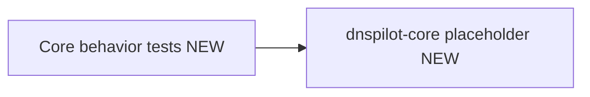
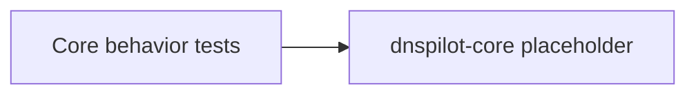
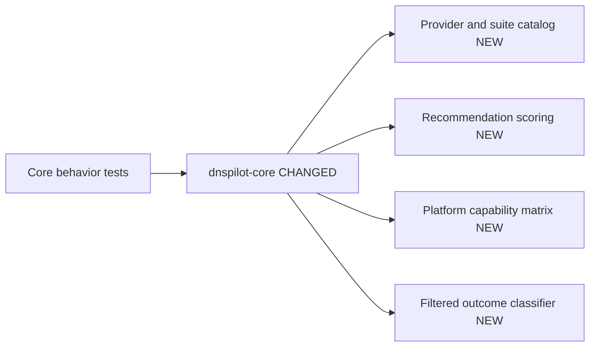
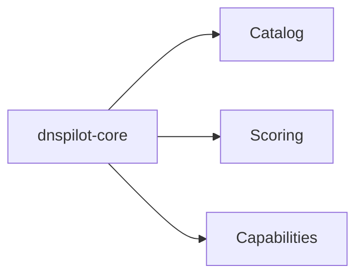
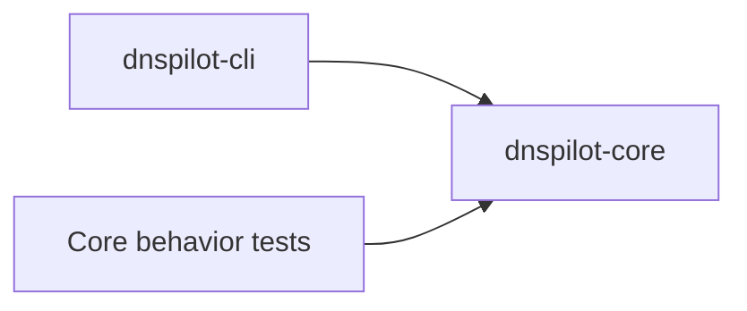
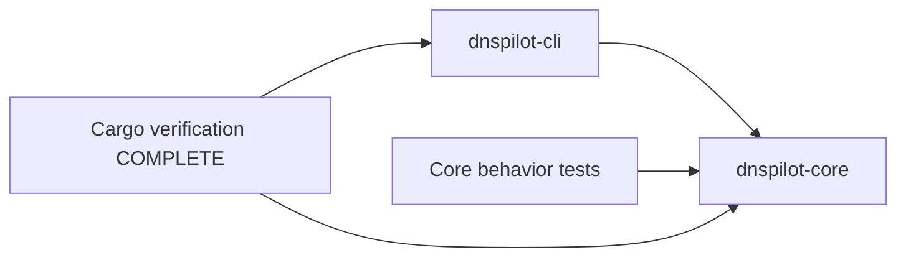
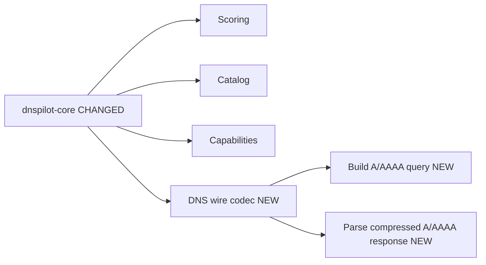
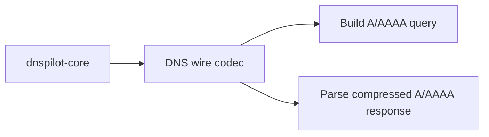
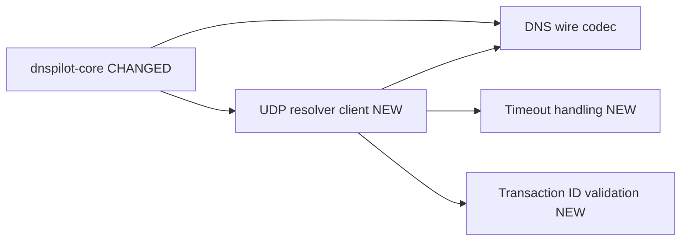
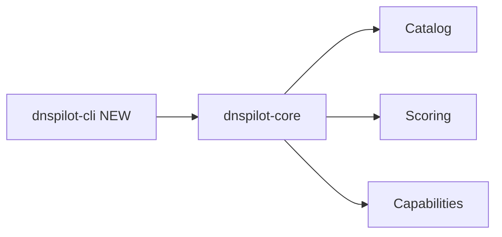

# Implementation Progress

## Plan Overview

Build DNS Pilot as a cross-platform product with a shared reusable core and
native platform shells. The first implementation slice creates the Rust core
contract for provider catalogs, test suites, recommendation scoring, filtered
DNS handling, and platform capability reporting.

## Chunks

- [x] [1] Workspace and RED tests — created Rust workspace and behavior tests.
- [x] [2] Shared core — implemented catalog, scoring, capability matrix, and validation.
- [x] [3] CLI smoke tool — added JSON commands for catalog, capability, and sample recommendation.
- [x] [4] Verification — core tests and CLI smoke commands pass.
- [x] [5] v0.1 DNS wire codec — deterministic DNS query builder and response parser.
- [x] [6] v0.1 UDP resolver client — local-testable UDP query execution.

---

## Chunk 1: Workspace and RED Tests

**Status:** Complete
**Files changed:** `Cargo.toml`, `crates/dnspilot-core/tests/core_behaviour.rs`

### What changed

Created the workspace and behavior-first tests for the core contract. The tests
cover catalog completeness, keep-current recommendation behavior, positive
recommendation behavior, filtered DNS expected-block semantics, and platform
capabilities.

### Before

Before: nothing.

### After



---

## Chunk 2: Shared Core

**Status:** Complete
**Files changed:** `crates/dnspilot-core/src/lib.rs`

### What changed

Implemented the reusable store-safe core: DNS profile/test suite models, built-in
catalog, recommendation scoring, filtered DNS classification, profile validation,
and per-platform apply capability matrix.

### Before



### After



---

## Chunk 3: CLI Smoke Tool

**Status:** Complete
**Files changed:** `crates/dnspilot-cli/src/main.rs`

### What changed

Added a small CLI wrapper around the shared core. It emits catalog JSON,
platform capability JSON, and a deterministic sample recommendation for quick
manual checks and future integration smoke tests.

### Before



---

## Chunk 4: Verification

**Status:** Complete
**Files changed:** none

### What changed

Verified the current foundation with `cargo test -p dnspilot-core --tests` and
CLI smoke commands. The Rust toolchain initially hung during first launch, then
recovered; `rustfmt` still hangs at process startup and was not used.

### Before



### After



### Verification

```text
cargo test -p dnspilot-core --tests
Result: 10 passed, 0 failed

cargo run -p dnspilot-cli -- catalog
Result: emitted 9 profiles; first profile cloudflare

cargo run -p dnspilot-cli -- capability macos-store
Result: platform macos-store, apply apple-network-extension-dns-settings

cargo run -p dnspilot-cli -- recommend-sample
Result: recommends quad9 with high confidence
```

---

## Chunk 5: v0.1 DNS Wire Codec

**Status:** Complete
**Files changed:** `crates/dnspilot-core/src/dns_wire.rs`, `crates/dnspilot-core/src/lib.rs`, `crates/dnspilot-core/tests/dns_wire_behaviour.rs`

### What changed

Added deterministic DNS wire support for building plain A/AAAA query packets and
parsing compressed A/AAAA responses. This still performs no live network I/O;
it is the codec layer the future UDP benchmark runner will call.

### Before


### After



### Verification

```text
cargo test -p dnspilot-core --test dns_wire_behaviour
Result: 4 passed, 0 failed

cargo test -p dnspilot-core --tests
Result: 10 passed, 0 failed
```

---

## Chunk 6: v0.1 UDP Resolver Client

**Status:** Complete
**Files changed:** `crates/dnspilot-core/src/dns_resolver.rs`, `crates/dnspilot-core/src/lib.rs`, `crates/dnspilot-core/tests/dns_udp_resolver_behaviour.rs`

### What changed

Added a synchronous UDP DNS client that sends one query to a resolver, enforces
timeout, validates the response transaction ID, rejects non-zero DNS response
codes, and returns elapsed time with the parsed response. Tests use a local fake
UDP resolver, so this layer is verified without internet dependency.

### Before



### After



### Verification

```text
cargo test -p dnspilot-core --test dns_udp_resolver_behaviour
Result: 3 passed, 0 failed

cargo test -p dnspilot-core --tests
Result: 13 passed, 0 failed
```

### After


