# Implementation Progress

## Plan Overview

Build DNS Pilot as a cross-platform product with a shared reusable core and
native platform shells. The first implementation slice creates the Rust core
contract for provider catalogs, test suites, recommendation scoring, filtered
DNS handling, and platform capability reporting.

## Chunks

- [x] [1] Workspace and RED tests — created Rust workspace and behavior tests.
- [x] [2] Shared core — implemented catalog, scoring, capability matrix, and validation.
- [x] [3] CLI smoke tool — added JSON commands for catalog, capability, and sample recommendation.
- [x] [4] Verification — core tests and CLI smoke commands pass.
- [x] [5] v0.1 DNS wire codec — deterministic DNS query builder and response parser.
- [x] [6] v0.1 UDP resolver client — local-testable UDP query execution.
- [x] [7] v0.1 DNS benchmark runner — multi-sample aggregation for latency and reliability.
- [x] [8] v0.1 live benchmark CLI — JSON benchmark command for manual resolver smoke tests.
- [x] [9] v0.1 TCP connect probe — local-testable connection latency aggregation.
- [x] [10] v0.1 connection-path estimator — DNS + TCP connect combined metrics with caveats.
- [x] [11] v0.1 connection-path CLI — manual DNS + TCP estimate command.
- [x] [12] v0.1 connection target guardrails — per-domain TCP target limiting and precise caveats.
- [x] [13] v0.1 dual-stack target selection — balanced IPv4/IPv6 endpoint limiting.
- [x] [14] v0.1 TLS/SNI probe contract — handshake metrics and certificate failure classification.
- [x] [15] v0.1 live TLS/SNI handshaker — Rustls handshake to resolved IP with SNI.
- [x] [16] v0.1 connection-path TLS integration — opt-in TLS/SNI reliability in core estimates.
- [x] [17] v0.1 TLS path-estimate CLI — flag and JSON samples for TLS/SNI probing.
- [x] [18] v0.1 path-estimate summary JSON — stable UI/recommendation summary fields.
- [x] [19] v0.1 path health verdicts — stable health and primary issue summary fields.
- [x] [20] v0.1 DNS resolver compare CLI — DNS-only multi-resolver recommendation.
- [x] [21] v0.1 connection-path compare CLI — DNS+TCP multi-resolver recommendation.
- [x] [22] v0.1 TLS path-compare CLI — optional TLS/SNI multi-resolver comparison.
- [x] [23] v0.1 recommendation safety gate — shared core gate for recommend/apply readiness.
- [x] [24] v0.1 storage snapshot contract — versioned local data schema.
- [x] [25] v0.1 SQLite storage backend — save/load versioned snapshots.
- [x] [26] v0.1 storage smoke CLI — create and verify SQLite snapshot.
- [x] [27] v0.1 custom profile persistence CLI — add/list custom DNS profiles.
- [x] [28] v0.1 benchmark history persistence CLI — save/list benchmark history.
- [x] [29] v0.1 path-compare history persistence CLI — save/list path comparison history.
- [x] [30] v0.1 compare history persistence CLI — save/list DNS-only comparison history.
- [x] [31] v0.1 custom suite persistence CLI — add/list custom domain suites.
- [x] [32] v0.1 benchmark saved-suite input — run benchmark from saved suite domains.
- [x] [33] v0.1 compare saved-suite input — run DNS comparison from saved suite domains.
- [x] [34] v0.1 path-compare saved-suite input — run path comparison from saved suite domains.
- [x] [35] v0.1 path-estimate saved-suite input — run path estimate from saved suite domains.
- [x] [36] v0.1 benchmark saved-profile input — run benchmark from saved plain DNS profile.
- [x] [37] v0.1 compare saved-profile input — run DNS comparison from saved plain DNS profiles.
- [x] [38] v0.1 path-estimate saved-profile input — run path estimate from saved plain DNS profile.
- [x] [39] v0.1 path-compare saved-profile input — run path comparison from saved plain DNS profiles.
- [x] [40] v0.1 custom encrypted profile persistence CLI — add/list DoH and DoT profiles.
- [x] [41] v0.1 custom filtering profile metadata — persist filtering DNS category.

---

## Chunk 1: Workspace and RED Tests

**Status:** Complete
**Files changed:** `Cargo.toml`, `crates/dnspilot-core/tests/core_behaviour.rs`

### What changed

Created the workspace and behavior-first tests for the core contract. The tests
cover catalog completeness, keep-current recommendation behavior, positive
recommendation behavior, filtered DNS expected-block semantics, and platform
capabilities.

### Before

Before: nothing.

### After


---

## Chunk 2: Shared Core

**Status:** Complete
**Files changed:** `crates/dnspilot-core/src/lib.rs`

### What changed

Implemented the reusable store-safe core: DNS profile/test suite models, built-in
catalog, recommendation scoring, filtered DNS classification, profile validation,
and per-platform apply capability matrix.

### Before


### After

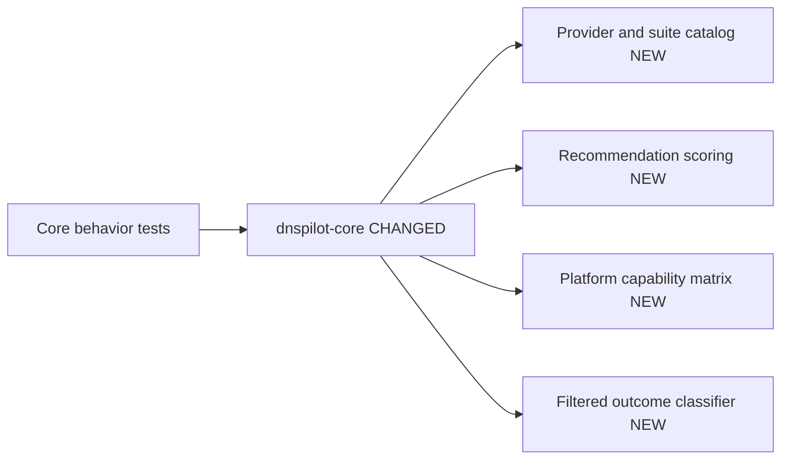

---

## Chunk 3: CLI Smoke Tool

**Status:** Complete
**Files changed:** `crates/dnspilot-cli/src/main.rs`

### What changed

Added a small CLI wrapper around the shared core. It emits catalog JSON,
platform capability JSON, and a deterministic sample recommendation for quick
manual checks and future integration smoke tests.

### Before

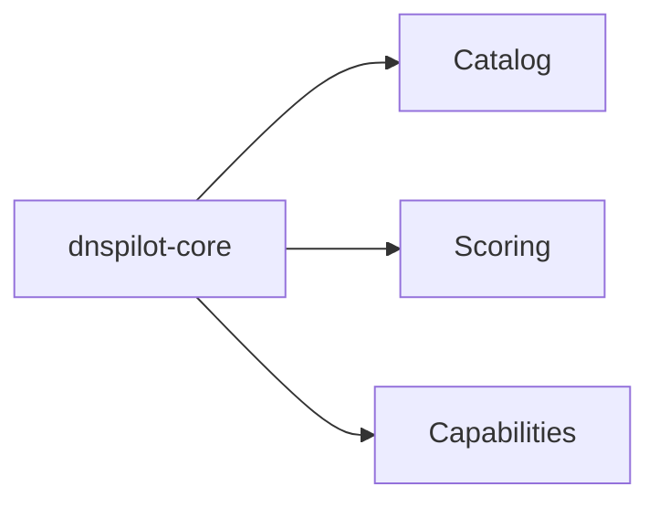

---

## Chunk 4: Verification

**Status:** Complete
**Files changed:** none

### What changed

Verified the current foundation with `cargo test -p dnspilot-core --tests` and
CLI smoke commands. The Rust toolchain initially hung during first launch, then
recovered; `rustfmt` still hangs at process startup and was not used.

### Before

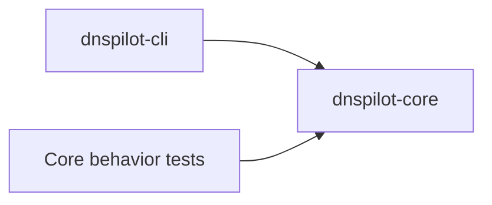

### After

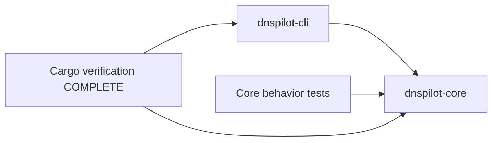

### Verification

```text
cargo test -p dnspilot-core --tests
Result: 10 passed, 0 failed

cargo run -p dnspilot-cli -- catalog
Result: emitted 9 profiles; first profile cloudflare

cargo run -p dnspilot-cli -- capability macos-store
Result: platform macos-store, apply apple-network-extension-dns-settings

cargo run -p dnspilot-cli -- recommend-sample
Result: recommends quad9 with high confidence
```

---

## Chunk 5: v0.1 DNS Wire Codec

**Status:** Complete
**Files changed:** `crates/dnspilot-core/src/dns_wire.rs`, `crates/dnspilot-core/src/lib.rs`, `crates/dnspilot-core/tests/dns_wire_behaviour.rs`

### What changed

Added deterministic DNS wire support for building plain A/AAAA query packets and
parsing compressed A/AAAA responses. This still performs no live network I/O;
it is the codec layer the future UDP benchmark runner will call.

### Before


### After

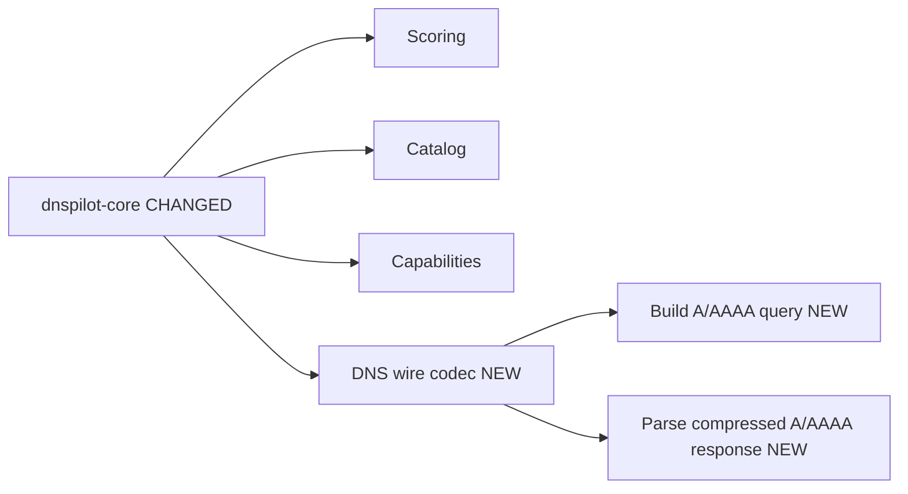

### Verification

```text
cargo test -p dnspilot-core --test dns_wire_behaviour
Result: 4 passed, 0 failed

cargo test -p dnspilot-core --tests
Result: 10 passed, 0 failed
```

---

## Chunk 6: v0.1 UDP Resolver Client

**Status:** Complete
**Files changed:** `crates/dnspilot-core/src/dns_resolver.rs`, `crates/dnspilot-core/src/lib.rs`, `crates/dnspilot-core/tests/dns_udp_resolver_behaviour.rs`

### What changed

Added a synchronous UDP DNS client that sends one query to a resolver, enforces
timeout, validates the response transaction ID, rejects non-zero DNS response
codes, and returns elapsed time with the parsed response. Tests use a local fake
UDP resolver, so this layer is verified without internet dependency.

### Before

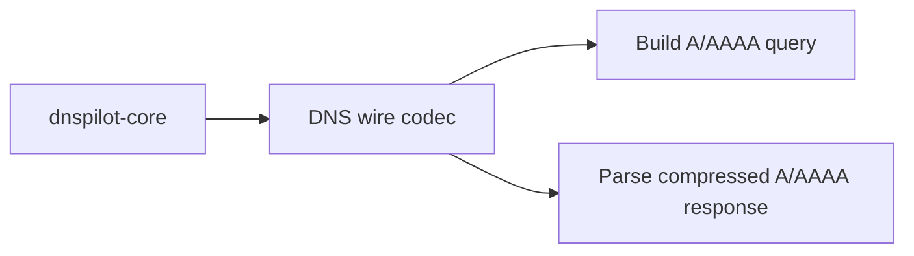

### After

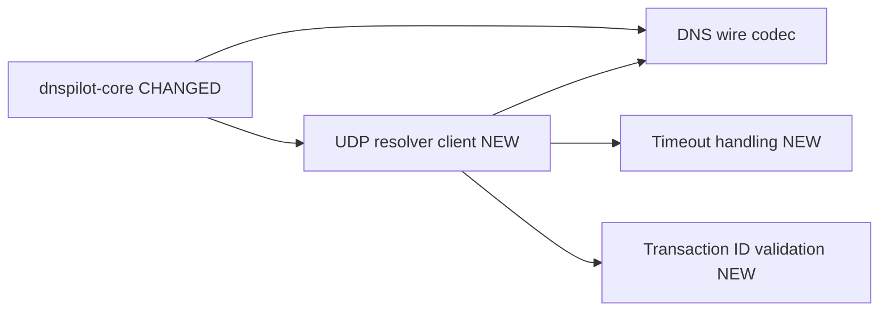

### Verification

```text
cargo test -p dnspilot-core --test dns_udp_resolver_behaviour
Result: 3 passed, 0 failed

cargo test -p dnspilot-core --tests
Result: 13 passed, 0 failed
```

---

## Chunk 7: v0.1 DNS Benchmark Runner

**Status:** Complete
**Files changed:** `crates/dnspilot-core/src/dns_benchmark.rs`, `crates/dnspilot-core/src/lib.rs`, `crates/dnspilot-core/tests/dns_benchmark_behaviour.rs`

### What changed

Added a multi-sample benchmark runner that executes A and AAAA lookups across
domains, records per-sample success/timeout/failure, and aggregates median DNS
latency, P95 latency, failure rate, timeout rate, and IPv4/IPv6 health. The
runner is testable with an injected lookup function and has a wrapper that uses
the UDP resolver client.

### Before

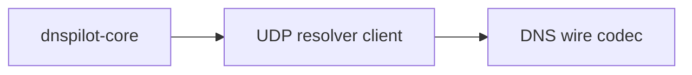

### After

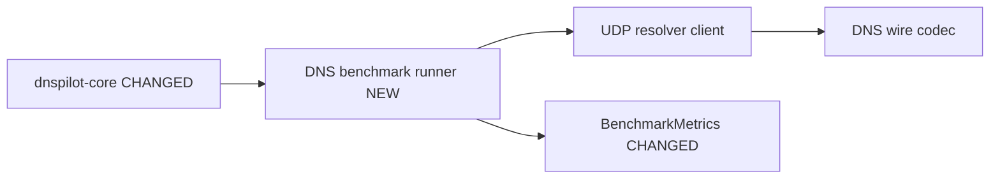

### Verification

```text
cargo test -p dnspilot-core --test dns_benchmark_behaviour
Result: 2 passed, 0 failed

cargo test --workspace --tests
Result: 15 passed, 0 failed
```

---

## Chunk 8: v0.1 Live Benchmark CLI

**Status:** Complete
**Files changed:** `crates/dnspilot-cli/src/main.rs`, `crates/dnspilot-cli/tests/cli_benchmark_behaviour.rs`

### What changed

Added `dnspilot-cli benchmark`, which accepts a resolver socket address, one or
more domains, attempt count, timeout, and optional profile ID. The command runs
the UDP benchmark path and emits JSON with metrics, per-sample outcomes, and a
plain warning that DNS results estimate resolver behavior rather than full
internet speed.

### Before

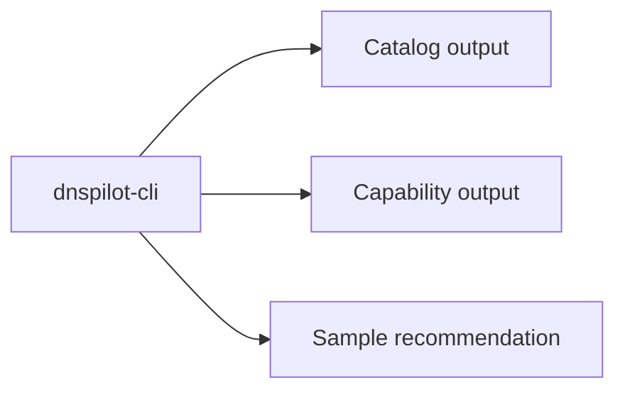

### After

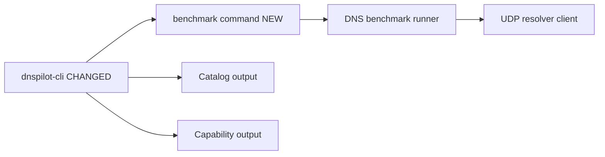

### Verification

```text
cargo test -p dnspilot-cli --test cli_benchmark_behaviour
Result: 1 passed, 0 failed

cargo test --workspace --tests
Result: 16 passed, 0 failed

cargo run -p dnspilot-cli -- benchmark --resolver 1.1.1.1:53 --domain github.com --attempts 1 --timeout-ms 1000
Result: sample_count 2, failure_rate 0.0, timeout_rate 0.0 in this run
```

---

## Chunk 9: v0.1 TCP Connect Probe

**Status:** Complete
**Files changed:** `crates/dnspilot-core/src/connect_probe.rs`, `crates/dnspilot-core/src/lib.rs`, `crates/dnspilot-core/tests/connect_probe_behaviour.rs`

### What changed

Added a TCP connect probe layer for connection-path estimates. It can measure a
single TCP connect attempt, classify timeout/failure outcomes, and aggregate
multi-sample median, P95, failure rate, and timeout rate without doing TLS yet.

### Before

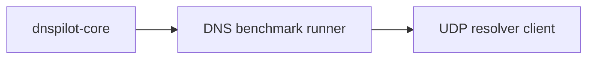

### After

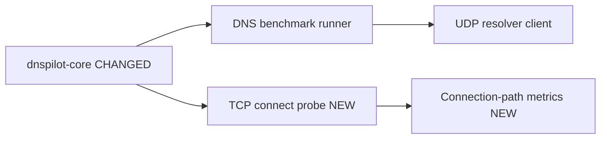

### Verification

```text
cargo test -p dnspilot-core --test connect_probe_behaviour
Result: 3 passed, 0 failed

/Users/aart/.rustup/toolchains/stable-aarch64-apple-darwin/bin/cargo test --workspace --tests
Result: 19 passed, 0 failed
```

---

## Chunk 10: v0.1 Connection-Path Estimator

**Status:** Complete
**Files changed:** `crates/dnspilot-core/src/connection_path.rs`, `crates/dnspilot-core/src/lib.rs`, `crates/dnspilot-core/tests/connection_path_behaviour.rs`

### What changed

Added a connection-path estimator that resolves A/AAAA records, extracts usable
IP endpoints, probes TCP connect latency to the configured port, and combines
DNS metrics with connect metrics. Combined failure and timeout rates are
conservative: the estimator uses the worse of DNS and connect rates so a fast
resolver with unreachable endpoints is not over-recommended.

### Before

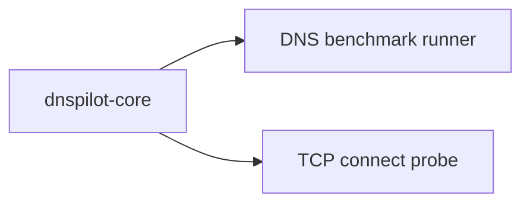

### After

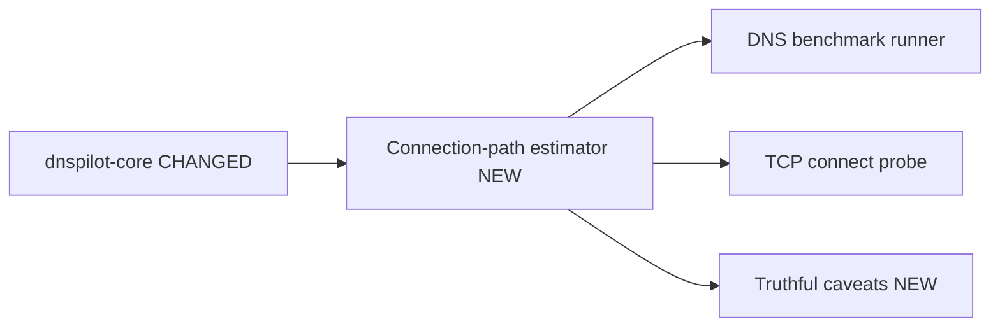

### Edge Cases Covered

- DNS success with no usable A/AAAA answers skips TCP probes and records a caveat.
- IPv6 DNS timeout lowers IPv6 health and DNS timeout rate.
- TCP connect timeout after DNS success raises combined failure/timeout rates.
- The estimator explicitly does not claim full web/app speed because TLS, HTTP,
  QUIC, browser cache, and server latency are not measured yet.

### Verification

```text
cargo test -p dnspilot-core --test connection_path_behaviour
Result: 3 passed, 0 failed

/Users/aart/.rustup/toolchains/stable-aarch64-apple-darwin/bin/cargo test --workspace --tests
Result: 22 passed, 0 failed
```

---

## Chunk 11: v0.1 Connection-Path CLI

**Status:** Complete
**Files changed:** `crates/dnspilot-cli/src/main.rs`, `crates/dnspilot-cli/tests/cli_path_estimate_behaviour.rs`

### What changed

Added `dnspilot-cli path-estimate`, which runs the connection-path estimator from
the command line and emits JSON with combined metrics, DNS samples, TCP connect
samples, connect targets, and caveats. The integration test uses a local fake DNS
resolver plus a local TCP listener so it is deterministic and does not depend on
public network state.

### Before

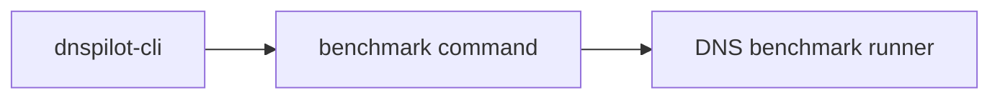

### After

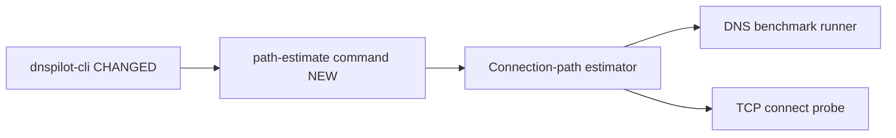

### Edge Cases / Caveats

- CLI output includes caveats stating this is not TLS, HTTP, QUIC, browser-cache,
  or server-latency measurement.
- A resolver can still look good here while failing TLS/SNI later; that is a
  known next-step gap.
- Public live smoke can vary by network, VPN, IPv6 availability, and firewall.

### Verification

```text
cargo test -p dnspilot-cli --test cli_path_estimate_behaviour
Result: 1 passed, 0 failed

/Users/aart/.rustup/toolchains/stable-aarch64-apple-darwin/bin/cargo test --workspace --tests
Result: 23 passed, 0 failed

cargo run -p dnspilot-cli -- path-estimate --resolver 1.1.1.1:53 --domain github.com --attempts 1 --dns-timeout-ms 1000 --connect-timeout-ms 1000 --connect-port 443
Result in this run: dns_sample_count 2, connect_sample_count 1, target_count 1, failure_rate 0.0
```

---

## Chunk 12: v0.1 Connection Target Guardrails

**Status:** Complete
**Files changed:** `crates/dnspilot-core/src/connection_path.rs`, `crates/dnspilot-core/tests/connection_path_behaviour.rs`, `crates/dnspilot-cli/src/main.rs`

### What changed

Added `max_connect_targets_per_domain` to limit how many resolved endpoints are
TCP-probed per domain. The CLI exposes it as
`--max-connect-targets-per-domain` with default `4`, and caveats now report only
when endpoints were actually skipped due to the limit.

### Before

```mermaid
graph LR
  PATH[Connection-path estimator] --> TARGETS[All unique resolved endpoints]
  TARGETS --> TCP[TCP connect probes]
```

### After

```mermaid
graph LR
  PATH[Connection-path estimator CHANGED] --> LIMIT[Per-domain target limit NEW]
  LIMIT --> TCP[TCP connect probes]
  LIMIT --> CAVEAT[Precise limit caveat NEW]
```

### Edge Cases / Caveats

- Large CDN answer sets are capped to avoid excessive TCP probes, battery drain,
  slow tests, and noisy network behavior.
- If endpoint count exactly equals the limit, no limit caveat is emitted because
  nothing was skipped.
- This still does not choose “best IP”; it preserves DNS answer order and limits
  probe volume. Smarter target selection is a later step.

### Verification

```text
cargo test -p dnspilot-core --test connection_path_behaviour limits_connect_targets_per_domain_and_records_caveat
Result: 1 passed, 0 failed

cargo test -p dnspilot-core --test connection_path_behaviour does_not_record_limit_caveat_when_no_endpoint_was_skipped
Result: 1 passed, 0 failed

/Users/aart/.rustup/toolchains/stable-aarch64-apple-darwin/bin/cargo test --workspace --tests
Result: 24 passed, 0 failed
```

### After

```mermaid
graph LR
  CLI[dnspilot-cli NEW] --> CORE[dnspilot-core]
  CORE --> CATALOG[Catalog]
  CORE --> SCORE[Scoring]
  CORE --> CAP[Capabilities]
```

---

## Chunk 13: v0.1 Dual-Stack Target Selection

**Status:** Complete
**Files changed:** `crates/dnspilot-core/src/connection_path.rs`, `crates/dnspilot-core/tests/connection_path_behaviour.rs`, `README.md`

### What changed

Changed connection-path target limiting from "first N endpoints per domain" to a
balanced selector that preserves both IPv4 and IPv6 when both are available.
This avoids a real bias where A records could fill the per-domain limit before
AAAA records were considered.

### Before

```mermaid
graph LR
  DNS[DNS answers] --> FIRST[First N endpoints per domain]
  FIRST --> TCP[TCP probes]
  FIRST --> BIAS[Possible IPv4-only selection]
```

### After

```mermaid
graph LR
  DNS[DNS answers] --> CANDIDATES[Unique endpoint candidates CHANGED]
  CANDIDATES --> BALANCE[Balanced IPv4/IPv6 selector NEW]
  BALANCE --> TCP[TCP probes]
  BALANCE --> CAVEAT[Balanced limit caveat CHANGED]
```

### Edge Cases / Caveats

- With limit `2` and both families available, the selector keeps one IPv4 and
  one IPv6 endpoint.
- With limit `1`, it cannot represent both families; the estimate should be
  considered weaker for dual-stack diagnosis.
- This still does not prove the best CDN endpoint. It only avoids family bias
  while keeping probe volume bounded.

### Verification

```text
cargo test -p dnspilot-core --test connection_path_behaviour limit_keeps_both_ipv4_and_ipv6_when_available
Result: 1 passed, 0 failed

/Users/aart/.rustup/toolchains/stable-aarch64-apple-darwin/bin/cargo test --workspace --tests
Result: 25 passed, 0 failed
```

---

## Chunk 14: v0.1 TLS/SNI Probe Contract

**Status:** Complete
**Files changed:** `crates/dnspilot-core/src/tls_probe.rs`, `crates/dnspilot-core/src/lib.rs`, `crates/dnspilot-core/tests/tls_probe_behaviour.rs`, `README.md`

### What changed

Added a TLS/SNI probe contract with targets, config, samples, outcomes, errors,
and aggregation. The runner accepts an injected handshaker so latency, timeout,
and certificate failure behavior can be tested deterministically before adding a
live TLS dependency.

### Before

```mermaid
graph LR
  PATH[Connection-path estimator] --> TCP[TCP connect probe]
  TCP --> METRICS[Connect latency metrics]
```

### After

```mermaid
graph LR
  PATH[Connection-path estimator] --> TCP[TCP connect probe]
  CORE[dnspilot-core CHANGED] --> TLS[TLS/SNI probe contract NEW]
  TLS --> SAMPLES[TLS samples NEW]
  TLS --> CERT[Certificate failure rate NEW]
```

### Edge Cases / Caveats

- Certificate failures are tracked separately from generic handshake failures.
  This matters for captive portals, corporate MITM, wrong endpoints, and SNI
  mismatch cases.
- The target keeps `server_name` separate from endpoint IP so future live TLS
  can connect to resolved IPs while sending the original domain as SNI.
- This chunk does not perform live TLS yet. The next chunk should add a real
  Rustls/native TLS handshaker and local deterministic TLS test coverage.

### Verification

```text
cargo test -p dnspilot-core --test tls_probe_behaviour
Result: 2 passed, 0 failed

/Users/aart/.rustup/toolchains/stable-aarch64-apple-darwin/bin/cargo test --workspace --tests
Result: 27 passed, 0 failed
```

---

## Chunk 15: v0.1 Live TLS/SNI Handshaker

**Status:** Complete
**Files changed:** `crates/dnspilot-core/src/tls_probe.rs`, `crates/dnspilot-core/tests/tls_probe_behaviour.rs`, `crates/dnspilot-core/Cargo.toml`, `Cargo.lock`, `README.md`

### What changed

Added a live Rustls TLS handshaker that connects to a resolved IP endpoint while
verifying the certificate against the target `server_name` used for SNI. The
test runs against a local Rustls server with a generated localhost certificate,
so it verifies real TLS behavior without external network dependency.

### Before

```mermaid
graph LR
  TLS[TLS/SNI probe contract] --> INJECT[Injected handshaker only]
  INJECT --> METRICS[TLS metrics]
```

### After

```mermaid
graph LR
  TLS[TLS/SNI probe CHANGED] --> LIVE[Live Rustls handshaker NEW]
  LIVE --> IP[Resolved IP endpoint]
  LIVE --> SNI[SNI server_name]
  LIVE --> CERT[Certificate verification]
  TLS --> INJECT[Injected handshaker]
```

### Edge Cases / Caveats

- The live handshaker now separates endpoint IP from SNI name. This is required
  because DNS Pilot resolves IPs first, but TLS certificates are issued for
  hostnames.
- Certificate rejection is mapped separately from generic handshake failure.
- Default trust currently uses Mozilla `webpki-roots`, not the OS trust store.
  Corporate/MDM roots can therefore be rejected here even when Safari/Chrome on
  that machine would trust them. OS-native trust should be a later platform
  adapter step.
- Rustls default crypto backend pulls `aws-lc-rs`, which increases build cost
  and should be revisited before broad mobile/Linux distribution.

### Verification

```text
cargo test -p dnspilot-core --test tls_probe_behaviour performs_live_tls_handshake_to_endpoint_with_sni_server_name
Result: 1 passed, 0 failed

cargo test -p dnspilot-core --test tls_probe_behaviour
Result: 3 passed, 0 failed

/Users/aart/.rustup/toolchains/stable-aarch64-apple-darwin/bin/cargo test --workspace --tests
Result: 28 passed, 0 failed
```

---

## Chunk 16: v0.1 Connection-Path TLS Integration

**Status:** Complete
**Files changed:** `crates/dnspilot-core/src/connection_path.rs`, `crates/dnspilot-core/tests/connection_path_behaviour.rs`, `crates/dnspilot-cli/src/main.rs`, `README.md`

### What changed

Integrated TLS/SNI probing into the connection-path estimator as an opt-in core
capability. When `tls_handshake_timeout` is set, the estimator probes TLS for
the selected resolved endpoints, includes TLS failure/timeout rates in combined
reliability, and records certificate-specific caveats.

### Before

```mermaid
graph LR
  PATH[Connection-path estimator] --> DNS[DNS benchmark]
  PATH --> TCP[TCP connect probe]
  PATH --> METRICS[Combined DNS/TCP reliability]
```

### After

```mermaid
graph LR
  PATH[Connection-path estimator CHANGED] --> DNS[DNS benchmark]
  PATH --> TCP[TCP connect probe]
  PATH --> TLS[TLS/SNI probe OPTIONAL NEW]
  TLS --> CERT[Certificate failure caveat NEW]
  TLS --> METRICS[Combined DNS/TCP/TLS reliability CHANGED]
```

### Edge Cases / Caveats

- TLS is opt-in at core level. Existing CLI `path-estimate` keeps
  `tls_handshake_timeout: None`, so manual CLI behavior is unchanged in this
  chunk.
- A path with DNS success and TCP success can still be marked unreliable if TLS
  certificate verification fails.
- Certificate failures can be valid signals for captive portals, SNI mismatch,
  or wrong edge mapping, but can be false negatives in corporate/MDM networks
  until OS-native trust store adapters exist.

### Verification

```text
CARGO_INCREMENTAL=0 cargo test -p dnspilot-core --test connection_path_behaviour tls_certificate_failures_reduce_combined_reliability_when_enabled
Result: 1 passed, 0 failed

CARGO_INCREMENTAL=0 cargo test --workspace --tests
Result: 30 passed, 0 failed
```

---

## Chunk 17: v0.1 TLS Path-Estimate CLI

**Status:** Complete
**Files changed:** `crates/dnspilot-cli/src/main.rs`, `crates/dnspilot-cli/tests/cli_path_estimate_behaviour.rs`, `README.md`

### What changed

Exposed TLS/SNI probing in `dnspilot-cli path-estimate` with
`--tls-handshake-timeout-ms`. CLI JSON now includes `tls_samples` with
`server_name`, endpoint, elapsed time, and TLS outcome when TLS probing is
enabled.

### Before

```mermaid
graph LR
  CLI[path-estimate CLI] --> CORE[Connection-path core]
  CLI --> DNS[DNS samples]
  CLI --> TCP[TCP samples]
```

### After

```mermaid
graph LR
  CLI[path-estimate CLI CHANGED] --> CORE[Connection-path core]
  CLI --> DNS[DNS samples]
  CLI --> TCP[TCP samples]
  CLI --> TLS[TLS samples OPTIONAL NEW]
```

### Edge Cases / Caveats

- TLS probing remains opt-in because it adds network work and can produce
  certificate failures in captive portal, proxy, VPN, or corporate/MDM
  environments.
- CLI output keeps `tls_samples: []` when the flag is not provided, preserving
  the existing default path-estimate behavior.
- Current TLS verification still uses bundled Mozilla roots, not OS-native
  enterprise roots.

### Verification

```text
CARGO_INCREMENTAL=0 cargo test -p dnspilot-cli --test cli_path_estimate_behaviour path_estimate_command_can_include_tls_samples_when_enabled
Result: 1 passed, 0 failed

CARGO_INCREMENTAL=0 cargo test -p dnspilot-cli --test cli_path_estimate_behaviour
Result: 2 passed, 0 failed

CARGO_INCREMENTAL=0 cargo test --workspace --tests
Result: 31 passed, 0 failed
```

## Chunk 19: v0.1 Path Health Verdicts

**Status:** Complete
**Files changed:** `crates/dnspilot-cli/src/main.rs`, `crates/dnspilot-cli/tests/cli_path_estimate_behaviour.rs`, `README.md`

### What changed

Added `summary.health` and `summary.primary_issue` to `dnspilot-cli
path-estimate`. This gives UI and recommendation flows stable verdict fields
instead of forcing them to infer state from metrics, samples, and caveat text.

### Before

```mermaid
graph LR
  SUMMARY[Path summary] --> COUNTS[Counts and scope]
  UI[UI] --> METRICS[Infer health from metrics/caveats]
```

### After

```mermaid
graph LR
  SUMMARY[Path summary CHANGED] --> COUNTS[Counts and scope]
  SUMMARY --> HEALTH[health NEW]
  SUMMARY --> ISSUE[primary_issue NEW]
  HEALTH --> UI[UI/recommendation layer]
```

### Edge Cases / Caveats

- `healthy` currently means no DNS/TCP/TLS failure or timeout was observed in
  the measured path.
- `failed` is emitted for total DNS/connect/TLS failure conditions, including
  TLS handshake failure after TCP connect succeeds.
- `degraded` is reserved for partial failures. This is a product-facing verdict,
  not a full recommendation across multiple DNS profiles yet.

### Verification

```text
CARGO_INCREMENTAL=0 cargo test -p dnspilot-cli --test cli_path_estimate_behaviour path_estimate_command_outputs_dns_and_connect_metrics
Result: 1 passed, 0 failed

CARGO_INCREMENTAL=0 cargo test -p dnspilot-cli --test cli_path_estimate_behaviour path_estimate_command_can_include_tls_samples_when_enabled
Result: 1 passed, 0 failed

CARGO_INCREMENTAL=0 cargo test -p dnspilot-cli --test cli_path_estimate_behaviour
Result: 2 passed, 0 failed

CARGO_INCREMENTAL=0 cargo test --workspace --tests
Result: 31 passed, 0 failed
```

## Chunk 20: v0.1 DNS Resolver Compare CLI

**Status:** Complete
**Files changed:** `crates/dnspilot-cli/src/main.rs`, `crates/dnspilot-cli/tests/cli_compare_behaviour.rs`, `README.md`

### What changed

Added `dnspilot-cli compare`, a DNS-only multi-resolver benchmark command. It
accepts repeated `--resolver id=host:port` entries, benchmarks each resolver
against the same domains, runs core recommendation scoring in
`fastest-raw-dns` mode, and emits stable JSON with `summary`, `runs`,
`recommendation`, and a scope warning.

### Before

```mermaid
graph LR
  CLI[CLI] --> BENCH[Single resolver benchmark]
  CLI --> PATH[Single resolver path-estimate]
```

### After

```mermaid
graph LR
  CLI[CLI CHANGED] --> BENCH[Single resolver benchmark]
  CLI --> PATH[Single resolver path-estimate]
  CLI --> COMPARE[Multi-resolver DNS compare NEW]
  COMPARE --> SCORE[Core fastest-raw-dns recommendation]
```

### Edge Cases / Caveats

- This is DNS-only compare. It does not include TCP connect, TLS/SNI, HTTP,
  QUIC, browser cache, VPN, MDM, captive portal, or app-specific behavior.
- If every resolver fails, compare returns `can_recommend=false` and
  `recommendation=null` instead of picking the least-bad failed resolver.
- Resolver IDs must be unique because recommendation/profile persistence uses
  `profile_id` as the stable identifier.
- IPv6 resolver addresses must use socket address bracket syntax, for example
  `cloudflare=[2606:4700:4700::1111]:53`.

### Verification

```text
CARGO_INCREMENTAL=0 cargo test -p dnspilot-cli --test cli_compare_behaviour
Result: 3 passed, 0 failed

CARGO_INCREMENTAL=0 cargo test -p dnspilot-cli --tests
Result: 6 passed, 0 failed

CARGO_INCREMENTAL=0 cargo test --workspace --tests
Result: 34 passed, 0 failed
```

---

## Chunk 21: v0.1 Connection-Path Compare CLI

**Status:** Complete
**Files changed:** `crates/dnspilot-cli/src/main.rs`, `crates/dnspilot-cli/tests/cli_path_compare_behaviour.rs`, `README.md`

### What changed

Added `dnspilot-cli path-compare`, a DNS+TCP multi-resolver comparison command.
It accepts repeated `--resolver id=host:port` entries, runs the existing
connection-path estimator for each resolver, scores candidates in
`best-overall` mode, and emits JSON with top-level health, per-run summaries,
raw samples, recommendation, and a scope warning.

### Before

```mermaid
graph LR
  COMPARE[compare] --> DNS[DNS-only recommendation]
  PATH[path-estimate] --> SINGLE[Single resolver DNS+TCP estimate]
```

### After

```mermaid
graph LR
  COMPARE[compare] --> DNS[DNS-only recommendation]
  PATH[path-estimate] --> SINGLE[Single resolver DNS+TCP estimate]
  PATHCOMPARE[path-compare NEW] --> MULTI[Multi-resolver DNS+TCP recommendation]
  MULTI --> SCORE[best-overall scoring]
```

### Edge Cases / Caveats

- A resolver with fast DNS can lose if its resolved endpoint fails TCP connect.
  This closes the main weakness of raw DNS-only ranking.
- If every candidate path fails or is inconclusive, path-compare returns
  `can_recommend=false` and `recommendation=null`.
- This still does not include TLS/SNI, HTTP, QUIC, browser cache, VPN, MDM,
  captive portal, or app-specific behavior.

### Verification

```text
CARGO_INCREMENTAL=0 cargo test -p dnspilot-cli --test cli_path_compare_behaviour
Result: 2 passed, 0 failed

CARGO_INCREMENTAL=0 cargo test -p dnspilot-cli --tests
Result: 8 passed, 0 failed

CARGO_INCREMENTAL=0 cargo test --workspace --tests
Result: 36 passed, 0 failed
```

---

## Chunk 22: v0.1 TLS Path-Compare CLI

**Status:** Complete
**Files changed:** `crates/dnspilot-cli/src/main.rs`, `crates/dnspilot-cli/tests/cli_path_compare_behaviour.rs`, `README.md`

### What changed

Extended `dnspilot-cli path-compare` with `--tls-handshake-timeout-ms`. When the
flag is present, each candidate resolver runs DNS, TCP connect, and TLS/SNI
handshake probes, then emits `dns-tcp-tls` scope, trust-store metadata,
per-run `tls_samples`, and conservative recommendation suppression when every
TLS path fails.

### Before

```mermaid
graph LR
  PATHCOMPARE[path-compare] --> DNS[DNS samples]
  PATHCOMPARE --> TCP[TCP connect samples]
  PATHCOMPARE --> SCORE[best-overall scoring]
```

### After

```mermaid
graph LR
  PATHCOMPARE[path-compare CHANGED] --> DNS[DNS samples]
  PATHCOMPARE --> TCP[TCP connect samples]
  PATHCOMPARE --> TLS[TLS/SNI samples NEW]
  PATHCOMPARE --> SCORE[best-overall scoring]
  TLS --> HEALTH[health and suppression CHANGED]
```

### Edge Cases / Caveats

- TLS probing currently uses the Rustls/webpki root set, not the OS-native trust
  store. Corporate roots or TLS interception can therefore appear as certificate
  failure until OS trust integration exists.
- If TCP succeeds but TLS/SNI fails for every candidate, path-compare returns
  `can_recommend=false` and `recommendation=null`.
- This still does not include HTTP, QUIC, browser cache, VPN, MDM, captive
  portal, or app-specific behavior.

### Verification

```text
CARGO_INCREMENTAL=0 cargo test -p dnspilot-cli --test cli_path_compare_behaviour
Result: 3 passed, 0 failed

CARGO_INCREMENTAL=0 cargo test -p dnspilot-cli --tests
Result: 9 passed, 0 failed

CARGO_INCREMENTAL=0 cargo test --workspace --tests
Result: 37 passed, 0 failed
```

---

## Chunk 23: v0.1 Recommendation Safety Gate

**Status:** Complete
**Files changed:** `crates/dnspilot-core/src/lib.rs`, `crates/dnspilot-core/tests/core_behaviour.rs`, `crates/dnspilot-cli/src/main.rs`, `README.md`

### What changed

Added a shared `recommendation_gate(metrics, scope)` API in `dnspilot-core`.
It returns stable `can_recommend`, `health`, `primary_issue`, and `notes`
before any caller asks the scoring engine to pick a candidate. CLI `compare`
and `path-compare` now consume this core gate instead of keeping local duplicated
rules.

### Before

```mermaid
graph LR
  COMPARE[compare CLI] --> LOCAL1[local can_recommend rule]
  PATHCOMPARE[path-compare CLI] --> LOCAL2[local can_recommend rule]
  CORE[core recommend] --> SCORE[score candidates]
```

### After

```mermaid
graph LR
  CORE[core CHANGED] --> GATE[recommendation_gate NEW]
  CORE --> SCORE[score candidates]
  COMPARE[compare CLI CHANGED] --> GATE
  PATHCOMPARE[path-compare CLI CHANGED] --> GATE
  GATE --> APPLY[UI/apply readiness]
```

### Edge Cases / Caveats

- DNS-only comparison can still recommend when TCP latency is absent, because
  that scope intentionally measures raw DNS only.
- DNS+TCP/TLS scopes suppress recommendation when every candidate lacks a usable
  connection path, even if DNS lookups themselves were fast.
- Degraded candidates can still be recommended when at least one candidate is
  usable; UI should present conservative confidence and caveats.

### Verification

```text
CARGO_INCREMENTAL=0 cargo test -p dnspilot-core --test core_behaviour recommendation_gate
Result: 3 passed, 0 failed

CARGO_INCREMENTAL=0 cargo test -p dnspilot-cli --test cli_compare_behaviour
Result: 3 passed, 0 failed

CARGO_INCREMENTAL=0 cargo test -p dnspilot-cli --test cli_path_compare_behaviour
Result: 3 passed, 0 failed

CARGO_INCREMENTAL=0 cargo test -p dnspilot-cli --tests
Result: 9 passed, 0 failed

CARGO_INCREMENTAL=0 cargo test --workspace --tests
Result: 40 passed, 0 failed
```

---

## Chunk 24: v0.1 Storage Snapshot Contract

**Status:** Complete
**Files changed:** `crates/dnspilot-core/src/storage.rs`, `crates/dnspilot-core/src/lib.rs`, `crates/dnspilot-core/tests/storage_behaviour.rs`, `README.md`

### What changed

Added a versioned storage snapshot contract for local profiles, test suites, and
benchmark history. The core now validates schema version, duplicate IDs,
profile validity, suite domains, and benchmark history shape before future
SQLite/native shells persist user data.

### Before

```mermaid
graph LR
  CORE[core] --> PROFILE[profiles]
  CORE --> SUITE[test suites]
  CORE --> BENCH[benchmark metrics]
```

### After

```mermaid
graph LR
  CORE[core CHANGED] --> PROFILE[profiles]
  CORE --> SUITE[test suites]
  CORE --> BENCH[benchmark metrics]
  CORE --> STORAGE[storage snapshot contract NEW]
  STORAGE --> VALIDATE[validation NEW]
```

### Edge Cases / Caveats

- This is a schema contract, not SQLite I/O yet.
- Schema version is strict; future migrations need explicit version handling.
- History records currently persist metrics/gate/recommendation profile id, not
  raw DNS/TCP/TLS sample arrays.

### Verification

```text
CARGO_INCREMENTAL=0 cargo test -p dnspilot-core --test storage_behaviour
Result: 3 passed, 0 failed

CARGO_INCREMENTAL=0 cargo test -p dnspilot-core --tests
Result: 34 passed, 0 failed

CARGO_INCREMENTAL=0 cargo test --workspace --tests
Result: 43 passed, 0 failed
```

---

## Chunk 25: v0.1 SQLite Storage Backend

**Status:** Complete
**Files changed:** `crates/dnspilot-core/Cargo.toml`, `Cargo.lock`, `crates/dnspilot-core/src/storage.rs`, `crates/dnspilot-core/src/lib.rs`, `crates/dnspilot-core/tests/storage_behaviour.rs`, `README.md`

### What changed

Added `SqliteStorage`, a core SQLite backend that initializes local tables,
saves a validated `StorageSnapshot`, and loads it back with validation. The
first backend stores the versioned snapshot JSON as the source of truth, keeping
migration and normalized-table work separate.

### Before

```mermaid
graph LR
  STORAGE[storage snapshot contract] --> JSON[JSON serialize/validate]
```

### After

```mermaid
graph LR
  STORAGE[storage snapshot contract] --> JSON[JSON serialize/validate]
  SQLITE[SQLite backend NEW] --> STORAGE
  SQLITE --> LOAD[load snapshot NEW]
  SQLITE --> SAVE[save snapshot NEW]
```

### Edge Cases / Caveats

- `rusqlite` is pinned to `0.32` because `0.40.1` pulled a `libsqlite3-sys`
  build script using unstable `cfg_select` on the current stable toolchain.
- The backend currently stores one snapshot blob, not normalized profile/history
  tables.
- `load_snapshot` returns an error when no snapshot has been saved yet.

### Verification

```text
CARGO_INCREMENTAL=0 cargo test -p dnspilot-core --test storage_behaviour
Result: 4 passed, 0 failed

CARGO_INCREMENTAL=0 cargo test -p dnspilot-core --tests
Result: 35 passed, 0 failed

CARGO_INCREMENTAL=0 cargo test --workspace --tests
Result: 44 passed, 0 failed
```

---

## Chunk 26: v0.1 Storage Smoke CLI

**Status:** Complete
**Files changed:** `crates/dnspilot-cli/src/main.rs`, `crates/dnspilot-cli/tests/cli_storage_behaviour.rs`, `README.md`

### What changed

Added `dnspilot-cli storage-smoke --db <path>`. The command creates a SQLite
storage backend, saves a built-in catalog snapshot, loads it back, and prints a
JSON summary for manual persistence checks.

### Before

```mermaid
graph LR
  CORE[SQLite backend] --> TEST[core storage tests]
```

### After

```mermaid
graph LR
  CORE[SQLite backend] --> TEST[core storage tests]
  CLI[storage-smoke CLI NEW] --> CORE
  CLI --> JSON[summary JSON NEW]
```

### Edge Cases / Caveats

- This persists built-in profiles/suites only; custom profile/history CLI flows
  are not implemented yet.
- Existing DB path is overwritten at snapshot row `id = 1`.
- The command is a smoke tool, not final user-facing UX.

### Verification

```text
CARGO_INCREMENTAL=0 cargo test -p dnspilot-cli --test cli_storage_behaviour
Result: 1 passed, 0 failed

CARGO_INCREMENTAL=0 cargo test -p dnspilot-cli --tests
Result: 10 passed, 0 failed

CARGO_INCREMENTAL=0 cargo test --workspace --tests
Result: 45 passed, 0 failed
```

---

## Chunk 27: v0.1 Custom Profile Persistence CLI

**Status:** Complete
**Files changed:** `crates/dnspilot-cli/src/main.rs`, `crates/dnspilot-cli/tests/cli_storage_behaviour.rs`, `README.md`

### What changed

Added `profile-add` and `profile-list` CLI commands backed by SQLite snapshots.
`profile-add` seeds a new DB with built-in catalog data when no snapshot exists,
validates the custom plain DNS profile, saves it, and `profile-list` reads it
back as JSON.

### Before

```mermaid
graph LR
  CLI[storage-smoke] --> SQLITE[SQLite snapshot]
```

### After

```mermaid
graph LR
  CLI[storage-smoke] --> SQLITE[SQLite snapshot]
  ADD[profile-add NEW] --> SQLITE
  LIST[profile-list NEW] --> SQLITE
```

### Edge Cases / Caveats

- Only plain DNS custom profiles are supported in this chunk.
- Duplicate profile IDs are rejected by snapshot validation.
- DoH/DoT custom profile fields are not exposed in CLI yet.

### Verification

```text
CARGO_INCREMENTAL=0 cargo test -p dnspilot-cli --test cli_storage_behaviour
Result: 2 passed, 0 failed

CARGO_INCREMENTAL=0 cargo test -p dnspilot-cli --tests
Result: 11 passed, 0 failed

CARGO_INCREMENTAL=0 cargo test --workspace --tests
Result: 46 passed, 0 failed
```

---

## Chunk 18: v0.1 Path-Estimate Summary JSON

**Status:** Complete
**Files changed:** `crates/dnspilot-cli/src/main.rs`, `crates/dnspilot-cli/tests/cli_path_estimate_behaviour.rs`, `README.md`

### What changed

Added a stable `summary` object to `dnspilot-cli path-estimate` JSON output.
It reports measurement scope, TLS enablement, trust store, sample counts, target
count, domain count, and caveat count so native shells and recommendation flows
do not need to infer these from raw arrays.

### Before

```mermaid
graph LR
  CLI[path-estimate CLI] --> RAW[Raw DNS/TCP/TLS arrays]
  RAW --> UI[UI infers coverage]
```

### After

```mermaid
graph LR
  CLI[path-estimate CLI CHANGED] --> RAW[Raw DNS/TCP/TLS arrays]
  CLI --> SUMMARY[Stable summary JSON NEW]
  SUMMARY --> UI[UI/recommendation layer]
```

### Edge Cases / Caveats

- `measurement_scope` is `dns-tcp` by default and `dns-tcp-tls` only when TLS
  probing is enabled.
- `trust_store` is `null` when TLS is disabled and `mozilla-webpki-roots` when
  TLS probing is enabled, making the current non-OS trust behavior explicit.
- Summary counts are descriptive only; scoring still comes from core metrics.

### Verification

```text
CARGO_INCREMENTAL=0 cargo test -p dnspilot-cli --test cli_path_estimate_behaviour path_estimate_command_outputs_dns_and_connect_metrics
Result: 1 passed, 0 failed

CARGO_INCREMENTAL=0 cargo test -p dnspilot-cli --test cli_path_estimate_behaviour path_estimate_command_can_include_tls_samples_when_enabled
Result: 1 passed, 0 failed

CARGO_INCREMENTAL=0 cargo test -p dnspilot-cli --test cli_path_estimate_behaviour
Result: 2 passed, 0 failed

CARGO_INCREMENTAL=0 cargo test --workspace --tests
Result: 31 passed, 0 failed
```

---

## Chunk 28: v0.1 Benchmark History Persistence CLI

**Status:** Complete
**Files changed:** `crates/dnspilot-cli/src/main.rs`, `crates/dnspilot-cli/tests/cli_storage_behaviour.rs`, `crates/dnspilot-core/src/lib.rs`, `crates/dnspilot-core/tests/storage_behaviour.rs`, `README.md`

### What changed

Added `benchmark --save-db <path> --history-id <id>` and `history-list --db
<path>`. Benchmark history now persists through the SQLite snapshot backend, and
DNS-only records can round-trip path metrics where connect latency is not
applicable.

### Before

```mermaid
graph LR
  BENCH[benchmark CLI] --> JSON[live JSON only]
  SQLITE[SQLite snapshot] --> PROFILES[profiles/suites]
```

### After

```mermaid
graph LR
  BENCH[benchmark CLI CHANGED] --> JSON[live JSON]
  BENCH --> HISTORY[benchmark history NEW]
  HISTORY --> SQLITE[SQLite snapshot CHANGED]
  LIST[history-list CLI NEW] --> SQLITE
```

### Edge Cases / Caveats

- `recommendation_profile_id` is stored only when the recommendation gate allows
  a recommendation.
- JSON turns non-finite latency values into `null`; storage deserialize maps only
  latency `null` values back to `Infinity` and keeps rate/health fields strict.
- This is still snapshot persistence, not normalized history tables.

### Verification

```text
CARGO_INCREMENTAL=0 cargo test -p dnspilot-core --test storage_behaviour
Result: 5 passed, 0 failed

CARGO_INCREMENTAL=0 cargo test -p dnspilot-cli --test cli_storage_behaviour
Result: 3 passed, 0 failed

CARGO_INCREMENTAL=0 cargo test -p dnspilot-cli --tests
Result: 12 passed, 0 failed

CARGO_INCREMENTAL=0 cargo test --workspace --tests
Result: 48 passed, 0 failed
```

---

## Chunk 29: v0.1 Path-Compare History Persistence CLI

**Status:** Complete
**Files changed:** `crates/dnspilot-cli/src/main.rs`, `crates/dnspilot-cli/tests/cli_path_compare_behaviour.rs`, `README.md`

### What changed

Added `path-compare --save-db <path> --history-id <id>`. Multi-resolver
connection-path comparisons now persist resolver IDs, domains, metrics,
recommendation gate, and selected recommendation profile into benchmark history.

### Before

```mermaid
graph LR
  PATH[path-compare CLI] --> JSON[live JSON only]
  HISTORY[history-list CLI] --> SQLITE[SQLite snapshot]
```

### After

```mermaid
graph LR
  PATH[path-compare CLI CHANGED] --> JSON[live JSON]
  PATH --> HISTORY[benchmark history NEW]
  HISTORY --> SQLITE[SQLite snapshot]
  LIST[history-list CLI] --> SQLITE
```

### Edge Cases / Caveats

- Saved scope is `dns-tcp` by default and `dns-tcp-tls` when TLS probing is
  enabled.
- Duplicate history IDs are rejected by storage snapshot validation.
- Failed or inconclusive path comparisons can still be saved; they persist
  `recommendation_profile_id: null`.

### Verification

```text
CARGO_INCREMENTAL=0 cargo test -p dnspilot-cli --test cli_path_compare_behaviour path_compare_command_can_save_history_to_sqlite
Result: 1 passed, 0 failed

CARGO_INCREMENTAL=0 cargo test -p dnspilot-cli --test cli_path_compare_behaviour
Result: 4 passed, 0 failed

CARGO_INCREMENTAL=0 cargo test -p dnspilot-cli --tests
Result: 13 passed, 0 failed

CARGO_INCREMENTAL=0 cargo test --workspace --tests
Result: 49 passed, 0 failed
```

---

## Chunk 30: v0.1 Compare History Persistence CLI

**Status:** Complete
**Files changed:** `crates/dnspilot-cli/src/main.rs`, `crates/dnspilot-cli/tests/cli_compare_behaviour.rs`, `README.md`

### What changed

Added `compare --save-db <path> --history-id <id>`. DNS-only multi-resolver
comparisons now persist resolver IDs, domains, metrics, recommendation gate, and
selected DNS recommendation into benchmark history.

### Before

```mermaid
graph LR
  COMPARE[compare CLI] --> JSON[live JSON only]
  HISTORY[history-list CLI] --> SQLITE[SQLite snapshot]
```

### After

```mermaid
graph LR
  COMPARE[compare CLI CHANGED] --> JSON[live JSON]
  COMPARE --> HISTORY[benchmark history NEW]
  HISTORY --> SQLITE[SQLite snapshot]
  LIST[history-list CLI] --> SQLITE
```

### Edge Cases / Caveats

- Saved scope is always `dns-only`; connection-path history remains owned by
  `path-compare`.
- Failed or inconclusive DNS comparisons can still be saved; they persist
  `recommendation_profile_id: null`.
- Duplicate history IDs are rejected by storage snapshot validation.

### Verification

```text
CARGO_INCREMENTAL=0 cargo test -p dnspilot-cli --test cli_compare_behaviour compare_command_can_save_history_to_sqlite
Result: 1 passed, 0 failed

CARGO_INCREMENTAL=0 cargo test -p dnspilot-cli --test cli_compare_behaviour
Result: 4 passed, 0 failed

CARGO_INCREMENTAL=0 cargo test -p dnspilot-cli --tests
Result: 14 passed, 0 failed

CARGO_INCREMENTAL=0 cargo test --workspace --tests
Result: 50 passed, 0 failed
```

---

## Chunk 31: v0.1 Custom Suite Persistence CLI

**Status:** Complete
**Files changed:** `crates/dnspilot-cli/src/main.rs`, `crates/dnspilot-cli/tests/cli_storage_behaviour.rs`, `README.md`

### What changed

Added `suite-add` and `suite-list` CLI commands backed by SQLite snapshots. This
lets custom domain test suites, such as Azure-focused checks, be saved as a
local option instead of typed repeatedly.

### Before

```mermaid
graph LR
  BUILTIN[built-in test suites] --> SNAPSHOT[SQLite snapshot]
  CLI[CLI] --> DOMAINS[ad hoc --domain args]
```

### After

```mermaid
graph LR
  BUILTIN[built-in test suites] --> SNAPSHOT[SQLite snapshot]
  ADD[suite-add CLI NEW] --> SNAPSHOT
  LIST[suite-list CLI NEW] --> SNAPSHOT
  CLI[CLI] --> DOMAINS[ad hoc --domain args]
```

### Edge Cases / Caveats

- Duplicate suite IDs are rejected by storage snapshot validation.
- `suite-add` requires at least one `--domain`.
- Saved suites are persisted and listed; benchmark commands do not consume
  `--suite-id` yet.

### Verification

```text
CARGO_INCREMENTAL=0 cargo test -p dnspilot-cli --test cli_storage_behaviour suite_add_command_persists_custom_domain_suite
Result: 1 passed, 0 failed

CARGO_INCREMENTAL=0 cargo test -p dnspilot-cli --test cli_storage_behaviour
Result: 4 passed, 0 failed

CARGO_INCREMENTAL=0 cargo test -p dnspilot-cli --tests
Result: 15 passed, 0 failed

CARGO_INCREMENTAL=0 cargo test --workspace --tests
Result: 51 passed, 0 failed
```

---

## Chunk 32: v0.1 Benchmark Saved-Suite Input

**Status:** Complete
**Files changed:** `crates/dnspilot-cli/src/main.rs`, `crates/dnspilot-cli/tests/cli_storage_behaviour.rs`, `README.md`

### What changed

Added `benchmark --suite-db <path> --suite-id <id>`. Benchmark can now resolve
domains from a saved custom test suite, so saved Azure/Microsoft or other
domain sets become runnable options.

### Before

```mermaid
graph LR
  SUITE[suite-add/suite-list] --> SQLITE[SQLite snapshot]
  BENCH[benchmark CLI] --> DOMAIN[required --domain args]
```

### After

```mermaid
graph LR
  SUITE[suite-add/suite-list] --> SQLITE[SQLite snapshot]
  SQLITE --> BENCH[benchmark CLI CHANGED]
  BENCH --> DOMAINS[suite domains plus ad hoc domains NEW]
```

### Edge Cases / Caveats

- `--domain` or `--suite-id` is required.
- `--suite-db` is required when `--suite-id` is used.
- `compare` and `path-compare` do not consume saved suites yet.

### Verification

```text
CARGO_INCREMENTAL=0 cargo test -p dnspilot-cli --test cli_storage_behaviour benchmark_command_can_use_saved_domain_suite
Result: 1 passed, 0 failed

CARGO_INCREMENTAL=0 cargo test -p dnspilot-cli --test cli_storage_behaviour
Result: 5 passed, 0 failed

CARGO_INCREMENTAL=0 cargo test -p dnspilot-cli --tests
Result: 16 passed, 0 failed

CARGO_INCREMENTAL=0 cargo test --workspace --tests
Result: 52 passed, 0 failed
```

---

## Chunk 33: v0.1 Compare Saved-Suite Input

**Status:** Complete
**Files changed:** `crates/dnspilot-cli/src/main.rs`, `crates/dnspilot-cli/tests/cli_compare_behaviour.rs`, `README.md`

### What changed

Added `compare --suite-db <path> --suite-id <id>`. DNS-only multi-resolver
comparison can now run against saved custom domain suites and still supports
additional ad hoc `--domain` values.

### Before

```mermaid
graph LR
  SUITE[saved suites] --> SQLITE[SQLite snapshot]
  COMPARE[compare CLI] --> DOMAIN[required --domain args]
```

### After

```mermaid
graph LR
  SUITE[saved suites] --> SQLITE[SQLite snapshot]
  SQLITE --> COMPARE[compare CLI CHANGED]
  COMPARE --> DOMAINS[suite domains plus ad hoc domains NEW]
```

### Edge Cases / Caveats

- `--domain` or `--suite-id` is required.
- `--suite-db` is required when `--suite-id` is used.
- `path-compare` does not consume saved suites yet.

### Verification

```text
CARGO_INCREMENTAL=0 cargo test -p dnspilot-cli --test cli_compare_behaviour compare_command_can_use_saved_domain_suite
Result: 1 passed, 0 failed

CARGO_INCREMENTAL=0 cargo test -p dnspilot-cli --test cli_compare_behaviour
Result: 5 passed, 0 failed

CARGO_INCREMENTAL=0 cargo test -p dnspilot-cli --tests
Result: 17 passed, 0 failed

CARGO_INCREMENTAL=0 cargo test --workspace --tests
Result: 53 passed, 0 failed
```

---

## Chunk 34: v0.1 Path-Compare Saved-Suite Input

**Status:** Complete
**Files changed:** `crates/dnspilot-cli/src/main.rs`, `crates/dnspilot-cli/tests/cli_path_compare_behaviour.rs`, `README.md`

### What changed

Added `path-compare --suite-db <path> --suite-id <id>`. Connection-path
multi-resolver comparison can now run against saved custom domain suites while
still allowing extra ad hoc `--domain` values.

### Before

```mermaid
graph LR
  SUITE[saved suites] --> SQLITE[SQLite snapshot]
  PATH[path-compare CLI] --> DOMAIN[required --domain args]
```

### After

```mermaid
graph LR
  SUITE[saved suites] --> SQLITE[SQLite snapshot]
  SQLITE --> PATH[path-compare CLI CHANGED]
  PATH --> DOMAINS[suite domains plus ad hoc domains NEW]
```

### Edge Cases / Caveats

- `--domain` or `--suite-id` is required.
- `--suite-db` is required when `--suite-id` is used.
- `path-estimate` does not consume saved suites yet.

### Verification

```text
CARGO_INCREMENTAL=0 cargo test -p dnspilot-cli --test cli_path_compare_behaviour path_compare_command_can_use_saved_domain_suite
Result: 1 passed, 0 failed

CARGO_INCREMENTAL=0 cargo test -p dnspilot-cli --test cli_path_compare_behaviour
Result: 5 passed, 0 failed

CARGO_INCREMENTAL=0 cargo test -p dnspilot-cli --tests
Result: 18 passed, 0 failed

CARGO_INCREMENTAL=0 cargo test --workspace --tests
Result: 54 passed, 0 failed
```

---

## Chunk 35: v0.1 Path-Estimate Saved-Suite Input

**Status:** Complete
**Files changed:** `crates/dnspilot-cli/src/main.rs`, `crates/dnspilot-cli/tests/cli_path_estimate_behaviour.rs`, `README.md`

### What changed

Added `path-estimate --suite-db <path> --suite-id <id>`. Single-resolver
connection-path estimates can now run against saved custom domain suites, making
suite usage consistent across benchmark, compare, path-estimate, and
path-compare.

### Before

```mermaid
graph LR
  SUITE[saved suites] --> SQLITE[SQLite snapshot]
  EST[path-estimate CLI] --> DOMAIN[required --domain args]
```

### After

```mermaid
graph LR
  SUITE[saved suites] --> SQLITE[SQLite snapshot]
  SQLITE --> EST[path-estimate CLI CHANGED]
  EST --> DOMAINS[suite domains plus ad hoc domains NEW]
```

### Edge Cases / Caveats

- `--domain` or `--suite-id` is required.
- `--suite-db` is required when `--suite-id` is used.
- Saved suite domains can be combined with extra ad hoc `--domain` values.

### Verification

```text
CARGO_INCREMENTAL=0 cargo test -p dnspilot-cli --test cli_path_estimate_behaviour path_estimate_command_can_use_saved_domain_suite
Result: 1 passed, 0 failed

CARGO_INCREMENTAL=0 cargo test -p dnspilot-cli --test cli_path_estimate_behaviour
Result: 3 passed, 0 failed

CARGO_INCREMENTAL=0 cargo test -p dnspilot-cli --tests
Result: 19 passed, 0 failed

CARGO_INCREMENTAL=0 cargo test --workspace --tests
Result: 55 passed, 0 failed
```

---

## Chunk 36: v0.1 Benchmark Saved-Profile Input

**Status:** Complete
**Files changed:** `crates/dnspilot-cli/src/main.rs`, `crates/dnspilot-cli/tests/cli_storage_behaviour.rs`, `README.md`

### What changed

Added `benchmark --profile-db <path> --profile-id <id>`. A saved plain DNS
profile can now provide the resolver address for benchmark runs, defaulting to
port 53 with `--resolver-port` available for local/test resolvers.

### Before

```mermaid
graph LR
  PROFILE[profile-add/profile-list] --> SQLITE[SQLite snapshot]
  BENCH[benchmark CLI] --> RESOLVER[required --resolver address]
```

### After

```mermaid
graph LR
  PROFILE[profile-add/profile-list] --> SQLITE[SQLite snapshot]
  SQLITE --> BENCH[benchmark CLI CHANGED]
  BENCH --> RESOLVER[saved plain DNS resolver NEW]
```

### Edge Cases / Caveats

- Only plain DNS profiles are runnable in this chunk.
- IPv4 addresses are preferred before IPv6 addresses when both exist.
- Saved profiles store IPs, not ports; runtime uses port 53 unless
  `--resolver-port` is provided.

### Verification

```text
CARGO_INCREMENTAL=0 cargo test -p dnspilot-cli --test cli_storage_behaviour benchmark_command_can_use_saved_plain_dns_profile
Result: 1 passed, 0 failed

CARGO_INCREMENTAL=0 cargo test -p dnspilot-cli --test cli_storage_behaviour
Result: 6 passed, 0 failed

CARGO_INCREMENTAL=0 cargo test -p dnspilot-cli --tests
Result: 20 passed, 0 failed

CARGO_INCREMENTAL=0 cargo test --workspace --tests
Result: 56 passed, 0 failed
```

---

## Chunk 37: v0.1 Compare Saved-Profile Input

**Status:** Complete
**Files changed:** `crates/dnspilot-cli/src/main.rs`, `crates/dnspilot-cli/tests/cli_compare_behaviour.rs`, `README.md`

### What changed

Added `compare --profile-db <path> --profile-id <id>`. DNS-only multi-resolver
comparison can now include saved plain DNS profiles and still mix in explicit
`--resolver id=host:port` entries.

### Before

```mermaid
graph LR
  PROFILE[profile-add/profile-list] --> SQLITE[SQLite snapshot]
  COMPARE[compare CLI] --> RESOLVER[explicit --resolver entries]
```

### After

```mermaid
graph LR
  PROFILE[profile-add/profile-list] --> SQLITE[SQLite snapshot]
  SQLITE --> COMPARE[compare CLI CHANGED]
  RESOLVER[explicit --resolver entries] --> COMPARE
  COMPARE --> RUNS[manual plus saved profile runs NEW]
```

### Edge Cases / Caveats

- Only plain DNS profiles are runnable.
- Saved profile IPs use port 53 unless `--resolver-port` is provided.
- Duplicate resolver/profile IDs are rejected across manual and saved inputs.

### Verification

```text
CARGO_INCREMENTAL=0 cargo test -p dnspilot-cli --test cli_compare_behaviour compare_command_can_use_saved_plain_dns_profiles
Result: 1 passed, 0 failed

CARGO_INCREMENTAL=0 cargo test -p dnspilot-cli --test cli_compare_behaviour
Result: 6 passed, 0 failed

CARGO_INCREMENTAL=0 cargo test -p dnspilot-cli --tests
Result: 21 passed, 0 failed

CARGO_INCREMENTAL=0 cargo test --workspace --tests
Result: 57 passed, 0 failed
```

---

## Chunk 38: v0.1 Path-Estimate Saved-Profile Input

**Status:** Complete
**Files changed:** `crates/dnspilot-cli/src/main.rs`, `crates/dnspilot-cli/tests/cli_path_estimate_behaviour.rs`, `README.md`

### What changed

Added `path-estimate --profile-db <path> --profile-id <id>`. A saved plain DNS
profile can now provide the resolver address for single-resolver
connection-path estimates.

### Before

```mermaid
graph LR
  PROFILE[profile-add/profile-list] --> SQLITE[SQLite snapshot]
  EST[path-estimate CLI] --> RESOLVER[required --resolver address]
```

### After

```mermaid
graph LR
  PROFILE[profile-add/profile-list] --> SQLITE[SQLite snapshot]
  SQLITE --> EST[path-estimate CLI CHANGED]
  EST --> RESOLVER[saved plain DNS resolver NEW]
```

### Edge Cases / Caveats

- Only plain DNS profiles are runnable.
- Saved profile IPs use port 53 unless `--resolver-port` is provided.
- `path-compare` does not consume saved profiles yet.

### Verification

```text
CARGO_INCREMENTAL=0 cargo test -p dnspilot-cli --test cli_path_estimate_behaviour path_estimate_command_can_use_saved_plain_dns_profile
Result: 1 passed, 0 failed

CARGO_INCREMENTAL=0 cargo test -p dnspilot-cli --test cli_path_estimate_behaviour
Result: 4 passed, 0 failed

CARGO_INCREMENTAL=0 cargo test -p dnspilot-cli --tests
Result: 22 passed, 0 failed

CARGO_INCREMENTAL=0 cargo test --workspace --tests
Result: 58 passed, 0 failed
```

---

## Chunk 39: v0.1 Path-Compare Saved-Profile Input

**Status:** Complete
**Files changed:** `crates/dnspilot-cli/src/main.rs`, `crates/dnspilot-cli/tests/cli_path_compare_behaviour.rs`, `README.md`

### What changed

Added `path-compare --profile-db <path> --profile-id <id>`. Connection-path
multi-resolver comparison can now include saved plain DNS profiles and still mix
in explicit `--resolver id=host:port` entries.

### Before

```mermaid
graph LR
  PROFILE[profile-add/profile-list] --> SQLITE[SQLite snapshot]
  PATH[path-compare CLI] --> RESOLVER[explicit --resolver entries]
```

### After

```mermaid
graph LR
  PROFILE[profile-add/profile-list] --> SQLITE[SQLite snapshot]
  SQLITE --> PATH[path-compare CLI CHANGED]
  RESOLVER[explicit --resolver entries] --> PATH
  PATH --> RUNS[manual plus saved profile runs NEW]
```

### Edge Cases / Caveats

- Only plain DNS profiles are runnable.
- Saved profile IPs use port 53 unless `--resolver-port` is provided.
- Duplicate resolver/profile IDs are rejected across manual and saved inputs.

### Verification

```text
CARGO_INCREMENTAL=0 cargo test -p dnspilot-cli --test cli_path_compare_behaviour path_compare_command_can_use_saved_plain_dns_profiles
Result: 1 passed, 0 failed

CARGO_INCREMENTAL=0 cargo test -p dnspilot-cli --test cli_path_compare_behaviour
Result: 6 passed, 0 failed

CARGO_INCREMENTAL=0 cargo test -p dnspilot-cli --tests
Result: 23 passed, 0 failed

CARGO_INCREMENTAL=0 cargo test --workspace --tests
Result: 59 passed, 0 failed
```

---

## Chunk 40: v0.1 Custom Encrypted Profile Persistence CLI

**Status:** Complete
**Files changed:** `crates/dnspilot-cli/src/main.rs`, `crates/dnspilot-cli/tests/cli_storage_behaviour.rs`, `README.md`

### What changed

Extended `profile-add` with `--protocol plain|doh|dot`, `--doh-url`, and
`--dot-hostname`. Custom DoH and DoT profiles can now be stored and listed in
the same SQLite snapshot as plain DNS profiles.

### Before

```mermaid
graph LR
  ADD[profile-add CLI] --> PLAIN[plain DNS only]
  PLAIN --> SQLITE[SQLite snapshot]
```

### After

```mermaid
graph LR
  ADD[profile-add CLI CHANGED] --> PLAIN[plain DNS]
  ADD --> DOH[DoH profile NEW]
  ADD --> DOT[DoT profile NEW]
  PLAIN --> SQLITE[SQLite snapshot]
  DOH --> SQLITE
  DOT --> SQLITE
```

### Edge Cases / Caveats

- DoH profiles require `--doh-url`.
- DoT profiles require `--dot-hostname`.
- Benchmark runners still only execute plain DNS profiles; DoH/DoT persistence
  prepares store-safe apply/profile flows.

### Verification

```text
CARGO_INCREMENTAL=0 cargo test -p dnspilot-cli --test cli_storage_behaviour profile_add_command_persists_custom_encrypted_dns_profiles
Result: 1 passed, 0 failed

CARGO_INCREMENTAL=0 cargo test -p dnspilot-cli --test cli_storage_behaviour
Result: 7 passed, 0 failed

CARGO_INCREMENTAL=0 cargo test -p dnspilot-cli --tests
Result: 24 passed, 0 failed

CARGO_INCREMENTAL=0 cargo test --workspace --tests
Result: 60 passed, 0 failed
```

---

## Chunk 41: v0.1 Custom Filtering Profile Metadata

**Status:** Complete
**Files changed:** `crates/dnspilot-cli/src/main.rs`, `crates/dnspilot-cli/tests/cli_storage_behaviour.rs`, `README.md`

### What changed

Added `profile-add --filtering none|malware|family|ads|security`. Custom DNS
profiles can now preserve their filtering category and security note metadata,
which is needed so filtered DNS can be benchmarked and explained separately from
plain performance DNS.

### Before

```mermaid
graph LR
  ADD[profile-add CLI] --> PROFILE[custom profile]
  PROFILE --> NONE[filtering_type none only]
```

### After

```mermaid
graph LR
  ADD[profile-add CLI CHANGED] --> PROFILE[custom profile]
  PROFILE --> FILTER[filtering category NEW]
  FILTER --> NOTES[filtered DNS security note NEW]
```

### Edge Cases / Caveats

- Default filtering remains `none`.
- Filtered DNS may intentionally block domains; UI/recommendation flows must not
  treat expected blocks as generic failures.
- Runner classification still needs selected test mode/filtering goal context.

### Verification

```text
CARGO_INCREMENTAL=0 cargo test -p dnspilot-cli --test cli_storage_behaviour profile_add_command_persists_custom_filtering_type
Result: 1 passed, 0 failed

CARGO_INCREMENTAL=0 cargo test -p dnspilot-cli --test cli_storage_behaviour
Result: 8 passed, 0 failed

CARGO_INCREMENTAL=0 cargo test -p dnspilot-cli --tests
Result: 25 passed, 0 failed

CARGO_INCREMENTAL=0 cargo test --workspace --tests
Result: 61 passed, 0 failed
```
