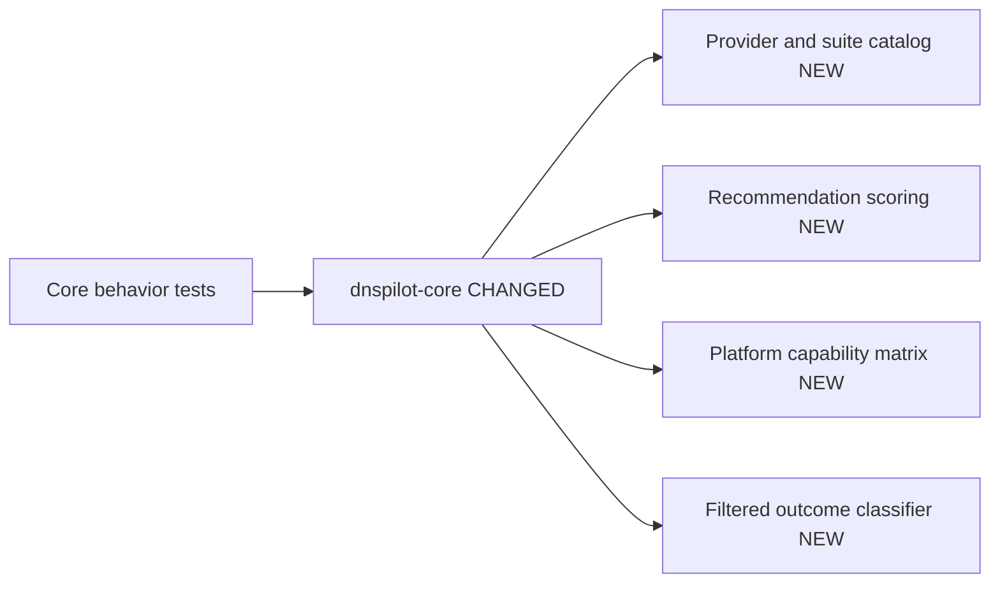
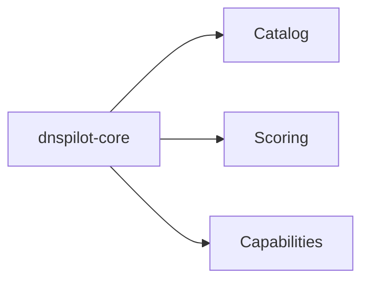
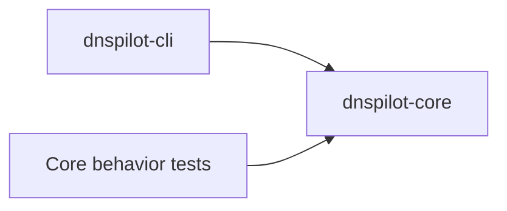
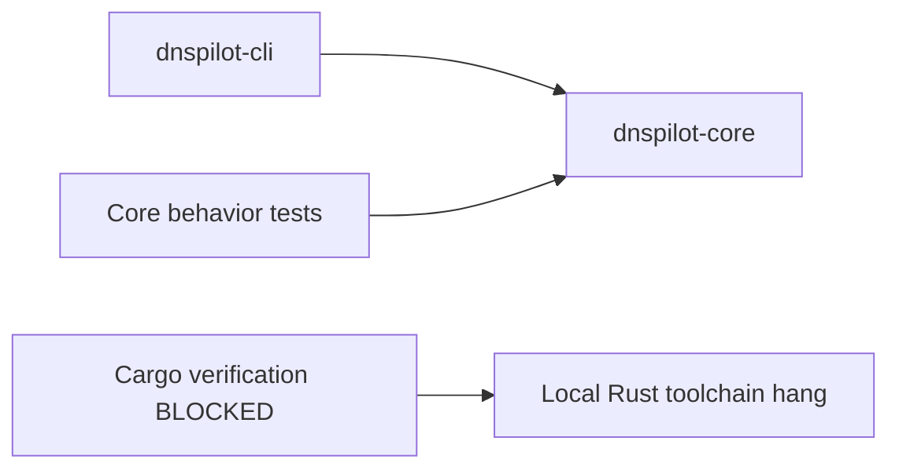
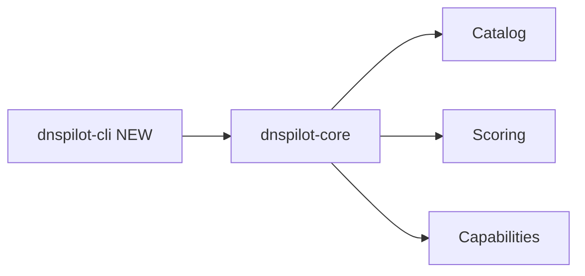

# Implementation Progress

## Plan Overview

Build DNS Pilot as a cross-platform product with a shared reusable core and
native platform shells. The first implementation slice creates the Rust core
contract for provider catalogs, test suites, recommendation scoring, filtered
DNS handling, and platform capability reporting.

## Chunks

- [x] [1] Workspace and RED tests — created Rust workspace and behavior tests.
- [x] [2] Shared core — implemented catalog, scoring, capability matrix, and validation.
- [x] [3] CLI smoke tool — added JSON commands for catalog, capability, and sample recommendation.
- [ ] [4] Verification — blocked by local Rust toolchain hang.

---

## Chunk 1: Workspace and RED Tests

**Status:** Complete
**Files changed:** `Cargo.toml`, `crates/dnspilot-core/tests/core_behaviour.rs`

### What changed

Created the workspace and behavior-first tests for the core contract. The tests
cover catalog completeness, keep-current recommendation behavior, positive
recommendation behavior, filtered DNS expected-block semantics, and platform
capabilities.

### Before

Before: nothing.

### After

---

## Chunk 2: Shared Core

**Status:** Complete
**Files changed:** `crates/dnspilot-core/src/lib.rs`

### What changed

Implemented the reusable store-safe core: DNS profile/test suite models, built-in
catalog, recommendation scoring, filtered DNS classification, profile validation,
and per-platform apply capability matrix.

### Before

### After

---

## Chunk 3: CLI Smoke Tool

**Status:** Complete
**Files changed:** `crates/dnspilot-cli/src/main.rs`

### What changed

Added a small CLI wrapper around the shared core. It emits catalog JSON,
platform capability JSON, and a deterministic sample recommendation for quick
manual checks and future integration smoke tests.

### Before

---

## Chunk 4: Verification

**Status:** Blocked
**Files changed:** none

### What changed

Attempted to run `cargo test -p dnspilot-core`, `cargo --version`, and direct
toolchain binaries under `.rustup/toolchains/stable-aarch64-apple-darwin/bin`.
The Rust binaries hang before returning version output, which indicates a local
toolchain/runtime issue rather than a project test failure.

### Before

### After

### After

