# Implementation Progress

## Plan Overview

Build DNS Pilot as a cross-platform product with a shared reusable core and
native platform shells. The first implementation slice creates the Rust core
contract for provider catalogs, test suites, recommendation scoring, filtered
DNS handling, and platform capability reporting.

## Chunks

- [x] [1] Workspace and RED tests — created Rust workspace and behavior tests.
- [x] [2] Shared core — implemented catalog, scoring, capability matrix, and validation.
- [x] [3] CLI smoke tool — added JSON commands for catalog, capability, and sample recommendation.
- [x] [4] Verification — core tests and CLI smoke commands pass.
- [x] [5] v0.1 DNS wire codec — deterministic DNS query builder and response parser.
- [x] [6] v0.1 UDP resolver client — local-testable UDP query execution.
- [x] [7] v0.1 DNS benchmark runner — multi-sample aggregation for latency and reliability.
- [x] [8] v0.1 live benchmark CLI — JSON benchmark command for manual resolver smoke tests.
- [x] [9] v0.1 TCP connect probe — local-testable connection latency aggregation.
- [x] [10] v0.1 connection-path estimator — DNS + TCP connect combined metrics with caveats.
- [x] [11] v0.1 connection-path CLI — manual DNS + TCP estimate command.
- [x] [12] v0.1 connection target guardrails — per-domain TCP target limiting and precise caveats.
- [x] [13] v0.1 dual-stack target selection — balanced IPv4/IPv6 endpoint limiting.
- [x] [14] v0.1 TLS/SNI probe contract — handshake metrics and certificate failure classification.
- [x] [15] v0.1 live TLS/SNI handshaker — Rustls handshake to resolved IP with SNI.
- [x] [16] v0.1 connection-path TLS integration — opt-in TLS/SNI reliability in core estimates.
- [x] [17] v0.1 TLS path-estimate CLI — flag and JSON samples for TLS/SNI probing.
- [x] [18] v0.1 path-estimate summary JSON — stable UI/recommendation summary fields.
- [x] [19] v0.1 path health verdicts — stable health and primary issue summary fields.
- [x] [20] v0.1 DNS resolver compare CLI — DNS-only multi-resolver recommendation.
- [x] [21] v0.1 connection-path compare CLI — DNS+TCP multi-resolver recommendation.
- [x] [22] v0.1 TLS path-compare CLI — optional TLS/SNI multi-resolver comparison.
- [x] [23] v0.1 recommendation safety gate — shared core gate for recommend/apply readiness.
- [x] [24] v0.1 storage snapshot contract — versioned local data schema.
- [x] [25] v0.1 SQLite storage backend — save/load versioned snapshots.
- [x] [26] v0.1 storage smoke CLI — create and verify SQLite snapshot.
- [x] [27] v0.1 custom profile persistence CLI — add/list custom DNS profiles.
- [x] [28] v0.1 benchmark history persistence CLI — save/list benchmark history.
- [x] [29] v0.1 path-compare history persistence CLI — save/list path comparison history.
- [x] [30] v0.1 compare history persistence CLI — save/list DNS-only comparison history.
- [x] [31] v0.1 custom suite persistence CLI — add/list custom domain suites.
- [x] [32] v0.1 benchmark saved-suite input — run benchmark from saved suite domains.
- [x] [33] v0.1 compare saved-suite input — run DNS comparison from saved suite domains.
- [x] [34] v0.1 path-compare saved-suite input — run path comparison from saved suite domains.
- [x] [35] v0.1 path-estimate saved-suite input — run path estimate from saved suite domains.
- [x] [36] v0.1 benchmark saved-profile input — run benchmark from saved plain DNS profile.
- [x] [37] v0.1 compare saved-profile input — run DNS comparison from saved plain DNS profiles.
- [x] [38] v0.1 path-estimate saved-profile input — run path estimate from saved plain DNS profile.
- [x] [39] v0.1 path-compare saved-profile input — run path comparison from saved plain DNS profiles.
- [x] [40] v0.1 custom encrypted profile persistence CLI — add/list DoH and DoT profiles.
- [x] [41] v0.1 custom filtering profile metadata — persist filtering DNS category.
- [x] [42] v0.1 DNS flush capability matrix — model flush support per platform.
- [x] [43] v0.1 full capability matrix CLI — emit all platform capabilities at once.
- [x] [44] v0.1 benchmark preflight policy — avoid flushing for direct resolver tests.
- [x] [45] v0.1 benchmark preflight CLI — expose flush guidance as JSON.
- [x] [46] v0.1 apply prompt safety policy — protect managed/intercepted networks.
- [x] [47] v0.1 apply prompt policy CLI — expose protected-network policy as JSON.
- [x] [48] v0.1 custom suite domain validation — reject invalid/duplicate domains.
- [x] [49] v0.1 custom profile server validation — reject family mismatch/duplicates.
- [x] [50] v0.1 zero-attempt CLI guards — reject empty benchmark runs consistently.
- [x] [51] v0.1 zero-timeout CLI guards — reject impossible benchmark timeouts.
- [x] [52] v0.1 zero connection-target CLI guards — reject empty path probes.
- [x] [53] v0.1 zero-port CLI guards — reject invalid resolver/connect ports.
- [x] [54] v0.1 resolved-domain CLI validation — reject invalid/duplicate domains.
- [x] [55] v0.1 encrypted profile endpoint validation — reject insecure DoH/invalid DoT.
- [x] [56] v0.1 macOS SwiftUI shell scaffold — add design tokens and capability ViewModel.
- [x] [57] v0.1 macOS capability JSON bridge — decode Rust capability schema into Swift ViewModel.
- [x] [58] v0.1 macOS catalog JSON bridge — decode Rust catalog schema into Swift ViewModel.
- [x] [59] v0.1 core shell payload contracts — expose catalog/capability payloads from Rust core.
- [x] [60] v0.1 shell payload schema version — version catalog/capability JSON contracts.
- [x] [61] v0.1 macOS schema version gate — reject unsupported shell payload versions.
- [x] [62] v0.1 macOS preview catalog summary — add default catalog bridge and summary metrics.
- [x] [63] v0.1 macOS catalog display summaries — prepare provider/suite labels for UI.
- [x] [64] v0.1 macOS catalog overview UI — render catalog summaries in the shell.
- [x] [65] v0.1 versioned policy payloads — version preflight/apply-policy JSON contracts.
- [x] [66] v0.1 macOS policy JSON decoders — decode preflight/apply-policy contracts.
- [x] [67] v0.1 macOS policy guidance ViewModel — summarize flush/apply safety.
- [x] [68] v0.1 macOS benchmark plan ViewModel — build compare/path-compare CLI args.
- [x] [69] v0.1 macOS benchmark runner — execute validated benchmark plans through an injectable process boundary.
- [x] [70] v0.1 macOS benchmark result decoder — parse compare/path-compare CLI JSON for UI display.
- [x] [71] v0.1 macOS benchmark result ViewModel — present result summaries, rows, and all-fail guardrails.
- [x] [72] v0.1 macOS benchmark execution coordinator — connect runner, decoder, and result presentation.
- [x] [73] v0.1 macOS benchmark executable locator — locate bundled CLI or development override.
- [x] [74] v0.1 macOS benchmark executable resolver — validate CLI path availability before launch.

---

## Chunk 1: Workspace and RED Tests

**Status:** Complete
**Files changed:** `Cargo.toml`, `crates/dnspilot-core/tests/core_behaviour.rs`

### What changed

Created the workspace and behavior-first tests for the core contract. The tests
cover catalog completeness, keep-current recommendation behavior, positive
recommendation behavior, filtered DNS expected-block semantics, and platform
capabilities.

### Before

Before: nothing.

### After


---

## Chunk 2: Shared Core

**Status:** Complete
**Files changed:** `crates/dnspilot-core/src/lib.rs`

### What changed

Implemented the reusable store-safe core: DNS profile/test suite models, built-in
catalog, recommendation scoring, filtered DNS classification, profile validation,
and per-platform apply capability matrix.

### Before


### After

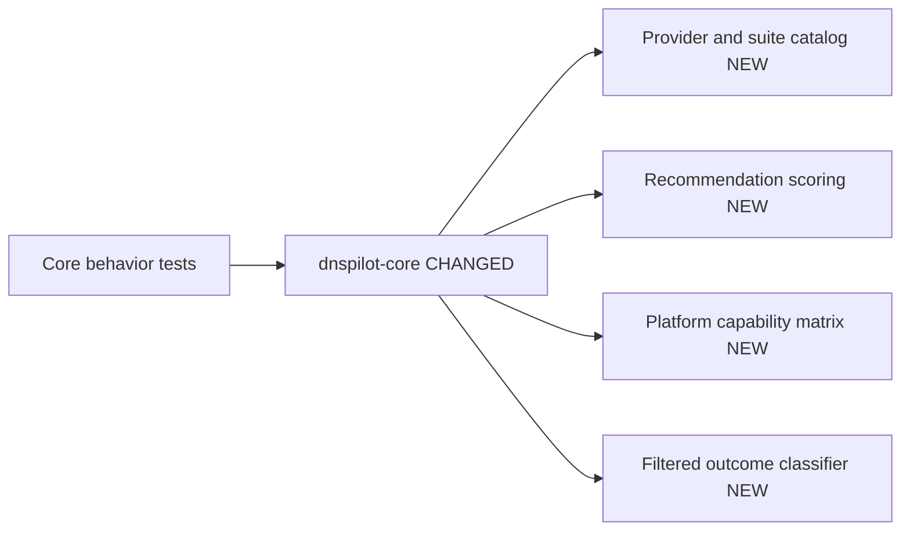

---

## Chunk 3: CLI Smoke Tool

**Status:** Complete
**Files changed:** `crates/dnspilot-cli/src/main.rs`

### What changed

Added a small CLI wrapper around the shared core. It emits catalog JSON,
platform capability JSON, and a deterministic sample recommendation for quick
manual checks and future integration smoke tests.

### Before

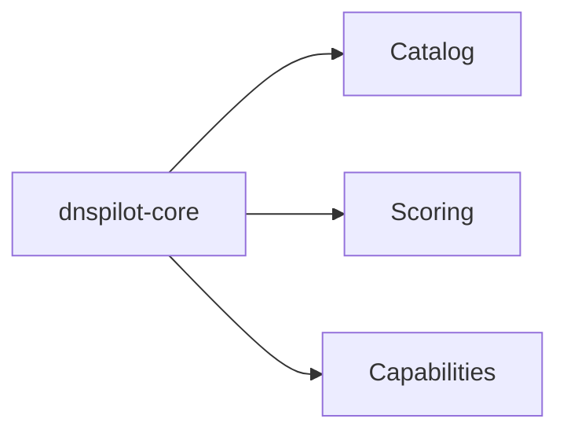

---

## Chunk 4: Verification

**Status:** Complete
**Files changed:** none

### What changed

Verified the current foundation with `cargo test -p dnspilot-core --tests` and
CLI smoke commands. The Rust toolchain initially hung during first launch, then
recovered; `rustfmt` still hangs at process startup and was not used.

### Before

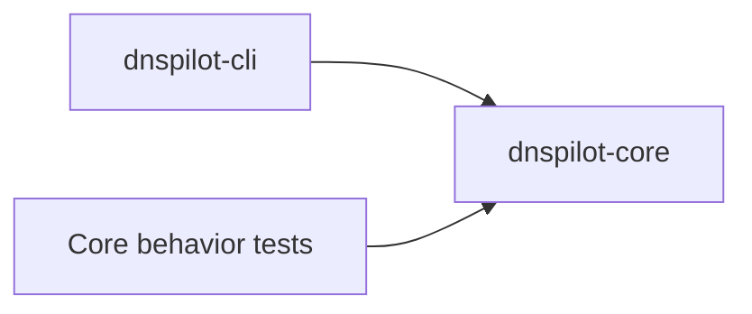

### After

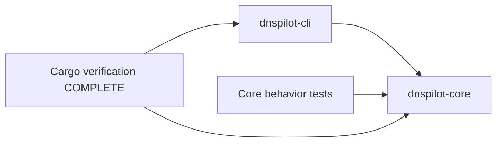

### Verification

```text
cargo test -p dnspilot-core --tests
Result: 10 passed, 0 failed

cargo run -p dnspilot-cli -- catalog
Result: emitted 9 profiles; first profile cloudflare

cargo run -p dnspilot-cli -- capability macos-store
Result: platform macos-store, apply apple-network-extension-dns-settings

cargo run -p dnspilot-cli -- recommend-sample
Result: recommends quad9 with high confidence
```

---

## Chunk 5: v0.1 DNS Wire Codec

**Status:** Complete
**Files changed:** `crates/dnspilot-core/src/dns_wire.rs`, `crates/dnspilot-core/src/lib.rs`, `crates/dnspilot-core/tests/dns_wire_behaviour.rs`

### What changed

Added deterministic DNS wire support for building plain A/AAAA query packets and
parsing compressed A/AAAA responses. This still performs no live network I/O;
it is the codec layer the future UDP benchmark runner will call.

### Before


### After

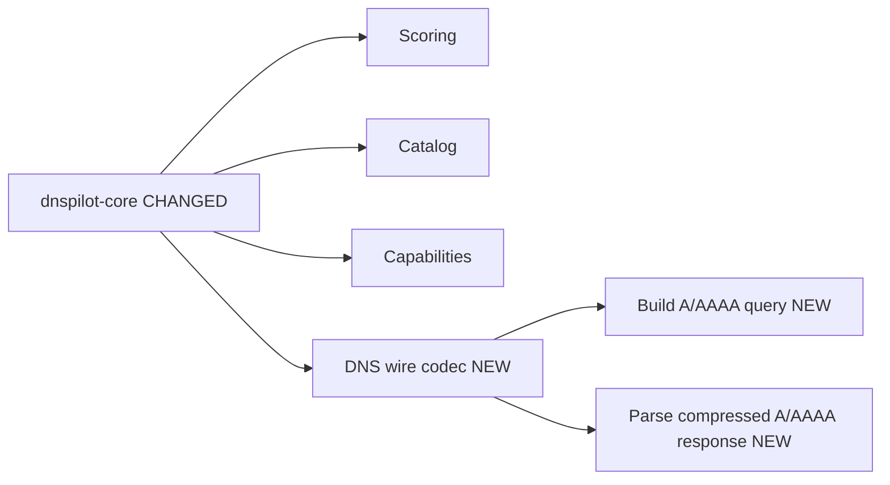

### Verification

```text
cargo test -p dnspilot-core --test dns_wire_behaviour
Result: 4 passed, 0 failed

cargo test -p dnspilot-core --tests
Result: 10 passed, 0 failed
```

---

## Chunk 6: v0.1 UDP Resolver Client

**Status:** Complete
**Files changed:** `crates/dnspilot-core/src/dns_resolver.rs`, `crates/dnspilot-core/src/lib.rs`, `crates/dnspilot-core/tests/dns_udp_resolver_behaviour.rs`

### What changed

Added a synchronous UDP DNS client that sends one query to a resolver, enforces
timeout, validates the response transaction ID, rejects non-zero DNS response
codes, and returns elapsed time with the parsed response. Tests use a local fake
UDP resolver, so this layer is verified without internet dependency.

### Before

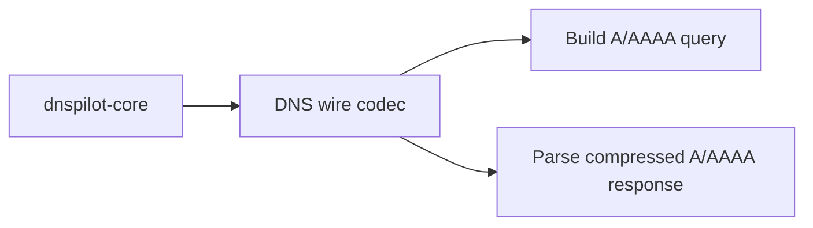

### After

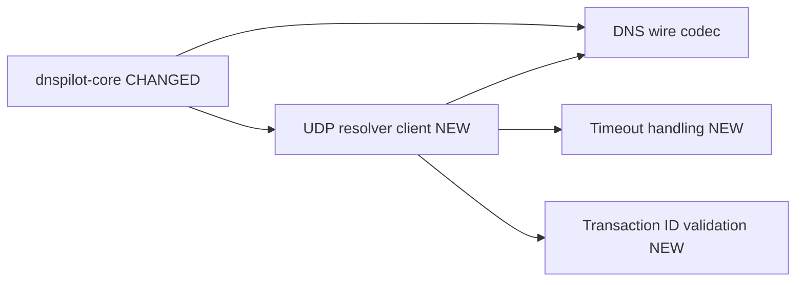

### Verification

```text
cargo test -p dnspilot-core --test dns_udp_resolver_behaviour
Result: 3 passed, 0 failed

cargo test -p dnspilot-core --tests
Result: 13 passed, 0 failed
```

---

## Chunk 7: v0.1 DNS Benchmark Runner

**Status:** Complete
**Files changed:** `crates/dnspilot-core/src/dns_benchmark.rs`, `crates/dnspilot-core/src/lib.rs`, `crates/dnspilot-core/tests/dns_benchmark_behaviour.rs`

### What changed

Added a multi-sample benchmark runner that executes A and AAAA lookups across
domains, records per-sample success/timeout/failure, and aggregates median DNS
latency, P95 latency, failure rate, timeout rate, and IPv4/IPv6 health. The
runner is testable with an injected lookup function and has a wrapper that uses
the UDP resolver client.

### Before

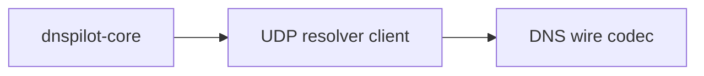

### After

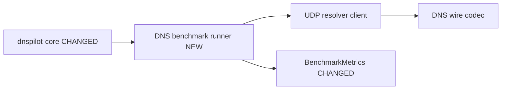

### Verification

```text
cargo test -p dnspilot-core --test dns_benchmark_behaviour
Result: 2 passed, 0 failed

cargo test --workspace --tests
Result: 15 passed, 0 failed
```

---

## Chunk 8: v0.1 Live Benchmark CLI

**Status:** Complete
**Files changed:** `crates/dnspilot-cli/src/main.rs`, `crates/dnspilot-cli/tests/cli_benchmark_behaviour.rs`

### What changed

Added `dnspilot-cli benchmark`, which accepts a resolver socket address, one or
more domains, attempt count, timeout, and optional profile ID. The command runs
the UDP benchmark path and emits JSON with metrics, per-sample outcomes, and a
plain warning that DNS results estimate resolver behavior rather than full
internet speed.

### Before

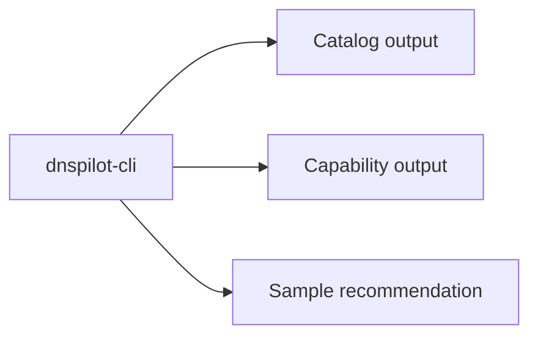

### After

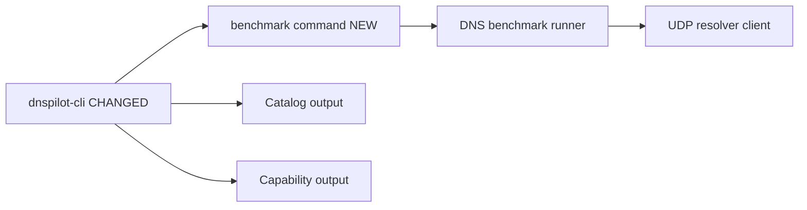

### Verification

```text
cargo test -p dnspilot-cli --test cli_benchmark_behaviour
Result: 1 passed, 0 failed

cargo test --workspace --tests
Result: 16 passed, 0 failed

cargo run -p dnspilot-cli -- benchmark --resolver 1.1.1.1:53 --domain github.com --attempts 1 --timeout-ms 1000
Result: sample_count 2, failure_rate 0.0, timeout_rate 0.0 in this run
```

---

## Chunk 9: v0.1 TCP Connect Probe

**Status:** Complete
**Files changed:** `crates/dnspilot-core/src/connect_probe.rs`, `crates/dnspilot-core/src/lib.rs`, `crates/dnspilot-core/tests/connect_probe_behaviour.rs`

### What changed

Added a TCP connect probe layer for connection-path estimates. It can measure a
single TCP connect attempt, classify timeout/failure outcomes, and aggregate
multi-sample median, P95, failure rate, and timeout rate without doing TLS yet.

### Before

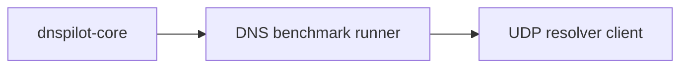

### After

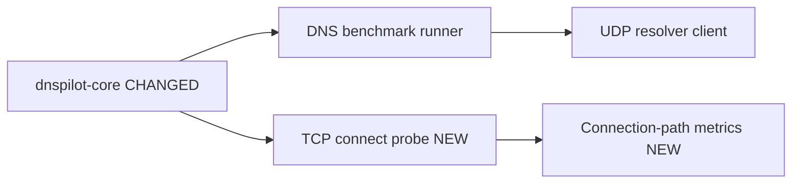

### Verification

```text
cargo test -p dnspilot-core --test connect_probe_behaviour
Result: 3 passed, 0 failed

/Users/aart/.rustup/toolchains/stable-aarch64-apple-darwin/bin/cargo test --workspace --tests
Result: 19 passed, 0 failed
```

---

## Chunk 10: v0.1 Connection-Path Estimator

**Status:** Complete
**Files changed:** `crates/dnspilot-core/src/connection_path.rs`, `crates/dnspilot-core/src/lib.rs`, `crates/dnspilot-core/tests/connection_path_behaviour.rs`

### What changed

Added a connection-path estimator that resolves A/AAAA records, extracts usable
IP endpoints, probes TCP connect latency to the configured port, and combines
DNS metrics with connect metrics. Combined failure and timeout rates are
conservative: the estimator uses the worse of DNS and connect rates so a fast
resolver with unreachable endpoints is not over-recommended.

### Before

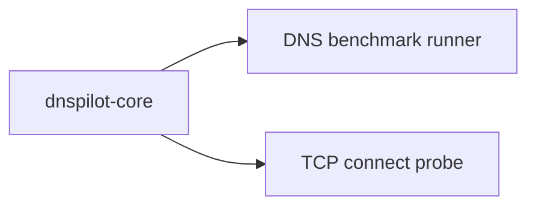

### After

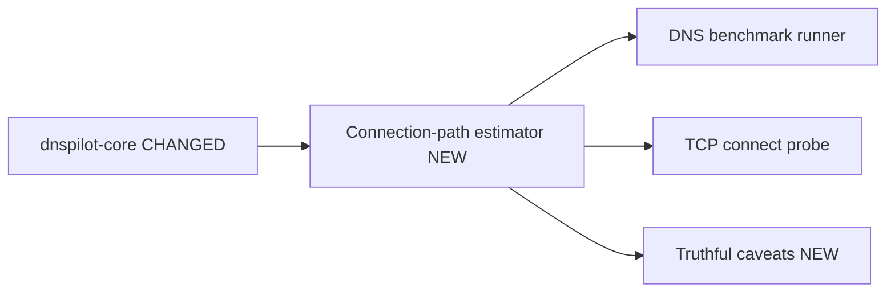

### Edge Cases Covered

- DNS success with no usable A/AAAA answers skips TCP probes and records a caveat.
- IPv6 DNS timeout lowers IPv6 health and DNS timeout rate.
- TCP connect timeout after DNS success raises combined failure/timeout rates.
- The estimator explicitly does not claim full web/app speed because TLS, HTTP,
  QUIC, browser cache, and server latency are not measured yet.

### Verification

```text
cargo test -p dnspilot-core --test connection_path_behaviour
Result: 3 passed, 0 failed

/Users/aart/.rustup/toolchains/stable-aarch64-apple-darwin/bin/cargo test --workspace --tests
Result: 22 passed, 0 failed
```

---

## Chunk 11: v0.1 Connection-Path CLI

**Status:** Complete
**Files changed:** `crates/dnspilot-cli/src/main.rs`, `crates/dnspilot-cli/tests/cli_path_estimate_behaviour.rs`

### What changed

Added `dnspilot-cli path-estimate`, which runs the connection-path estimator from
the command line and emits JSON with combined metrics, DNS samples, TCP connect
samples, connect targets, and caveats. The integration test uses a local fake DNS
resolver plus a local TCP listener so it is deterministic and does not depend on
public network state.

### Before

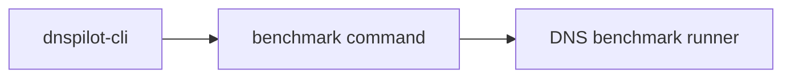

### After

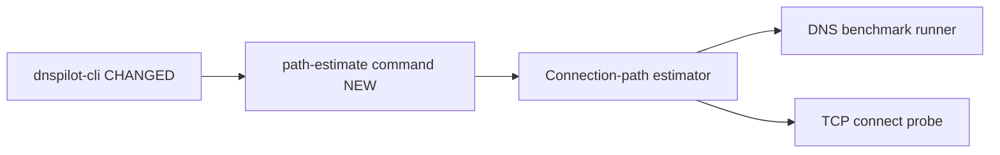

### Edge Cases / Caveats

- CLI output includes caveats stating this is not TLS, HTTP, QUIC, browser-cache,
  or server-latency measurement.
- A resolver can still look good here while failing TLS/SNI later; that is a
  known next-step gap.
- Public live smoke can vary by network, VPN, IPv6 availability, and firewall.

### Verification

```text
cargo test -p dnspilot-cli --test cli_path_estimate_behaviour
Result: 1 passed, 0 failed

/Users/aart/.rustup/toolchains/stable-aarch64-apple-darwin/bin/cargo test --workspace --tests
Result: 23 passed, 0 failed

cargo run -p dnspilot-cli -- path-estimate --resolver 1.1.1.1:53 --domain github.com --attempts 1 --dns-timeout-ms 1000 --connect-timeout-ms 1000 --connect-port 443
Result in this run: dns_sample_count 2, connect_sample_count 1, target_count 1, failure_rate 0.0
```

---

## Chunk 12: v0.1 Connection Target Guardrails

**Status:** Complete
**Files changed:** `crates/dnspilot-core/src/connection_path.rs`, `crates/dnspilot-core/tests/connection_path_behaviour.rs`, `crates/dnspilot-cli/src/main.rs`

### What changed

Added `max_connect_targets_per_domain` to limit how many resolved endpoints are
TCP-probed per domain. The CLI exposes it as
`--max-connect-targets-per-domain` with default `4`, and caveats now report only
when endpoints were actually skipped due to the limit.

### Before

```mermaid
graph LR
  PATH[Connection-path estimator] --> TARGETS[All unique resolved endpoints]
  TARGETS --> TCP[TCP connect probes]
```

### After

```mermaid
graph LR
  PATH[Connection-path estimator CHANGED] --> LIMIT[Per-domain target limit NEW]
  LIMIT --> TCP[TCP connect probes]
  LIMIT --> CAVEAT[Precise limit caveat NEW]
```

### Edge Cases / Caveats

- Large CDN answer sets are capped to avoid excessive TCP probes, battery drain,
  slow tests, and noisy network behavior.
- If endpoint count exactly equals the limit, no limit caveat is emitted because
  nothing was skipped.
- This still does not choose “best IP”; it preserves DNS answer order and limits
  probe volume. Smarter target selection is a later step.

### Verification

```text
cargo test -p dnspilot-core --test connection_path_behaviour limits_connect_targets_per_domain_and_records_caveat
Result: 1 passed, 0 failed

cargo test -p dnspilot-core --test connection_path_behaviour does_not_record_limit_caveat_when_no_endpoint_was_skipped
Result: 1 passed, 0 failed

/Users/aart/.rustup/toolchains/stable-aarch64-apple-darwin/bin/cargo test --workspace --tests
Result: 24 passed, 0 failed
```

### After

```mermaid
graph LR
  CLI[dnspilot-cli NEW] --> CORE[dnspilot-core]
  CORE --> CATALOG[Catalog]
  CORE --> SCORE[Scoring]
  CORE --> CAP[Capabilities]
```

---

## Chunk 13: v0.1 Dual-Stack Target Selection

**Status:** Complete
**Files changed:** `crates/dnspilot-core/src/connection_path.rs`, `crates/dnspilot-core/tests/connection_path_behaviour.rs`, `README.md`

### What changed

Changed connection-path target limiting from "first N endpoints per domain" to a
balanced selector that preserves both IPv4 and IPv6 when both are available.
This avoids a real bias where A records could fill the per-domain limit before
AAAA records were considered.

### Before

```mermaid
graph LR
  DNS[DNS answers] --> FIRST[First N endpoints per domain]
  FIRST --> TCP[TCP probes]
  FIRST --> BIAS[Possible IPv4-only selection]
```

### After

```mermaid
graph LR
  DNS[DNS answers] --> CANDIDATES[Unique endpoint candidates CHANGED]
  CANDIDATES --> BALANCE[Balanced IPv4/IPv6 selector NEW]
  BALANCE --> TCP[TCP probes]
  BALANCE --> CAVEAT[Balanced limit caveat CHANGED]
```

### Edge Cases / Caveats

- With limit `2` and both families available, the selector keeps one IPv4 and
  one IPv6 endpoint.
- With limit `1`, it cannot represent both families; the estimate should be
  considered weaker for dual-stack diagnosis.
- This still does not prove the best CDN endpoint. It only avoids family bias
  while keeping probe volume bounded.

### Verification

```text
cargo test -p dnspilot-core --test connection_path_behaviour limit_keeps_both_ipv4_and_ipv6_when_available
Result: 1 passed, 0 failed

/Users/aart/.rustup/toolchains/stable-aarch64-apple-darwin/bin/cargo test --workspace --tests
Result: 25 passed, 0 failed
```

---

## Chunk 14: v0.1 TLS/SNI Probe Contract

**Status:** Complete
**Files changed:** `crates/dnspilot-core/src/tls_probe.rs`, `crates/dnspilot-core/src/lib.rs`, `crates/dnspilot-core/tests/tls_probe_behaviour.rs`, `README.md`

### What changed

Added a TLS/SNI probe contract with targets, config, samples, outcomes, errors,
and aggregation. The runner accepts an injected handshaker so latency, timeout,
and certificate failure behavior can be tested deterministically before adding a
live TLS dependency.

### Before

```mermaid
graph LR
  PATH[Connection-path estimator] --> TCP[TCP connect probe]
  TCP --> METRICS[Connect latency metrics]
```

### After

```mermaid
graph LR
  PATH[Connection-path estimator] --> TCP[TCP connect probe]
  CORE[dnspilot-core CHANGED] --> TLS[TLS/SNI probe contract NEW]
  TLS --> SAMPLES[TLS samples NEW]
  TLS --> CERT[Certificate failure rate NEW]
```

### Edge Cases / Caveats

- Certificate failures are tracked separately from generic handshake failures.
  This matters for captive portals, corporate MITM, wrong endpoints, and SNI
  mismatch cases.
- The target keeps `server_name` separate from endpoint IP so future live TLS
  can connect to resolved IPs while sending the original domain as SNI.
- This chunk does not perform live TLS yet. The next chunk should add a real
  Rustls/native TLS handshaker and local deterministic TLS test coverage.

### Verification

```text
cargo test -p dnspilot-core --test tls_probe_behaviour
Result: 2 passed, 0 failed

/Users/aart/.rustup/toolchains/stable-aarch64-apple-darwin/bin/cargo test --workspace --tests
Result: 27 passed, 0 failed
```

---

## Chunk 15: v0.1 Live TLS/SNI Handshaker

**Status:** Complete
**Files changed:** `crates/dnspilot-core/src/tls_probe.rs`, `crates/dnspilot-core/tests/tls_probe_behaviour.rs`, `crates/dnspilot-core/Cargo.toml`, `Cargo.lock`, `README.md`

### What changed

Added a live Rustls TLS handshaker that connects to a resolved IP endpoint while
verifying the certificate against the target `server_name` used for SNI. The
test runs against a local Rustls server with a generated localhost certificate,
so it verifies real TLS behavior without external network dependency.

### Before

```mermaid
graph LR
  TLS[TLS/SNI probe contract] --> INJECT[Injected handshaker only]
  INJECT --> METRICS[TLS metrics]
```

### After

```mermaid
graph LR
  TLS[TLS/SNI probe CHANGED] --> LIVE[Live Rustls handshaker NEW]
  LIVE --> IP[Resolved IP endpoint]
  LIVE --> SNI[SNI server_name]
  LIVE --> CERT[Certificate verification]
  TLS --> INJECT[Injected handshaker]
```

### Edge Cases / Caveats

- The live handshaker now separates endpoint IP from SNI name. This is required
  because DNS Pilot resolves IPs first, but TLS certificates are issued for
  hostnames.
- Certificate rejection is mapped separately from generic handshake failure.
- Default trust currently uses Mozilla `webpki-roots`, not the OS trust store.
  Corporate/MDM roots can therefore be rejected here even when Safari/Chrome on
  that machine would trust them. OS-native trust should be a later platform
  adapter step.
- Rustls default crypto backend pulls `aws-lc-rs`, which increases build cost
  and should be revisited before broad mobile/Linux distribution.

### Verification

```text
cargo test -p dnspilot-core --test tls_probe_behaviour performs_live_tls_handshake_to_endpoint_with_sni_server_name
Result: 1 passed, 0 failed

cargo test -p dnspilot-core --test tls_probe_behaviour
Result: 3 passed, 0 failed

/Users/aart/.rustup/toolchains/stable-aarch64-apple-darwin/bin/cargo test --workspace --tests
Result: 28 passed, 0 failed
```

---

## Chunk 16: v0.1 Connection-Path TLS Integration

**Status:** Complete
**Files changed:** `crates/dnspilot-core/src/connection_path.rs`, `crates/dnspilot-core/tests/connection_path_behaviour.rs`, `crates/dnspilot-cli/src/main.rs`, `README.md`

### What changed

Integrated TLS/SNI probing into the connection-path estimator as an opt-in core
capability. When `tls_handshake_timeout` is set, the estimator probes TLS for
the selected resolved endpoints, includes TLS failure/timeout rates in combined
reliability, and records certificate-specific caveats.

### Before

```mermaid
graph LR
  PATH[Connection-path estimator] --> DNS[DNS benchmark]
  PATH --> TCP[TCP connect probe]
  PATH --> METRICS[Combined DNS/TCP reliability]
```

### After

```mermaid
graph LR
  PATH[Connection-path estimator CHANGED] --> DNS[DNS benchmark]
  PATH --> TCP[TCP connect probe]
  PATH --> TLS[TLS/SNI probe OPTIONAL NEW]
  TLS --> CERT[Certificate failure caveat NEW]
  TLS --> METRICS[Combined DNS/TCP/TLS reliability CHANGED]
```

### Edge Cases / Caveats

- TLS is opt-in at core level. Existing CLI `path-estimate` keeps
  `tls_handshake_timeout: None`, so manual CLI behavior is unchanged in this
  chunk.
- A path with DNS success and TCP success can still be marked unreliable if TLS
  certificate verification fails.
- Certificate failures can be valid signals for captive portals, SNI mismatch,
  or wrong edge mapping, but can be false negatives in corporate/MDM networks
  until OS-native trust store adapters exist.

### Verification

```text
CARGO_INCREMENTAL=0 cargo test -p dnspilot-core --test connection_path_behaviour tls_certificate_failures_reduce_combined_reliability_when_enabled
Result: 1 passed, 0 failed

CARGO_INCREMENTAL=0 cargo test --workspace --tests
Result: 30 passed, 0 failed
```

---

## Chunk 17: v0.1 TLS Path-Estimate CLI

**Status:** Complete
**Files changed:** `crates/dnspilot-cli/src/main.rs`, `crates/dnspilot-cli/tests/cli_path_estimate_behaviour.rs`, `README.md`

### What changed

Exposed TLS/SNI probing in `dnspilot-cli path-estimate` with
`--tls-handshake-timeout-ms`. CLI JSON now includes `tls_samples` with
`server_name`, endpoint, elapsed time, and TLS outcome when TLS probing is
enabled.

### Before

```mermaid
graph LR
  CLI[path-estimate CLI] --> CORE[Connection-path core]
  CLI --> DNS[DNS samples]
  CLI --> TCP[TCP samples]
```

### After

```mermaid
graph LR
  CLI[path-estimate CLI CHANGED] --> CORE[Connection-path core]
  CLI --> DNS[DNS samples]
  CLI --> TCP[TCP samples]
  CLI --> TLS[TLS samples OPTIONAL NEW]
```

### Edge Cases / Caveats

- TLS probing remains opt-in because it adds network work and can produce
  certificate failures in captive portal, proxy, VPN, or corporate/MDM
  environments.
- CLI output keeps `tls_samples: []` when the flag is not provided, preserving
  the existing default path-estimate behavior.
- Current TLS verification still uses bundled Mozilla roots, not OS-native
  enterprise roots.

### Verification

```text
CARGO_INCREMENTAL=0 cargo test -p dnspilot-cli --test cli_path_estimate_behaviour path_estimate_command_can_include_tls_samples_when_enabled
Result: 1 passed, 0 failed

CARGO_INCREMENTAL=0 cargo test -p dnspilot-cli --test cli_path_estimate_behaviour
Result: 2 passed, 0 failed

CARGO_INCREMENTAL=0 cargo test --workspace --tests
Result: 31 passed, 0 failed
```

## Chunk 19: v0.1 Path Health Verdicts

**Status:** Complete
**Files changed:** `crates/dnspilot-cli/src/main.rs`, `crates/dnspilot-cli/tests/cli_path_estimate_behaviour.rs`, `README.md`

### What changed

Added `summary.health` and `summary.primary_issue` to `dnspilot-cli
path-estimate`. This gives UI and recommendation flows stable verdict fields
instead of forcing them to infer state from metrics, samples, and caveat text.

### Before

```mermaid
graph LR
  SUMMARY[Path summary] --> COUNTS[Counts and scope]
  UI[UI] --> METRICS[Infer health from metrics/caveats]
```

### After

```mermaid
graph LR
  SUMMARY[Path summary CHANGED] --> COUNTS[Counts and scope]
  SUMMARY --> HEALTH[health NEW]
  SUMMARY --> ISSUE[primary_issue NEW]
  HEALTH --> UI[UI/recommendation layer]
```

### Edge Cases / Caveats

- `healthy` currently means no DNS/TCP/TLS failure or timeout was observed in
  the measured path.
- `failed` is emitted for total DNS/connect/TLS failure conditions, including
  TLS handshake failure after TCP connect succeeds.
- `degraded` is reserved for partial failures. This is a product-facing verdict,
  not a full recommendation across multiple DNS profiles yet.

### Verification

```text
CARGO_INCREMENTAL=0 cargo test -p dnspilot-cli --test cli_path_estimate_behaviour path_estimate_command_outputs_dns_and_connect_metrics
Result: 1 passed, 0 failed

CARGO_INCREMENTAL=0 cargo test -p dnspilot-cli --test cli_path_estimate_behaviour path_estimate_command_can_include_tls_samples_when_enabled
Result: 1 passed, 0 failed

CARGO_INCREMENTAL=0 cargo test -p dnspilot-cli --test cli_path_estimate_behaviour
Result: 2 passed, 0 failed

CARGO_INCREMENTAL=0 cargo test --workspace --tests
Result: 31 passed, 0 failed
```

## Chunk 20: v0.1 DNS Resolver Compare CLI

**Status:** Complete
**Files changed:** `crates/dnspilot-cli/src/main.rs`, `crates/dnspilot-cli/tests/cli_compare_behaviour.rs`, `README.md`

### What changed

Added `dnspilot-cli compare`, a DNS-only multi-resolver benchmark command. It
accepts repeated `--resolver id=host:port` entries, benchmarks each resolver
against the same domains, runs core recommendation scoring in
`fastest-raw-dns` mode, and emits stable JSON with `summary`, `runs`,
`recommendation`, and a scope warning.

### Before

```mermaid
graph LR
  CLI[CLI] --> BENCH[Single resolver benchmark]
  CLI --> PATH[Single resolver path-estimate]
```

### After

```mermaid
graph LR
  CLI[CLI CHANGED] --> BENCH[Single resolver benchmark]
  CLI --> PATH[Single resolver path-estimate]
  CLI --> COMPARE[Multi-resolver DNS compare NEW]
  COMPARE --> SCORE[Core fastest-raw-dns recommendation]
```

### Edge Cases / Caveats

- This is DNS-only compare. It does not include TCP connect, TLS/SNI, HTTP,
  QUIC, browser cache, VPN, MDM, captive portal, or app-specific behavior.
- If every resolver fails, compare returns `can_recommend=false` and
  `recommendation=null` instead of picking the least-bad failed resolver.
- Resolver IDs must be unique because recommendation/profile persistence uses
  `profile_id` as the stable identifier.
- IPv6 resolver addresses must use socket address bracket syntax, for example
  `cloudflare=[2606:4700:4700::1111]:53`.

### Verification

```text
CARGO_INCREMENTAL=0 cargo test -p dnspilot-cli --test cli_compare_behaviour
Result: 3 passed, 0 failed

CARGO_INCREMENTAL=0 cargo test -p dnspilot-cli --tests
Result: 6 passed, 0 failed

CARGO_INCREMENTAL=0 cargo test --workspace --tests
Result: 34 passed, 0 failed
```

---

## Chunk 21: v0.1 Connection-Path Compare CLI

**Status:** Complete
**Files changed:** `crates/dnspilot-cli/src/main.rs`, `crates/dnspilot-cli/tests/cli_path_compare_behaviour.rs`, `README.md`

### What changed

Added `dnspilot-cli path-compare`, a DNS+TCP multi-resolver comparison command.
It accepts repeated `--resolver id=host:port` entries, runs the existing
connection-path estimator for each resolver, scores candidates in
`best-overall` mode, and emits JSON with top-level health, per-run summaries,
raw samples, recommendation, and a scope warning.

### Before

```mermaid
graph LR
  COMPARE[compare] --> DNS[DNS-only recommendation]
  PATH[path-estimate] --> SINGLE[Single resolver DNS+TCP estimate]
```

### After

```mermaid
graph LR
  COMPARE[compare] --> DNS[DNS-only recommendation]
  PATH[path-estimate] --> SINGLE[Single resolver DNS+TCP estimate]
  PATHCOMPARE[path-compare NEW] --> MULTI[Multi-resolver DNS+TCP recommendation]
  MULTI --> SCORE[best-overall scoring]
```

### Edge Cases / Caveats

- A resolver with fast DNS can lose if its resolved endpoint fails TCP connect.
  This closes the main weakness of raw DNS-only ranking.
- If every candidate path fails or is inconclusive, path-compare returns
  `can_recommend=false` and `recommendation=null`.
- This still does not include TLS/SNI, HTTP, QUIC, browser cache, VPN, MDM,
  captive portal, or app-specific behavior.

### Verification

```text
CARGO_INCREMENTAL=0 cargo test -p dnspilot-cli --test cli_path_compare_behaviour
Result: 2 passed, 0 failed

CARGO_INCREMENTAL=0 cargo test -p dnspilot-cli --tests
Result: 8 passed, 0 failed

CARGO_INCREMENTAL=0 cargo test --workspace --tests
Result: 36 passed, 0 failed
```

---

## Chunk 22: v0.1 TLS Path-Compare CLI

**Status:** Complete
**Files changed:** `crates/dnspilot-cli/src/main.rs`, `crates/dnspilot-cli/tests/cli_path_compare_behaviour.rs`, `README.md`

### What changed

Extended `dnspilot-cli path-compare` with `--tls-handshake-timeout-ms`. When the
flag is present, each candidate resolver runs DNS, TCP connect, and TLS/SNI
handshake probes, then emits `dns-tcp-tls` scope, trust-store metadata,
per-run `tls_samples`, and conservative recommendation suppression when every
TLS path fails.

### Before

```mermaid
graph LR
  PATHCOMPARE[path-compare] --> DNS[DNS samples]
  PATHCOMPARE --> TCP[TCP connect samples]
  PATHCOMPARE --> SCORE[best-overall scoring]
```

### After

```mermaid
graph LR
  PATHCOMPARE[path-compare CHANGED] --> DNS[DNS samples]
  PATHCOMPARE --> TCP[TCP connect samples]
  PATHCOMPARE --> TLS[TLS/SNI samples NEW]
  PATHCOMPARE --> SCORE[best-overall scoring]
  TLS --> HEALTH[health and suppression CHANGED]
```

### Edge Cases / Caveats

- TLS probing currently uses the Rustls/webpki root set, not the OS-native trust
  store. Corporate roots or TLS interception can therefore appear as certificate
  failure until OS trust integration exists.
- If TCP succeeds but TLS/SNI fails for every candidate, path-compare returns
  `can_recommend=false` and `recommendation=null`.
- This still does not include HTTP, QUIC, browser cache, VPN, MDM, captive
  portal, or app-specific behavior.

### Verification

```text
CARGO_INCREMENTAL=0 cargo test -p dnspilot-cli --test cli_path_compare_behaviour
Result: 3 passed, 0 failed

CARGO_INCREMENTAL=0 cargo test -p dnspilot-cli --tests
Result: 9 passed, 0 failed

CARGO_INCREMENTAL=0 cargo test --workspace --tests
Result: 37 passed, 0 failed
```

---

## Chunk 23: v0.1 Recommendation Safety Gate

**Status:** Complete
**Files changed:** `crates/dnspilot-core/src/lib.rs`, `crates/dnspilot-core/tests/core_behaviour.rs`, `crates/dnspilot-cli/src/main.rs`, `README.md`

### What changed

Added a shared `recommendation_gate(metrics, scope)` API in `dnspilot-core`.
It returns stable `can_recommend`, `health`, `primary_issue`, and `notes`
before any caller asks the scoring engine to pick a candidate. CLI `compare`
and `path-compare` now consume this core gate instead of keeping local duplicated
rules.

### Before

```mermaid
graph LR
  COMPARE[compare CLI] --> LOCAL1[local can_recommend rule]
  PATHCOMPARE[path-compare CLI] --> LOCAL2[local can_recommend rule]
  CORE[core recommend] --> SCORE[score candidates]
```

### After

```mermaid
graph LR
  CORE[core CHANGED] --> GATE[recommendation_gate NEW]
  CORE --> SCORE[score candidates]
  COMPARE[compare CLI CHANGED] --> GATE
  PATHCOMPARE[path-compare CLI CHANGED] --> GATE
  GATE --> APPLY[UI/apply readiness]
```

### Edge Cases / Caveats

- DNS-only comparison can still recommend when TCP latency is absent, because
  that scope intentionally measures raw DNS only.
- DNS+TCP/TLS scopes suppress recommendation when every candidate lacks a usable
  connection path, even if DNS lookups themselves were fast.
- Degraded candidates can still be recommended when at least one candidate is
  usable; UI should present conservative confidence and caveats.

### Verification

```text
CARGO_INCREMENTAL=0 cargo test -p dnspilot-core --test core_behaviour recommendation_gate
Result: 3 passed, 0 failed

CARGO_INCREMENTAL=0 cargo test -p dnspilot-cli --test cli_compare_behaviour
Result: 3 passed, 0 failed

CARGO_INCREMENTAL=0 cargo test -p dnspilot-cli --test cli_path_compare_behaviour
Result: 3 passed, 0 failed

CARGO_INCREMENTAL=0 cargo test -p dnspilot-cli --tests
Result: 9 passed, 0 failed

CARGO_INCREMENTAL=0 cargo test --workspace --tests
Result: 40 passed, 0 failed
```

---

## Chunk 24: v0.1 Storage Snapshot Contract

**Status:** Complete
**Files changed:** `crates/dnspilot-core/src/storage.rs`, `crates/dnspilot-core/src/lib.rs`, `crates/dnspilot-core/tests/storage_behaviour.rs`, `README.md`

### What changed

Added a versioned storage snapshot contract for local profiles, test suites, and
benchmark history. The core now validates schema version, duplicate IDs,
profile validity, suite domains, and benchmark history shape before future
SQLite/native shells persist user data.

### Before

```mermaid
graph LR
  CORE[core] --> PROFILE[profiles]
  CORE --> SUITE[test suites]
  CORE --> BENCH[benchmark metrics]
```

### After

```mermaid
graph LR
  CORE[core CHANGED] --> PROFILE[profiles]
  CORE --> SUITE[test suites]
  CORE --> BENCH[benchmark metrics]
  CORE --> STORAGE[storage snapshot contract NEW]
  STORAGE --> VALIDATE[validation NEW]
```

### Edge Cases / Caveats

- This is a schema contract, not SQLite I/O yet.
- Schema version is strict; future migrations need explicit version handling.
- History records currently persist metrics/gate/recommendation profile id, not
  raw DNS/TCP/TLS sample arrays.

### Verification

```text
CARGO_INCREMENTAL=0 cargo test -p dnspilot-core --test storage_behaviour
Result: 3 passed, 0 failed

CARGO_INCREMENTAL=0 cargo test -p dnspilot-core --tests
Result: 34 passed, 0 failed

CARGO_INCREMENTAL=0 cargo test --workspace --tests
Result: 43 passed, 0 failed
```

---

## Chunk 25: v0.1 SQLite Storage Backend

**Status:** Complete
**Files changed:** `crates/dnspilot-core/Cargo.toml`, `Cargo.lock`, `crates/dnspilot-core/src/storage.rs`, `crates/dnspilot-core/src/lib.rs`, `crates/dnspilot-core/tests/storage_behaviour.rs`, `README.md`

### What changed

Added `SqliteStorage`, a core SQLite backend that initializes local tables,
saves a validated `StorageSnapshot`, and loads it back with validation. The
first backend stores the versioned snapshot JSON as the source of truth, keeping
migration and normalized-table work separate.

### Before

```mermaid
graph LR
  STORAGE[storage snapshot contract] --> JSON[JSON serialize/validate]
```

### After

```mermaid
graph LR
  STORAGE[storage snapshot contract] --> JSON[JSON serialize/validate]
  SQLITE[SQLite backend NEW] --> STORAGE
  SQLITE --> LOAD[load snapshot NEW]
  SQLITE --> SAVE[save snapshot NEW]
```

### Edge Cases / Caveats

- `rusqlite` is pinned to `0.32` because `0.40.1` pulled a `libsqlite3-sys`
  build script using unstable `cfg_select` on the current stable toolchain.
- The backend currently stores one snapshot blob, not normalized profile/history
  tables.
- `load_snapshot` returns an error when no snapshot has been saved yet.

### Verification

```text
CARGO_INCREMENTAL=0 cargo test -p dnspilot-core --test storage_behaviour
Result: 4 passed, 0 failed

CARGO_INCREMENTAL=0 cargo test -p dnspilot-core --tests
Result: 35 passed, 0 failed

CARGO_INCREMENTAL=0 cargo test --workspace --tests
Result: 44 passed, 0 failed
```

---

## Chunk 26: v0.1 Storage Smoke CLI

**Status:** Complete
**Files changed:** `crates/dnspilot-cli/src/main.rs`, `crates/dnspilot-cli/tests/cli_storage_behaviour.rs`, `README.md`

### What changed

Added `dnspilot-cli storage-smoke --db <path>`. The command creates a SQLite
storage backend, saves a built-in catalog snapshot, loads it back, and prints a
JSON summary for manual persistence checks.

### Before

```mermaid
graph LR
  CORE[SQLite backend] --> TEST[core storage tests]
```

### After

```mermaid
graph LR
  CORE[SQLite backend] --> TEST[core storage tests]
  CLI[storage-smoke CLI NEW] --> CORE
  CLI --> JSON[summary JSON NEW]
```

### Edge Cases / Caveats

- This persists built-in profiles/suites only; custom profile/history CLI flows
  are not implemented yet.
- Existing DB path is overwritten at snapshot row `id = 1`.
- The command is a smoke tool, not final user-facing UX.

### Verification

```text
CARGO_INCREMENTAL=0 cargo test -p dnspilot-cli --test cli_storage_behaviour
Result: 1 passed, 0 failed

CARGO_INCREMENTAL=0 cargo test -p dnspilot-cli --tests
Result: 10 passed, 0 failed

CARGO_INCREMENTAL=0 cargo test --workspace --tests
Result: 45 passed, 0 failed
```

---

## Chunk 27: v0.1 Custom Profile Persistence CLI

**Status:** Complete
**Files changed:** `crates/dnspilot-cli/src/main.rs`, `crates/dnspilot-cli/tests/cli_storage_behaviour.rs`, `README.md`

### What changed

Added `profile-add` and `profile-list` CLI commands backed by SQLite snapshots.
`profile-add` seeds a new DB with built-in catalog data when no snapshot exists,
validates the custom plain DNS profile, saves it, and `profile-list` reads it
back as JSON.

### Before

```mermaid
graph LR
  CLI[storage-smoke] --> SQLITE[SQLite snapshot]
```

### After

```mermaid
graph LR
  CLI[storage-smoke] --> SQLITE[SQLite snapshot]
  ADD[profile-add NEW] --> SQLITE
  LIST[profile-list NEW] --> SQLITE
```

### Edge Cases / Caveats

- Only plain DNS custom profiles are supported in this chunk.
- Duplicate profile IDs are rejected by snapshot validation.
- DoH/DoT custom profile fields are not exposed in CLI yet.

### Verification

```text
CARGO_INCREMENTAL=0 cargo test -p dnspilot-cli --test cli_storage_behaviour
Result: 2 passed, 0 failed

CARGO_INCREMENTAL=0 cargo test -p dnspilot-cli --tests
Result: 11 passed, 0 failed

CARGO_INCREMENTAL=0 cargo test --workspace --tests
Result: 46 passed, 0 failed
```

---

## Chunk 18: v0.1 Path-Estimate Summary JSON

**Status:** Complete
**Files changed:** `crates/dnspilot-cli/src/main.rs`, `crates/dnspilot-cli/tests/cli_path_estimate_behaviour.rs`, `README.md`

### What changed

Added a stable `summary` object to `dnspilot-cli path-estimate` JSON output.
It reports measurement scope, TLS enablement, trust store, sample counts, target
count, domain count, and caveat count so native shells and recommendation flows
do not need to infer these from raw arrays.

### Before

```mermaid
graph LR
  CLI[path-estimate CLI] --> RAW[Raw DNS/TCP/TLS arrays]
  RAW --> UI[UI infers coverage]
```

### After

```mermaid
graph LR
  CLI[path-estimate CLI CHANGED] --> RAW[Raw DNS/TCP/TLS arrays]
  CLI --> SUMMARY[Stable summary JSON NEW]
  SUMMARY --> UI[UI/recommendation layer]
```

### Edge Cases / Caveats

- `measurement_scope` is `dns-tcp` by default and `dns-tcp-tls` only when TLS
  probing is enabled.
- `trust_store` is `null` when TLS is disabled and `mozilla-webpki-roots` when
  TLS probing is enabled, making the current non-OS trust behavior explicit.
- Summary counts are descriptive only; scoring still comes from core metrics.

### Verification

```text
CARGO_INCREMENTAL=0 cargo test -p dnspilot-cli --test cli_path_estimate_behaviour path_estimate_command_outputs_dns_and_connect_metrics
Result: 1 passed, 0 failed

CARGO_INCREMENTAL=0 cargo test -p dnspilot-cli --test cli_path_estimate_behaviour path_estimate_command_can_include_tls_samples_when_enabled
Result: 1 passed, 0 failed

CARGO_INCREMENTAL=0 cargo test -p dnspilot-cli --test cli_path_estimate_behaviour
Result: 2 passed, 0 failed

CARGO_INCREMENTAL=0 cargo test --workspace --tests
Result: 31 passed, 0 failed
```

---

## Chunk 28: v0.1 Benchmark History Persistence CLI

**Status:** Complete
**Files changed:** `crates/dnspilot-cli/src/main.rs`, `crates/dnspilot-cli/tests/cli_storage_behaviour.rs`, `crates/dnspilot-core/src/lib.rs`, `crates/dnspilot-core/tests/storage_behaviour.rs`, `README.md`

### What changed

Added `benchmark --save-db <path> --history-id <id>` and `history-list --db
<path>`. Benchmark history now persists through the SQLite snapshot backend, and
DNS-only records can round-trip path metrics where connect latency is not
applicable.

### Before

```mermaid
graph LR
  BENCH[benchmark CLI] --> JSON[live JSON only]
  SQLITE[SQLite snapshot] --> PROFILES[profiles/suites]
```

### After

```mermaid
graph LR
  BENCH[benchmark CLI CHANGED] --> JSON[live JSON]
  BENCH --> HISTORY[benchmark history NEW]
  HISTORY --> SQLITE[SQLite snapshot CHANGED]
  LIST[history-list CLI NEW] --> SQLITE
```

### Edge Cases / Caveats

- `recommendation_profile_id` is stored only when the recommendation gate allows
  a recommendation.
- JSON turns non-finite latency values into `null`; storage deserialize maps only
  latency `null` values back to `Infinity` and keeps rate/health fields strict.
- This is still snapshot persistence, not normalized history tables.

### Verification

```text
CARGO_INCREMENTAL=0 cargo test -p dnspilot-core --test storage_behaviour
Result: 5 passed, 0 failed

CARGO_INCREMENTAL=0 cargo test -p dnspilot-cli --test cli_storage_behaviour
Result: 3 passed, 0 failed

CARGO_INCREMENTAL=0 cargo test -p dnspilot-cli --tests
Result: 12 passed, 0 failed

CARGO_INCREMENTAL=0 cargo test --workspace --tests
Result: 48 passed, 0 failed
```

---

## Chunk 29: v0.1 Path-Compare History Persistence CLI

**Status:** Complete
**Files changed:** `crates/dnspilot-cli/src/main.rs`, `crates/dnspilot-cli/tests/cli_path_compare_behaviour.rs`, `README.md`

### What changed

Added `path-compare --save-db <path> --history-id <id>`. Multi-resolver
connection-path comparisons now persist resolver IDs, domains, metrics,
recommendation gate, and selected recommendation profile into benchmark history.

### Before

```mermaid
graph LR
  PATH[path-compare CLI] --> JSON[live JSON only]
  HISTORY[history-list CLI] --> SQLITE[SQLite snapshot]
```

### After

```mermaid
graph LR
  PATH[path-compare CLI CHANGED] --> JSON[live JSON]
  PATH --> HISTORY[benchmark history NEW]
  HISTORY --> SQLITE[SQLite snapshot]
  LIST[history-list CLI] --> SQLITE
```

### Edge Cases / Caveats

- Saved scope is `dns-tcp` by default and `dns-tcp-tls` when TLS probing is
  enabled.
- Duplicate history IDs are rejected by storage snapshot validation.
- Failed or inconclusive path comparisons can still be saved; they persist
  `recommendation_profile_id: null`.

### Verification

```text
CARGO_INCREMENTAL=0 cargo test -p dnspilot-cli --test cli_path_compare_behaviour path_compare_command_can_save_history_to_sqlite
Result: 1 passed, 0 failed

CARGO_INCREMENTAL=0 cargo test -p dnspilot-cli --test cli_path_compare_behaviour
Result: 4 passed, 0 failed

CARGO_INCREMENTAL=0 cargo test -p dnspilot-cli --tests
Result: 13 passed, 0 failed

CARGO_INCREMENTAL=0 cargo test --workspace --tests
Result: 49 passed, 0 failed
```

---

## Chunk 30: v0.1 Compare History Persistence CLI

**Status:** Complete
**Files changed:** `crates/dnspilot-cli/src/main.rs`, `crates/dnspilot-cli/tests/cli_compare_behaviour.rs`, `README.md`

### What changed

Added `compare --save-db <path> --history-id <id>`. DNS-only multi-resolver
comparisons now persist resolver IDs, domains, metrics, recommendation gate, and
selected DNS recommendation into benchmark history.

### Before

```mermaid
graph LR
  COMPARE[compare CLI] --> JSON[live JSON only]
  HISTORY[history-list CLI] --> SQLITE[SQLite snapshot]
```

### After

```mermaid
graph LR
  COMPARE[compare CLI CHANGED] --> JSON[live JSON]
  COMPARE --> HISTORY[benchmark history NEW]
  HISTORY --> SQLITE[SQLite snapshot]
  LIST[history-list CLI] --> SQLITE
```

### Edge Cases / Caveats

- Saved scope is always `dns-only`; connection-path history remains owned by
  `path-compare`.
- Failed or inconclusive DNS comparisons can still be saved; they persist
  `recommendation_profile_id: null`.
- Duplicate history IDs are rejected by storage snapshot validation.

### Verification

```text
CARGO_INCREMENTAL=0 cargo test -p dnspilot-cli --test cli_compare_behaviour compare_command_can_save_history_to_sqlite
Result: 1 passed, 0 failed

CARGO_INCREMENTAL=0 cargo test -p dnspilot-cli --test cli_compare_behaviour
Result: 4 passed, 0 failed

CARGO_INCREMENTAL=0 cargo test -p dnspilot-cli --tests
Result: 14 passed, 0 failed

CARGO_INCREMENTAL=0 cargo test --workspace --tests
Result: 50 passed, 0 failed
```

---

## Chunk 31: v0.1 Custom Suite Persistence CLI

**Status:** Complete
**Files changed:** `crates/dnspilot-cli/src/main.rs`, `crates/dnspilot-cli/tests/cli_storage_behaviour.rs`, `README.md`

### What changed

Added `suite-add` and `suite-list` CLI commands backed by SQLite snapshots. This
lets custom domain test suites, such as Azure-focused checks, be saved as a
local option instead of typed repeatedly.

### Before

```mermaid
graph LR
  BUILTIN[built-in test suites] --> SNAPSHOT[SQLite snapshot]
  CLI[CLI] --> DOMAINS[ad hoc --domain args]
```

### After

```mermaid
graph LR
  BUILTIN[built-in test suites] --> SNAPSHOT[SQLite snapshot]
  ADD[suite-add CLI NEW] --> SNAPSHOT
  LIST[suite-list CLI NEW] --> SNAPSHOT
  CLI[CLI] --> DOMAINS[ad hoc --domain args]
```

### Edge Cases / Caveats

- Duplicate suite IDs are rejected by storage snapshot validation.
- `suite-add` requires at least one `--domain`.
- Saved suites are persisted and listed; benchmark commands do not consume
  `--suite-id` yet.

### Verification

```text
CARGO_INCREMENTAL=0 cargo test -p dnspilot-cli --test cli_storage_behaviour suite_add_command_persists_custom_domain_suite
Result: 1 passed, 0 failed

CARGO_INCREMENTAL=0 cargo test -p dnspilot-cli --test cli_storage_behaviour
Result: 4 passed, 0 failed

CARGO_INCREMENTAL=0 cargo test -p dnspilot-cli --tests
Result: 15 passed, 0 failed

CARGO_INCREMENTAL=0 cargo test --workspace --tests
Result: 51 passed, 0 failed
```

---

## Chunk 32: v0.1 Benchmark Saved-Suite Input

**Status:** Complete
**Files changed:** `crates/dnspilot-cli/src/main.rs`, `crates/dnspilot-cli/tests/cli_storage_behaviour.rs`, `README.md`

### What changed

Added `benchmark --suite-db <path> --suite-id <id>`. Benchmark can now resolve
domains from a saved custom test suite, so saved Azure/Microsoft or other
domain sets become runnable options.

### Before

```mermaid
graph LR
  SUITE[suite-add/suite-list] --> SQLITE[SQLite snapshot]
  BENCH[benchmark CLI] --> DOMAIN[required --domain args]
```

### After

```mermaid
graph LR
  SUITE[suite-add/suite-list] --> SQLITE[SQLite snapshot]
  SQLITE --> BENCH[benchmark CLI CHANGED]
  BENCH --> DOMAINS[suite domains plus ad hoc domains NEW]
```

### Edge Cases / Caveats

- `--domain` or `--suite-id` is required.
- `--suite-db` is required when `--suite-id` is used.
- `compare` and `path-compare` do not consume saved suites yet.

### Verification

```text
CARGO_INCREMENTAL=0 cargo test -p dnspilot-cli --test cli_storage_behaviour benchmark_command_can_use_saved_domain_suite
Result: 1 passed, 0 failed

CARGO_INCREMENTAL=0 cargo test -p dnspilot-cli --test cli_storage_behaviour
Result: 5 passed, 0 failed

CARGO_INCREMENTAL=0 cargo test -p dnspilot-cli --tests
Result: 16 passed, 0 failed

CARGO_INCREMENTAL=0 cargo test --workspace --tests
Result: 52 passed, 0 failed
```

---

## Chunk 33: v0.1 Compare Saved-Suite Input

**Status:** Complete
**Files changed:** `crates/dnspilot-cli/src/main.rs`, `crates/dnspilot-cli/tests/cli_compare_behaviour.rs`, `README.md`

### What changed

Added `compare --suite-db <path> --suite-id <id>`. DNS-only multi-resolver
comparison can now run against saved custom domain suites and still supports
additional ad hoc `--domain` values.

### Before

```mermaid
graph LR
  SUITE[saved suites] --> SQLITE[SQLite snapshot]
  COMPARE[compare CLI] --> DOMAIN[required --domain args]
```

### After

```mermaid
graph LR
  SUITE[saved suites] --> SQLITE[SQLite snapshot]
  SQLITE --> COMPARE[compare CLI CHANGED]
  COMPARE --> DOMAINS[suite domains plus ad hoc domains NEW]
```

### Edge Cases / Caveats

- `--domain` or `--suite-id` is required.
- `--suite-db` is required when `--suite-id` is used.
- `path-compare` does not consume saved suites yet.

### Verification

```text
CARGO_INCREMENTAL=0 cargo test -p dnspilot-cli --test cli_compare_behaviour compare_command_can_use_saved_domain_suite
Result: 1 passed, 0 failed

CARGO_INCREMENTAL=0 cargo test -p dnspilot-cli --test cli_compare_behaviour
Result: 5 passed, 0 failed

CARGO_INCREMENTAL=0 cargo test -p dnspilot-cli --tests
Result: 17 passed, 0 failed

CARGO_INCREMENTAL=0 cargo test --workspace --tests
Result: 53 passed, 0 failed
```

---

## Chunk 34: v0.1 Path-Compare Saved-Suite Input

**Status:** Complete
**Files changed:** `crates/dnspilot-cli/src/main.rs`, `crates/dnspilot-cli/tests/cli_path_compare_behaviour.rs`, `README.md`

### What changed

Added `path-compare --suite-db <path> --suite-id <id>`. Connection-path
multi-resolver comparison can now run against saved custom domain suites while
still allowing extra ad hoc `--domain` values.

### Before

```mermaid
graph LR
  SUITE[saved suites] --> SQLITE[SQLite snapshot]
  PATH[path-compare CLI] --> DOMAIN[required --domain args]
```

### After

```mermaid
graph LR
  SUITE[saved suites] --> SQLITE[SQLite snapshot]
  SQLITE --> PATH[path-compare CLI CHANGED]
  PATH --> DOMAINS[suite domains plus ad hoc domains NEW]
```

### Edge Cases / Caveats

- `--domain` or `--suite-id` is required.
- `--suite-db` is required when `--suite-id` is used.
- `path-estimate` does not consume saved suites yet.

### Verification

```text
CARGO_INCREMENTAL=0 cargo test -p dnspilot-cli --test cli_path_compare_behaviour path_compare_command_can_use_saved_domain_suite
Result: 1 passed, 0 failed

CARGO_INCREMENTAL=0 cargo test -p dnspilot-cli --test cli_path_compare_behaviour
Result: 5 passed, 0 failed

CARGO_INCREMENTAL=0 cargo test -p dnspilot-cli --tests
Result: 18 passed, 0 failed

CARGO_INCREMENTAL=0 cargo test --workspace --tests
Result: 54 passed, 0 failed
```

---

## Chunk 35: v0.1 Path-Estimate Saved-Suite Input

**Status:** Complete
**Files changed:** `crates/dnspilot-cli/src/main.rs`, `crates/dnspilot-cli/tests/cli_path_estimate_behaviour.rs`, `README.md`

### What changed

Added `path-estimate --suite-db <path> --suite-id <id>`. Single-resolver
connection-path estimates can now run against saved custom domain suites, making
suite usage consistent across benchmark, compare, path-estimate, and
path-compare.

### Before

```mermaid
graph LR
  SUITE[saved suites] --> SQLITE[SQLite snapshot]
  EST[path-estimate CLI] --> DOMAIN[required --domain args]
```

### After

```mermaid
graph LR
  SUITE[saved suites] --> SQLITE[SQLite snapshot]
  SQLITE --> EST[path-estimate CLI CHANGED]
  EST --> DOMAINS[suite domains plus ad hoc domains NEW]
```

### Edge Cases / Caveats

- `--domain` or `--suite-id` is required.
- `--suite-db` is required when `--suite-id` is used.
- Saved suite domains can be combined with extra ad hoc `--domain` values.

### Verification

```text
CARGO_INCREMENTAL=0 cargo test -p dnspilot-cli --test cli_path_estimate_behaviour path_estimate_command_can_use_saved_domain_suite
Result: 1 passed, 0 failed

CARGO_INCREMENTAL=0 cargo test -p dnspilot-cli --test cli_path_estimate_behaviour
Result: 3 passed, 0 failed

CARGO_INCREMENTAL=0 cargo test -p dnspilot-cli --tests
Result: 19 passed, 0 failed

CARGO_INCREMENTAL=0 cargo test --workspace --tests
Result: 55 passed, 0 failed
```

---

## Chunk 36: v0.1 Benchmark Saved-Profile Input

**Status:** Complete
**Files changed:** `crates/dnspilot-cli/src/main.rs`, `crates/dnspilot-cli/tests/cli_storage_behaviour.rs`, `README.md`

### What changed

Added `benchmark --profile-db <path> --profile-id <id>`. A saved plain DNS
profile can now provide the resolver address for benchmark runs, defaulting to
port 53 with `--resolver-port` available for local/test resolvers.

### Before

```mermaid
graph LR
  PROFILE[profile-add/profile-list] --> SQLITE[SQLite snapshot]
  BENCH[benchmark CLI] --> RESOLVER[required --resolver address]
```

### After

```mermaid
graph LR
  PROFILE[profile-add/profile-list] --> SQLITE[SQLite snapshot]
  SQLITE --> BENCH[benchmark CLI CHANGED]
  BENCH --> RESOLVER[saved plain DNS resolver NEW]
```

### Edge Cases / Caveats

- Only plain DNS profiles are runnable in this chunk.
- IPv4 addresses are preferred before IPv6 addresses when both exist.
- Saved profiles store IPs, not ports; runtime uses port 53 unless
  `--resolver-port` is provided.

### Verification

```text
CARGO_INCREMENTAL=0 cargo test -p dnspilot-cli --test cli_storage_behaviour benchmark_command_can_use_saved_plain_dns_profile
Result: 1 passed, 0 failed

CARGO_INCREMENTAL=0 cargo test -p dnspilot-cli --test cli_storage_behaviour
Result: 6 passed, 0 failed

CARGO_INCREMENTAL=0 cargo test -p dnspilot-cli --tests
Result: 20 passed, 0 failed

CARGO_INCREMENTAL=0 cargo test --workspace --tests
Result: 56 passed, 0 failed
```

---

## Chunk 37: v0.1 Compare Saved-Profile Input

**Status:** Complete
**Files changed:** `crates/dnspilot-cli/src/main.rs`, `crates/dnspilot-cli/tests/cli_compare_behaviour.rs`, `README.md`

### What changed

Added `compare --profile-db <path> --profile-id <id>`. DNS-only multi-resolver
comparison can now include saved plain DNS profiles and still mix in explicit
`--resolver id=host:port` entries.

### Before

```mermaid
graph LR
  PROFILE[profile-add/profile-list] --> SQLITE[SQLite snapshot]
  COMPARE[compare CLI] --> RESOLVER[explicit --resolver entries]
```

### After

```mermaid
graph LR
  PROFILE[profile-add/profile-list] --> SQLITE[SQLite snapshot]
  SQLITE --> COMPARE[compare CLI CHANGED]
  RESOLVER[explicit --resolver entries] --> COMPARE
  COMPARE --> RUNS[manual plus saved profile runs NEW]
```

### Edge Cases / Caveats

- Only plain DNS profiles are runnable.
- Saved profile IPs use port 53 unless `--resolver-port` is provided.
- Duplicate resolver/profile IDs are rejected across manual and saved inputs.

### Verification

```text
CARGO_INCREMENTAL=0 cargo test -p dnspilot-cli --test cli_compare_behaviour compare_command_can_use_saved_plain_dns_profiles
Result: 1 passed, 0 failed

CARGO_INCREMENTAL=0 cargo test -p dnspilot-cli --test cli_compare_behaviour
Result: 6 passed, 0 failed

CARGO_INCREMENTAL=0 cargo test -p dnspilot-cli --tests
Result: 21 passed, 0 failed

CARGO_INCREMENTAL=0 cargo test --workspace --tests
Result: 57 passed, 0 failed
```

---

## Chunk 38: v0.1 Path-Estimate Saved-Profile Input

**Status:** Complete
**Files changed:** `crates/dnspilot-cli/src/main.rs`, `crates/dnspilot-cli/tests/cli_path_estimate_behaviour.rs`, `README.md`

### What changed

Added `path-estimate --profile-db <path> --profile-id <id>`. A saved plain DNS
profile can now provide the resolver address for single-resolver
connection-path estimates.

### Before

```mermaid
graph LR
  PROFILE[profile-add/profile-list] --> SQLITE[SQLite snapshot]
  EST[path-estimate CLI] --> RESOLVER[required --resolver address]
```

### After

```mermaid
graph LR
  PROFILE[profile-add/profile-list] --> SQLITE[SQLite snapshot]
  SQLITE --> EST[path-estimate CLI CHANGED]
  EST --> RESOLVER[saved plain DNS resolver NEW]
```

### Edge Cases / Caveats

- Only plain DNS profiles are runnable.
- Saved profile IPs use port 53 unless `--resolver-port` is provided.
- `path-compare` does not consume saved profiles yet.

### Verification

```text
CARGO_INCREMENTAL=0 cargo test -p dnspilot-cli --test cli_path_estimate_behaviour path_estimate_command_can_use_saved_plain_dns_profile
Result: 1 passed, 0 failed

CARGO_INCREMENTAL=0 cargo test -p dnspilot-cli --test cli_path_estimate_behaviour
Result: 4 passed, 0 failed

CARGO_INCREMENTAL=0 cargo test -p dnspilot-cli --tests
Result: 22 passed, 0 failed

CARGO_INCREMENTAL=0 cargo test --workspace --tests
Result: 58 passed, 0 failed
```

---

## Chunk 39: v0.1 Path-Compare Saved-Profile Input

**Status:** Complete
**Files changed:** `crates/dnspilot-cli/src/main.rs`, `crates/dnspilot-cli/tests/cli_path_compare_behaviour.rs`, `README.md`

### What changed

Added `path-compare --profile-db <path> --profile-id <id>`. Connection-path
multi-resolver comparison can now include saved plain DNS profiles and still mix
in explicit `--resolver id=host:port` entries.

### Before

```mermaid
graph LR
  PROFILE[profile-add/profile-list] --> SQLITE[SQLite snapshot]
  PATH[path-compare CLI] --> RESOLVER[explicit --resolver entries]
```

### After

```mermaid
graph LR
  PROFILE[profile-add/profile-list] --> SQLITE[SQLite snapshot]
  SQLITE --> PATH[path-compare CLI CHANGED]
  RESOLVER[explicit --resolver entries] --> PATH
  PATH --> RUNS[manual plus saved profile runs NEW]
```

### Edge Cases / Caveats

- Only plain DNS profiles are runnable.
- Saved profile IPs use port 53 unless `--resolver-port` is provided.
- Duplicate resolver/profile IDs are rejected across manual and saved inputs.

### Verification

```text
CARGO_INCREMENTAL=0 cargo test -p dnspilot-cli --test cli_path_compare_behaviour path_compare_command_can_use_saved_plain_dns_profiles
Result: 1 passed, 0 failed

CARGO_INCREMENTAL=0 cargo test -p dnspilot-cli --test cli_path_compare_behaviour
Result: 6 passed, 0 failed

CARGO_INCREMENTAL=0 cargo test -p dnspilot-cli --tests
Result: 23 passed, 0 failed

CARGO_INCREMENTAL=0 cargo test --workspace --tests
Result: 59 passed, 0 failed
```

---

## Chunk 40: v0.1 Custom Encrypted Profile Persistence CLI

**Status:** Complete
**Files changed:** `crates/dnspilot-cli/src/main.rs`, `crates/dnspilot-cli/tests/cli_storage_behaviour.rs`, `README.md`

### What changed

Extended `profile-add` with `--protocol plain|doh|dot`, `--doh-url`, and
`--dot-hostname`. Custom DoH and DoT profiles can now be stored and listed in
the same SQLite snapshot as plain DNS profiles.

### Before

```mermaid
graph LR
  ADD[profile-add CLI] --> PLAIN[plain DNS only]
  PLAIN --> SQLITE[SQLite snapshot]
```

### After

```mermaid
graph LR
  ADD[profile-add CLI CHANGED] --> PLAIN[plain DNS]
  ADD --> DOH[DoH profile NEW]
  ADD --> DOT[DoT profile NEW]
  PLAIN --> SQLITE[SQLite snapshot]
  DOH --> SQLITE
  DOT --> SQLITE
```

### Edge Cases / Caveats

- DoH profiles require `--doh-url`.
- DoT profiles require `--dot-hostname`.
- Benchmark runners still only execute plain DNS profiles; DoH/DoT persistence
  prepares store-safe apply/profile flows.

### Verification

```text
CARGO_INCREMENTAL=0 cargo test -p dnspilot-cli --test cli_storage_behaviour profile_add_command_persists_custom_encrypted_dns_profiles
Result: 1 passed, 0 failed

CARGO_INCREMENTAL=0 cargo test -p dnspilot-cli --test cli_storage_behaviour
Result: 7 passed, 0 failed

CARGO_INCREMENTAL=0 cargo test -p dnspilot-cli --tests
Result: 24 passed, 0 failed

CARGO_INCREMENTAL=0 cargo test --workspace --tests
Result: 60 passed, 0 failed
```

---

## Chunk 41: v0.1 Custom Filtering Profile Metadata

**Status:** Complete
**Files changed:** `crates/dnspilot-cli/src/main.rs`, `crates/dnspilot-cli/tests/cli_storage_behaviour.rs`, `README.md`

### What changed

Added `profile-add --filtering none|malware|family|ads|security`. Custom DNS
profiles can now preserve their filtering category and security note metadata,
which is needed so filtered DNS can be benchmarked and explained separately from
plain performance DNS.

### Before

```mermaid
graph LR
  ADD[profile-add CLI] --> PROFILE[custom profile]
  PROFILE --> NONE[filtering_type none only]
```

### After

```mermaid
graph LR
  ADD[profile-add CLI CHANGED] --> PROFILE[custom profile]
  PROFILE --> FILTER[filtering category NEW]
  FILTER --> NOTES[filtered DNS security note NEW]
```

### Edge Cases / Caveats

- Default filtering remains `none`.
- Filtered DNS may intentionally block domains; UI/recommendation flows must not
  treat expected blocks as generic failures.
- Runner classification still needs selected test mode/filtering goal context.

### Verification

```text
CARGO_INCREMENTAL=0 cargo test -p dnspilot-cli --test cli_storage_behaviour profile_add_command_persists_custom_filtering_type
Result: 1 passed, 0 failed

CARGO_INCREMENTAL=0 cargo test -p dnspilot-cli --test cli_storage_behaviour
Result: 8 passed, 0 failed

CARGO_INCREMENTAL=0 cargo test -p dnspilot-cli --tests
Result: 25 passed, 0 failed

CARGO_INCREMENTAL=0 cargo test --workspace --tests
Result: 61 passed, 0 failed
```

---

## Chunk 42: v0.1 DNS Flush Capability Matrix

**Status:** Complete
**Files changed:** `crates/dnspilot-core/src/lib.rs`, `crates/dnspilot-core/tests/core_behaviour.rs`, `README.md`

### What changed

Added `FlushCapability` to `PlatformCapability`. The core now explicitly tells
platform shells whether DNS cache flush should be guided, unsupported, handled
by a desktop admin service, or handled through Linux resolver/polkit paths.

### Before

```mermaid
graph LR
  CAP[platform capability] --> APPLY[apply capability]
  CAP --> NOTES[notes only for flush ambiguity]
```

### After

```mermaid
graph LR
  CAP[platform capability CHANGED] --> APPLY[apply capability]
  CAP --> FLUSH[flush capability NEW]
  FLUSH --> UI[flush/test UI decisions]
```

### Edge Cases / Caveats

- Store-safe builds do not claim automatic DNS cache flush.
- iOS exposes flush as unsupported for normal apps.
- Power/native builds can later wire helper, admin service, or polkit adapters.

### Verification

```text
CARGO_INCREMENTAL=0 cargo test -p dnspilot-core --test core_behaviour flush_capabilities_match_platform_constraints
Result: 1 passed, 0 failed

CARGO_INCREMENTAL=0 cargo test -p dnspilot-core --tests
Result: 37 passed, 0 failed

CARGO_INCREMENTAL=0 cargo test --workspace --tests
Result: 62 passed, 0 failed
```

---

## Chunk 43: v0.1 Full Capability Matrix CLI

**Status:** Complete
**Files changed:** `crates/dnspilot-core/src/lib.rs`, `crates/dnspilot-cli/src/main.rs`, `crates/dnspilot-cli/tests/cli_capability_behaviour.rs`, `README.md`

### What changed

Added a core `all_platforms()` contract and a CLI `capabilities` command that
emits every platform capability in one JSON payload. This gives native shells a
single matrix read for UI capability tables while preserving per-platform
`apply` and `flush` distinctions.

### Before

```mermaid
graph LR
  CLI[CLI] --> ONE[capability platform]
  ONE --> SINGLE[single platform JSON]
```

### After

```mermaid
graph LR
  CORE[core platform list NEW] --> MATRIX[all capability records NEW]
  CLI[CLI CHANGED] --> ONE[capability platform]
  CLI --> ALL[capabilities command NEW]
  ALL --> MATRIX
```

### Edge Cases / Caveats

- The matrix is descriptive only; store-safe UI must still avoid hidden admin
  apply or flush actions.
- Linux remains capability-based, not feature-parity-based. Flatpak/Snap and
  native deb/rpm read different apply/flush paths from the same matrix.
- Adding a new platform must update the canonical `ALL_PLATFORMS` list or it
  will not appear in matrix output.

### Verification

```text
CARGO_INCREMENTAL=0 cargo test -p dnspilot-cli --test cli_capability_behaviour capabilities_command_outputs_full_matrix_with_flush_contract
RED result: failed because subcommand `capabilities` did not exist

CARGO_INCREMENTAL=0 cargo test -p dnspilot-cli --test cli_capability_behaviour capabilities_command_outputs_full_matrix_with_flush_contract
Result: 1 passed, 0 failed

CARGO_INCREMENTAL=0 cargo test --workspace --tests
Result: 63 passed, 0 failed
```

---

## Chunk 44: v0.1 Benchmark Preflight Policy

**Status:** Complete
**Files changed:** `crates/dnspilot-core/src/lib.rs`, `crates/dnspilot-core/tests/core_behaviour.rs`, `README.md`

### What changed

Added a core benchmark preflight contract that separates direct resolver
benchmarks from system-DNS validation after apply. Direct resolver scoring does
not require OS DNS cache flush because it sends DNS packets to the selected
resolver directly; system-DNS validation can recommend flush/guidance based on
the platform capability matrix.

### Before

```mermaid
graph LR
  TEST[test action] --> FLUSH[flush assumption]
  FLUSH --> BENCH[benchmark]
```

### After

```mermaid
graph LR
  TEST[test action CHANGED] --> SCOPE{preflight scope NEW}
  SCOPE --> DIRECT[direct resolver benchmark]
  SCOPE --> SYSTEM[system DNS validation after apply]
  DIRECT --> NOFLUSH[flush not needed NEW]
  SYSTEM --> POLICY[platform flush policy NEW]
```

### Edge Cases / Caveats

- Unconditional flush before every benchmark is misleading and may imply the CLI
  is testing OS resolver state when it is actually testing a selected resolver.
- iOS can recommend validation caution while still reporting normal-app DNS
  cache flush as unsupported.
- Even after flush, browser Secure DNS, VPN, MDM, captive portal, and app caches
  can invalidate system-DNS validation results.

### Verification

```text
CARGO_INCREMENTAL=0 cargo test -p dnspilot-core --test core_behaviour benchmark_preflight_distinguishes_direct_resolver_from_system_validation
RED result: failed because benchmark preflight types/function did not exist

CARGO_INCREMENTAL=0 cargo test -p dnspilot-core --test core_behaviour benchmark_preflight_distinguishes_direct_resolver_from_system_validation
Result: 1 passed, 0 failed

CARGO_INCREMENTAL=0 cargo test -p dnspilot-core --tests
Result: 38 passed, 0 failed

CARGO_INCREMENTAL=0 cargo test --workspace --tests
Result: 64 passed, 0 failed
```

---

## Chunk 45: v0.1 Benchmark Preflight CLI

**Status:** Complete
**Files changed:** `crates/dnspilot-cli/src/main.rs`, `crates/dnspilot-cli/tests/cli_preflight_behaviour.rs`, `README.md`

### What changed

Added a CLI `preflight` command that emits the core benchmark preflight policy
as JSON. Native shells and smoke scripts can now ask whether a direct resolver
benchmark or system-DNS validation needs DNS cache flush guidance for a specific
platform.

### Before

```mermaid
graph LR
  CORE[core preflight policy] --> LIB[core consumers only]
```

### After

```mermaid
graph LR
  CORE[core preflight policy] --> CLI[preflight CLI NEW]
  CLI --> JSON[platform/scope flush JSON NEW]
```

### Edge Cases / Caveats

- The command defaults to direct resolver benchmarking, where flush is not
  needed.
- System-DNS validation remains advisory; it cannot prove browser/app traffic
  used the system resolver.
- Store-safe shells should use this output to show guidance, not to execute
  hidden admin commands.

### Verification

```text
CARGO_INCREMENTAL=0 cargo test -p dnspilot-cli --test cli_preflight_behaviour
RED result: failed because subcommand `preflight` did not exist

CARGO_INCREMENTAL=0 cargo test -p dnspilot-cli --test cli_preflight_behaviour
Result: 2 passed, 0 failed

CARGO_INCREMENTAL=0 cargo test --workspace --tests
Result: 66 passed, 0 failed
```

---

## Chunk 46: v0.1 Apply Prompt Safety Policy

**Status:** Complete
**Files changed:** `crates/dnspilot-core/src/lib.rs`, `crates/dnspilot-core/tests/core_behaviour.rs`, `README.md`

### What changed

Added an apply-prompt policy for network environments. The core now defaults to
protecting the current DNS and suppressing apply prompts when VPN, MDM,
corporate DNS, or captive portal signals are present, even if a benchmark found
a faster resolver.

### Before

```mermaid
graph LR
  REC[recommendation] --> APPLY[apply prompt]
```

### After

```mermaid
graph LR
  REC[recommendation] --> POLICY[apply prompt policy NEW]
  ENV[network environment NEW] --> POLICY
  POLICY --> ALLOW[allow or guide]
  POLICY --> PROTECT[protect current DNS NEW]
```

### Edge Cases / Caveats

- VPN and MDM can intentionally own DNS; changing DNS can break security or
  corporate access.
- Captive portals can make DNS behavior look broken until login finishes.
- Windows Store and similar store-safe builds can guide settings, but should not
  perform hidden DNS changes.

### Verification

```text
CARGO_INCREMENTAL=0 cargo test -p dnspilot-core --test core_behaviour apply_prompt_policy_protects_managed_or_intercepted_networks
RED result: failed because apply prompt policy types/function did not exist

CARGO_INCREMENTAL=0 cargo test -p dnspilot-core --test core_behaviour apply_prompt_policy_protects_managed_or_intercepted_networks
Result: 1 passed, 0 failed

CARGO_INCREMENTAL=0 cargo test -p dnspilot-core --tests
Result: 39 passed, 0 failed

CARGO_INCREMENTAL=0 cargo test --workspace --tests
Result: 67 passed, 0 failed
```

---

## Chunk 47: v0.1 Apply Prompt Policy CLI

**Status:** Complete
**Files changed:** `crates/dnspilot-cli/src/main.rs`, `crates/dnspilot-cli/tests/cli_apply_policy_behaviour.rs`, `README.md`

### What changed

Added a CLI `apply-policy` command that exposes the protected-network apply
prompt policy as JSON. Platform shells can pass detected VPN, MDM, corporate
DNS, or captive portal signals and receive an explicit allow/guide/protect
decision.

### Before

```mermaid
graph LR
  CORE[core apply policy] --> LIB[core consumers only]
```

### After

```mermaid
graph LR
  SIGNALS[platform network signals] --> CLI[apply-policy CLI NEW]
  CORE[core apply policy] --> CLI
  CLI --> JSON[apply prompt JSON NEW]
```

### Edge Cases / Caveats

- The CLI does not detect VPN/MDM/corporate state itself; native shells provide
  those signals.
- A protected signal overrides otherwise valid apply capability.
- Guided store flows remain guide-only and must not imply automatic DNS changes.

### Verification

```text
CARGO_INCREMENTAL=0 cargo test -p dnspilot-cli --test cli_apply_policy_behaviour
RED result: failed because subcommand `apply-policy` did not exist

CARGO_INCREMENTAL=0 cargo test -p dnspilot-cli --test cli_apply_policy_behaviour
Result: 2 passed, 0 failed

CARGO_INCREMENTAL=0 cargo test --workspace --tests
Result: 69 passed, 0 failed
```

---

## Chunk 48: v0.1 Custom Suite Domain Validation

**Status:** Complete
**Files changed:** `crates/dnspilot-core/src/lib.rs`, `crates/dnspilot-core/src/dns_wire.rs`, `crates/dnspilot-core/src/storage.rs`, `crates/dnspilot-core/tests/storage_behaviour.rs`, `crates/dnspilot-cli/tests/cli_storage_behaviour.rs`, `README.md`

### What changed

Added shared `TestSuite::validate()` logic for custom domain suites. Storage and
CLI persistence now reject invalid DNS names and duplicate domains before a bad
suite can pollute benchmark runs or fail later inside the DNS wire layer.

### Before

```mermaid
graph LR
  SUITE[suite-add] --> SAVE[save snapshot]
  SAVE --> BAD[bad domains stored]
  BAD --> BENCH[late benchmark failure]
```

### After

```mermaid
graph LR
  SUITE[suite-add CHANGED] --> VALIDATE[TestSuite validate NEW]
  VALIDATE --> WIRE[DNS wire domain validator NEW]
  VALIDATE --> SAVE[save snapshot]
  VALIDATE --> REJECT[reject invalid or duplicate domains NEW]
```

### Edge Cases / Caveats

- Duplicate domains can overweight a target domain and distort scoring.
- Invalid domain names should fail at profile/suite creation time, not during a
  benchmark run.
- The validator reuses DNS wire name rules so suite validation matches query
  construction.

### Verification

```text
CARGO_INCREMENTAL=0 cargo test -p dnspilot-core --test storage_behaviour storage_snapshot_rejects_invalid_or_duplicate_suite_domains
RED result: failed because invalid and duplicate suite domains were accepted

CARGO_INCREMENTAL=0 cargo test -p dnspilot-cli --test cli_storage_behaviour suite_add_command_rejects_invalid_domain
RED result: failed because suite-add accepted an invalid domain

CARGO_INCREMENTAL=0 cargo test -p dnspilot-core --test storage_behaviour storage_snapshot_rejects_invalid_or_duplicate_suite_domains
Result: 1 passed, 0 failed

CARGO_INCREMENTAL=0 cargo test -p dnspilot-cli --test cli_storage_behaviour suite_add_command_rejects_invalid_domain
Result: 1 passed, 0 failed

CARGO_INCREMENTAL=0 cargo test -p dnspilot-core --tests
Result: 40 passed, 0 failed

CARGO_INCREMENTAL=0 cargo test --workspace --tests
Result: 71 passed, 0 failed
```

---

## Chunk 49: v0.1 Custom Profile Server Validation

**Status:** Complete
**Files changed:** `crates/dnspilot-core/src/lib.rs`, `crates/dnspilot-core/tests/core_behaviour.rs`, `crates/dnspilot-cli/tests/cli_storage_behaviour.rs`, `README.md`

### What changed

Strengthened DNS profile validation so IPv4 server lists only accept IPv4
addresses, IPv6 server lists only accept IPv6 addresses, and duplicate DNS
servers are rejected. CLI profile persistence inherits this validation before a
bad profile can be saved.

### Before

```mermaid
graph LR
  PROFILE[profile-add] --> PARSE[parse as any IP]
  PARSE --> SAVE[save mislabeled server]
```

### After

```mermaid
graph LR
  PROFILE[profile-add CHANGED] --> VALIDATE[profile validate CHANGED]
  VALIDATE --> IPV4[IPv4 list requires IPv4 NEW]
  VALIDATE --> IPV6[IPv6 list requires IPv6 NEW]
  VALIDATE --> DEDUPE[reject duplicate servers NEW]
```

### Edge Cases / Caveats

- An IPv6 address in `ipv4_servers` can silently break UI assumptions and later
  resolver selection.
- Duplicate server entries overweight one resolver and waste probes.
- Built-in profile validation still runs through the same storage contract.

### Verification

```text
CARGO_INCREMENTAL=0 cargo test -p dnspilot-core --test core_behaviour dns_profile_validation_rejects_mismatched_or_duplicate_server_families
RED result: failed because IPv6 addresses in the IPv4 list were accepted

CARGO_INCREMENTAL=0 cargo test -p dnspilot-cli --test cli_storage_behaviour profile_add_command_rejects_mismatched_ipv4_server
RED result: failed because profile-add accepted IPv6 in the IPv4 list

CARGO_INCREMENTAL=0 cargo test -p dnspilot-core --test core_behaviour dns_profile_validation_rejects_mismatched_or_duplicate_server_families
Result: 1 passed, 0 failed

CARGO_INCREMENTAL=0 cargo test -p dnspilot-cli --test cli_storage_behaviour profile_add_command_rejects_mismatched_ipv4_server
Result: 1 passed, 0 failed

CARGO_INCREMENTAL=0 cargo test -p dnspilot-core --tests
Result: 41 passed, 0 failed

CARGO_INCREMENTAL=0 cargo test --workspace --tests
Result: 73 passed, 0 failed
```

---

## Chunk 50: v0.1 Zero-Attempt CLI Guards

**Status:** Complete
**Files changed:** `crates/dnspilot-cli/src/main.rs`, `crates/dnspilot-cli/tests/cli_benchmark_behaviour.rs`, `crates/dnspilot-cli/tests/cli_path_estimate_behaviour.rs`, `README.md`

### What changed

Added zero-attempt validation to `benchmark` and `path-estimate` so all benchmark
entry points reject empty runs consistently. `compare` and `path-compare` already
had this guard; this closes the remaining direct command gap.

### Before

```mermaid
graph LR
  CLI[benchmark/path-estimate] --> ZERO[attempts 0]
  ZERO --> EMPTY[empty run output]
```

### After

```mermaid
graph LR
  CLI[benchmark/path-estimate CHANGED] --> CHECK[attempts guard NEW]
  CHECK --> REJECT[exit 2 with message NEW]
  CHECK --> RUN[run benchmark]
```

### Edge Cases / Caveats

- Zero samples can produce misleading success output and invalid statistics.
- Validation happens before resolver/domain work, so bad runs do not touch the
  network.
- The same user-facing error string is used across benchmark commands.

### Verification

```text
CARGO_INCREMENTAL=0 cargo test -p dnspilot-cli --test cli_benchmark_behaviour benchmark_command_rejects_zero_attempts
RED result: failed because benchmark accepted `--attempts 0`

CARGO_INCREMENTAL=0 cargo test -p dnspilot-cli --test cli_path_estimate_behaviour path_estimate_command_rejects_zero_attempts
RED result: failed because path-estimate accepted `--attempts 0`

CARGO_INCREMENTAL=0 cargo test -p dnspilot-cli --test cli_benchmark_behaviour benchmark_command_rejects_zero_attempts
Result: 1 passed, 0 failed

CARGO_INCREMENTAL=0 cargo test -p dnspilot-cli --test cli_path_estimate_behaviour path_estimate_command_rejects_zero_attempts
Result: 1 passed, 0 failed

CARGO_INCREMENTAL=0 cargo test -p dnspilot-cli --tests
Result: 34 passed, 0 failed

CARGO_INCREMENTAL=0 cargo test --workspace --tests
Result: 75 passed, 0 failed
```

---

## Chunk 51: v0.1 Zero-Timeout CLI Guards

**Status:** Complete
**Files changed:** `crates/dnspilot-cli/src/main.rs`, `crates/dnspilot-cli/tests/cli_benchmark_behaviour.rs`, `crates/dnspilot-cli/tests/cli_compare_behaviour.rs`, `crates/dnspilot-cli/tests/cli_path_estimate_behaviour.rs`, `crates/dnspilot-cli/tests/cli_path_compare_behaviour.rs`, `README.md`

### What changed

Added zero-timeout validation across benchmark, compare, path-estimate, and
path-compare commands. DNS, TCP connect, and optional TLS/SNI timeouts now reject
`0` before any network work starts.

### Before

```mermaid
graph LR
  CLI[benchmark CLI] --> ZERO[timeout 0ms]
  ZERO --> RUN[network run with impossible timeout]
```

### After

```mermaid
graph LR
  CLI[benchmark CLI CHANGED] --> CHECK[timeout guard NEW]
  CHECK --> REJECT[exit 2 with flag-specific message NEW]
  CHECK --> RUN[network run]
```

### Edge Cases / Caveats

- `0ms` timeout creates deterministic failure/noise, not useful benchmark data.
- Optional TLS timeout also rejects `0`; absence still means TLS probing disabled.
- Validation shares the same helper style as zero-attempt guards.

### Verification

```text
CARGO_INCREMENTAL=0 cargo test -p dnspilot-cli --test cli_benchmark_behaviour benchmark_command_rejects_zero_timeout
RED result: failed because benchmark accepted `--timeout-ms 0`

CARGO_INCREMENTAL=0 cargo test -p dnspilot-cli --test cli_compare_behaviour compare_command_rejects_zero_timeout
RED result: failed because compare accepted `--timeout-ms 0`

CARGO_INCREMENTAL=0 cargo test -p dnspilot-cli --test cli_path_estimate_behaviour path_estimate_command_rejects_zero_connect_timeout
RED result: failed because path-estimate accepted `--connect-timeout-ms 0`

CARGO_INCREMENTAL=0 cargo test -p dnspilot-cli --test cli_path_compare_behaviour path_compare_command_rejects_zero_tls_timeout
RED result: failed because path-compare accepted `--tls-handshake-timeout-ms 0`

CARGO_INCREMENTAL=0 cargo test -p dnspilot-cli --tests zero
Result: 7 passed, 0 failed

CARGO_INCREMENTAL=0 cargo test -p dnspilot-cli --tests
Result: 38 passed, 0 failed

CARGO_INCREMENTAL=0 cargo test --workspace --tests
Result: 79 passed, 0 failed
```

---

## Chunk 52: v0.1 Zero Connection-Target CLI Guards

**Status:** Complete
**Files changed:** `crates/dnspilot-cli/src/main.rs`, `crates/dnspilot-cli/tests/cli_path_estimate_behaviour.rs`, `crates/dnspilot-cli/tests/cli_path_compare_behaviour.rs`, `README.md`

### What changed

Added validation for `--max-connect-targets-per-domain` on `path-estimate` and
`path-compare`. A zero value is rejected before DNS/TCP work starts because it
would produce an empty connection-path probe.

### Before

```mermaid
graph LR
  PATH[path command] --> LIMIT[max targets 0]
  LIMIT --> EMPTY[no TCP targets]
```

### After

```mermaid
graph LR
  PATH[path command CHANGED] --> CHECK[target limit guard NEW]
  CHECK --> REJECT[exit 2 with message NEW]
  CHECK --> RUN[path probes]
```

### Edge Cases / Caveats

- A path benchmark with zero connect targets is not a path benchmark.
- This guard keeps recommendation-gate no-target failures for real resolver/CDN
  behavior, not user input mistakes.

### Verification

```text
CARGO_INCREMENTAL=0 cargo test -p dnspilot-cli --test cli_path_estimate_behaviour path_estimate_command_rejects_zero_max_connect_targets
RED result: failed because path-estimate accepted `--max-connect-targets-per-domain 0`

CARGO_INCREMENTAL=0 cargo test -p dnspilot-cli --test cli_path_compare_behaviour path_compare_command_rejects_zero_max_connect_targets
RED result: failed because path-compare accepted `--max-connect-targets-per-domain 0`

CARGO_INCREMENTAL=0 cargo test -p dnspilot-cli --test cli_path_estimate_behaviour path_estimate_command_rejects_zero_max_connect_targets
Result: 1 passed, 0 failed

CARGO_INCREMENTAL=0 cargo test -p dnspilot-cli --test cli_path_compare_behaviour path_compare_command_rejects_zero_max_connect_targets
Result: 1 passed, 0 failed

CARGO_INCREMENTAL=0 cargo test -p dnspilot-cli --tests
Result: 40 passed, 0 failed

CARGO_INCREMENTAL=0 cargo test --workspace --tests
Result: 81 passed, 0 failed
```

---

## Chunk 53: v0.1 Zero-Port CLI Guards

**Status:** Complete
**Files changed:** `crates/dnspilot-cli/src/main.rs`, `crates/dnspilot-cli/tests/cli_benchmark_behaviour.rs`, `crates/dnspilot-cli/tests/cli_compare_behaviour.rs`, `crates/dnspilot-cli/tests/cli_path_estimate_behaviour.rs`, `README.md`

### What changed

Added port validation for resolver and connect ports. Direct resolver addresses,
multi-resolver specs, saved-profile resolver-port fallback, and path connect
ports now reject `0` before network work starts.

### Before

```mermaid
graph LR
  CLI[benchmark CLI] --> PORT[port 0]
  PORT --> RUN[network run with invalid target]
```

### After

```mermaid
graph LR
  CLI[benchmark CLI CHANGED] --> CHECK[port guard NEW]
  CHECK --> REJECT[exit 2 with message NEW]
  CHECK --> RUN[network run]
```

### Edge Cases / Caveats

- `SocketAddr` can parse port `0`, but it is not a meaningful DNS resolver or
  TCP connect target for this app.
- Resolver specs and direct resolver args use the same `--resolver port` message.
- `--resolver-port` fallback is guarded for saved profile runs even when no
  direct resolver argument is provided.

### Verification

```text
CARGO_INCREMENTAL=0 cargo test -p dnspilot-cli --test cli_benchmark_behaviour benchmark_command_rejects_zero_resolver_port
RED result: failed because benchmark accepted `--resolver 127.0.0.1:0`

CARGO_INCREMENTAL=0 cargo test -p dnspilot-cli --test cli_compare_behaviour compare_command_rejects_zero_resolver_port
RED result: failed because compare accepted resolver spec port 0

CARGO_INCREMENTAL=0 cargo test -p dnspilot-cli --test cli_path_estimate_behaviour path_estimate_command_rejects_zero_connect_port
RED result: failed because path-estimate accepted `--connect-port 0`

CARGO_INCREMENTAL=0 cargo test -p dnspilot-cli --test cli_benchmark_behaviour benchmark_command_rejects_zero_resolver_port
Result: 1 passed, 0 failed

CARGO_INCREMENTAL=0 cargo test -p dnspilot-cli --test cli_compare_behaviour compare_command_rejects_zero_resolver_port
Result: 1 passed, 0 failed

CARGO_INCREMENTAL=0 cargo test -p dnspilot-cli --test cli_path_estimate_behaviour path_estimate_command_rejects_zero_connect_port
Result: 1 passed, 0 failed

CARGO_INCREMENTAL=0 cargo test -p dnspilot-cli --tests
Result: 43 passed, 0 failed

CARGO_INCREMENTAL=0 cargo test --workspace --tests
Result: 84 passed, 0 failed
```

---

## Chunk 54: v0.1 Resolved-Domain CLI Validation

**Status:** Complete
**Files changed:** `crates/dnspilot-cli/src/main.rs`, `crates/dnspilot-cli/tests/cli_benchmark_behaviour.rs`, `crates/dnspilot-cli/tests/cli_compare_behaviour.rs`, `README.md`

### What changed

Added validation after suite and explicit `--domain` values are merged. CLI
benchmark commands now reject invalid DNS names and duplicate resolved domains
before starting network work.

### Before

```mermaid
graph LR
  SUITE[suite domains] --> MERGE[merge domains]
  CLI[--domain values] --> MERGE
  MERGE --> RUN[benchmark run]
```

### After

```mermaid
graph LR
  SUITE[suite domains] --> MERGE[merge domains CHANGED]
  CLI[--domain values] --> MERGE
  MERGE --> VALIDATE[DNS wire validation + dedupe NEW]
  VALIDATE --> REJECT[reject invalid/duplicate NEW]
  VALIDATE --> RUN[benchmark run]
```

### Edge Cases / Caveats

- Invalid explicit domains should not be counted as resolver failures.
- Duplicate domains can overweight one destination and distort ranking.
- Suite and CLI domains are validated after merge so cross-source duplicates are
  also caught.

### Verification

```text
CARGO_INCREMENTAL=0 cargo test -p dnspilot-cli --test cli_benchmark_behaviour benchmark_command_rejects_invalid_domain_before_network
RED result: failed because benchmark accepted invalid explicit domain

CARGO_INCREMENTAL=0 cargo test -p dnspilot-cli --test cli_compare_behaviour compare_command_rejects_duplicate_domains
RED result: failed because compare accepted duplicate domains

CARGO_INCREMENTAL=0 cargo test -p dnspilot-cli --test cli_benchmark_behaviour benchmark_command_rejects_invalid_domain_before_network
Result: 1 passed, 0 failed

CARGO_INCREMENTAL=0 cargo test -p dnspilot-cli --test cli_compare_behaviour compare_command_rejects_duplicate_domains
Result: 1 passed, 0 failed

CARGO_INCREMENTAL=0 cargo test -p dnspilot-cli --tests
Result: 45 passed, 0 failed

CARGO_INCREMENTAL=0 cargo test --workspace --tests
Result: 86 passed, 0 failed
```

---

## Chunk 55: v0.1 Encrypted Profile Endpoint Validation

**Status:** Complete
**Files changed:** `crates/dnspilot-core/Cargo.toml`, `Cargo.lock`, `crates/dnspilot-core/src/lib.rs`, `crates/dnspilot-core/tests/core_behaviour.rs`, `crates/dnspilot-cli/tests/cli_storage_behaviour.rs`, `README.md`

### What changed

Added validation for encrypted DNS profile endpoints. DoH profiles now require a
parseable HTTPS URL with a host, and DoT profiles validate their hostname using
the DNS wire domain validator.

### Before

```mermaid
graph LR
  PROFILE[encrypted profile] --> FIELD[field exists]
  FIELD --> SAVE[save profile]
```

### After

```mermaid
graph LR
  PROFILE[encrypted profile CHANGED] --> DOH[DoH URL validation NEW]
  PROFILE --> DOT[DoT hostname validation NEW]
  DOH --> SAVE[save profile]
  DOT --> SAVE
  DOH --> REJECT[reject insecure/invalid endpoint NEW]
  DOT --> REJECT
```

### Edge Cases / Caveats

- `http://` is not acceptable for DoH.
- DoT needs a DNS hostname suitable for SNI, not arbitrary text.
- This still does not implement encrypted DNS benchmarking; it only validates
  stored profile metadata for future store-safe apply flows.

### Verification

```text
CARGO_INCREMENTAL=0 cargo test -p dnspilot-core --test core_behaviour dns_profile_validation_rejects_invalid_encrypted_endpoints
RED result: failed because insecure DoH URL was accepted

CARGO_INCREMENTAL=0 cargo test -p dnspilot-cli --test cli_storage_behaviour profile_add_command_rejects_insecure_doh_url
RED result: failed because profile-add accepted insecure DoH URL

CARGO_INCREMENTAL=0 cargo test -p dnspilot-core --test core_behaviour dns_profile_validation_rejects_invalid_encrypted_endpoints
Result: 1 passed, 0 failed

CARGO_INCREMENTAL=0 cargo test -p dnspilot-cli --test cli_storage_behaviour profile_add_command_rejects_insecure_doh_url
Result: 1 passed, 0 failed

cargo clean
Reason: stable toolchain updated from rustc 1.93 artifacts to rustc 1.96 during dependency fetch; target cache had incompatible proc-macro artifacts.

CARGO_INCREMENTAL=0 cargo test -p dnspilot-core --tests
Result: 42 passed, 0 failed

CARGO_INCREMENTAL=0 cargo test --workspace --tests
Result: 88 passed, 0 failed
```

---

## Chunk 56: v0.1 macOS SwiftUI Shell Scaffold

**Status:** Complete
**Files changed:** `.gitignore`, `apps/macos/DNSPilotMac/Package.swift`, `apps/macos/DNSPilotMac/Sources/DNSPilotMacCore/*`, `apps/macos/DNSPilotMac/Sources/DNSPilotMac/DNSPilotMacApp.swift`, `apps/macos/DNSPilotMac/Tests/DNSPilotMacCoreTests/CapabilityMatrixViewModelTests.swift`, `README.md`

### What changed

Added the first macOS 14+ SwiftUI shell scaffold as a Swift Package. The shell
has centralized design tokens, capability matrix models, a bridge protocol with
preview data, ViewModel tests, and a simple SwiftUI capability matrix window.

### Before

```mermaid
graph LR
  CORE[Rust core/CLI] --> NONE[no native shell]
```

### After

```mermaid
graph LR
  MAC[macOS SwiftUI shell NEW] --> VM[capability ViewModel NEW]
  VM --> BRIDGE[core bridge protocol NEW]
  MAC --> TOKENS[design tokens NEW]
  BRIDGE --> PREVIEW[preview data NEW]
```

### Edge Cases / Caveats

- The macOS shell currently uses preview bridge data; real Rust/UniFFI or CLI
  bridge wiring is a separate chunk.
- Visual/manual app inspection is not claimed yet; this chunk only verifies
  package build and ViewModel/design-token tests.
- `.build/` is ignored so SwiftPM artifacts stay out of git.

### Verification

```text
swift test --package-path apps/macos/DNSPilotMac
RED result: failed because CapabilityMatrixViewModel and DNSPilotDesign did not exist

swift test --package-path apps/macos/DNSPilotMac
Result: 2 passed, 0 failed

swift build --package-path apps/macos/DNSPilotMac
Result: build complete
```

---

## Chunk 57: v0.1 macOS Capability JSON Bridge

**Status:** Complete
**Files changed:** `apps/macos/DNSPilotMac/Sources/DNSPilotMac/DNSPilotMacApp.swift`, `apps/macos/DNSPilotMac/Sources/DNSPilotMacCore/CapabilityMatrixJSONDecoder.swift`, `apps/macos/DNSPilotMac/Sources/DNSPilotMacCore/CapabilityMatrixViewModel.swift`, `apps/macos/DNSPilotMac/Tests/DNSPilotMacCoreTests/CapabilityMatrixViewModelTests.swift`, `README.md`

### What changed

Added a Swift decoder and bridge for the Rust CLI/core `capabilities` JSON
schema. The ViewModel now supports throwing bridges and exposes a load error
message, so future CLI/FFI bridge failures do not silently render an empty
matrix.

### Before

```mermaid
graph LR
  VM[capability ViewModel] --> PREVIEW[preview bridge only]
  RUST[Rust capabilities JSON] --> GAP[not decoded by macOS shell]
```

### After

```mermaid
graph LR
  RUST[Rust capabilities JSON] --> DECODER[Swift JSON decoder NEW]
  DECODER --> JSONBRIDGE[JSON capability bridge NEW]
  JSONBRIDGE --> VM[capability ViewModel CHANGED]
  PREVIEW[preview bridge] --> VM
  VM --> ERROR[load error message NEW]
```

### Edge Cases / Caveats

- Unknown `apply` or `flush` values fail fast to catch schema drift.
- Unknown platform IDs still get a readable fallback display name, so new
  platforms can appear without losing the row.
- The macOS app still does not execute the Rust CLI or link Rust FFI at runtime;
  this chunk only locks the data contract and error path.

### Verification

```text
swift test --package-path apps/macos/DNSPilotMac --filter CapabilityMatrixViewModelTests/testCapabilitiesDecoderMapsRustCliSchema
RED result: failed because CapabilityMatrixJSONDecoder did not exist

swift test --package-path apps/macos/DNSPilotMac --filter CapabilityMatrixViewModelTests/testViewModelLoadsRowsFromJSONBridge
RED result: failed because the bridge protocol was non-throwing, CapabilityMatrixJSONBridge did not exist, and ViewModel had no loadErrorMessage

swift test --package-path apps/macos/DNSPilotMac
Result: 6 passed, 0 failed

swift build --package-path apps/macos/DNSPilotMac
Result: build complete
```

---

## Chunk 58: v0.1 macOS Catalog JSON Bridge

**Status:** Complete
**Files changed:** `apps/macos/DNSPilotMac/Sources/DNSPilotMacCore/CatalogModels.swift`, `apps/macos/DNSPilotMac/Sources/DNSPilotMacCore/CatalogJSONDecoder.swift`, `apps/macos/DNSPilotMac/Sources/DNSPilotMacCore/CatalogViewModel.swift`, `apps/macos/DNSPilotMac/Tests/DNSPilotMacCoreTests/CatalogViewModelTests.swift`, `README.md`

### What changed

Added Swift catalog models, a JSON decoder, a JSON bridge, and a CatalogViewModel
for the Rust CLI/core `catalog` schema. This covers DNS profiles and test
suites so the macOS shell can later show provider and suite data without
duplicating catalog rules.

### Before

```mermaid
graph LR
  RUSTCAT[Rust catalog JSON] --> GAP[not decoded by macOS shell]
  MAC[macOS shell] --> CAP[capability bridge only]
```

### After

```mermaid
graph LR
  RUSTCAT[Rust catalog JSON] --> CATDECODER[Swift catalog decoder NEW]
  CATDECODER --> CATBRIDGE[catalog JSON bridge NEW]
  CATBRIDGE --> CATVM[Catalog ViewModel NEW]
  MAC[macOS shell] --> CAP[capability bridge]
```

### Edge Cases / Caveats

- Unknown DNS protocol or filtering enum values fail decode, which catches
  schema drift before UI recommendation code consumes bad assumptions.
- Provider metadata and created/updated timestamps are intentionally not shown
  in the Swift shell model yet.
- Catalog data is decoded and view-modeled, but not rendered in the app UI yet.

### Verification

```text
swift test --package-path apps/macos/DNSPilotMac --filter CatalogViewModelTests/testCatalogDecoderMapsRustCliSchema
RED result: failed because CatalogSnapshot, DNSPilotCatalogBridge, CatalogJSONDecoder, CatalogJSONBridge, and CatalogViewModel did not exist

swift test --package-path apps/macos/DNSPilotMac
Intermediate result: failed because optional `.none` in the test assertion resolved to Optional.none instead of CatalogFilteringType.none

swift test --package-path apps/macos/DNSPilotMac
Result: 10 passed, 0 failed
```

---

## Chunk 59: v0.1 Core Shell Payload Contracts

**Status:** Complete
**Files changed:** `crates/dnspilot-core/src/lib.rs`, `crates/dnspilot-core/tests/core_behaviour.rs`, `crates/dnspilot-cli/src/main.rs`, `README.md`

### What changed

Added core-owned payload structs and factory functions for the shell-facing
`catalog` and `capabilities` contracts. The CLI now serializes those core
payloads instead of hand-building duplicate JSON wrappers.

### Before

```mermaid
graph LR
  CORE[core built-ins] --> CLIJSON[CLI hand-built JSON]
  CORE --> FUTURE[future FFI bridge]
  CLIJSON --> SWIFT[Swift JSON decoders]
```

### After

```mermaid
graph LR
  CORE[core built-ins] --> PAYLOADS[core payload contracts NEW]
  PAYLOADS --> CLI[CLI catalog/capabilities CHANGED]
  PAYLOADS --> FUTURE[future FFI bridge]
  CLI --> SWIFT[Swift JSON decoders]
```

### Edge Cases / Caveats

- CLI object field order may differ because it now serializes typed structs
  directly; consumers must parse JSON fields rather than compare raw text.
- `testSuites` remains explicitly camel-cased for the macOS decoder contract.
- This still does not bind Rust into Swift at runtime; it creates the single
  Rust source for the bridge payload shape.

### Verification

```text
CARGO_INCREMENTAL=0 cargo test -p dnspilot-core --test core_behaviour
RED result: failed because catalog_payload and capability_matrix_payload did not exist

CARGO_INCREMENTAL=0 cargo test -p dnspilot-core --test core_behaviour
Result: 16 passed, 0 failed

CARGO_INCREMENTAL=0 cargo test -p dnspilot-cli --test cli_capability_behaviour
Intermediate result: failed because builtin storage snapshot still needed built_in_profiles and built_in_test_suites imports

CARGO_INCREMENTAL=0 cargo test -p dnspilot-cli --test cli_capability_behaviour
Result: 1 passed, 0 failed

CARGO_INCREMENTAL=0 cargo run -p dnspilot-cli -- catalog
Result: command emitted profiles and testSuites JSON
```

---

## Chunk 60: v0.1 Shell Payload Schema Version

**Status:** Complete
**Files changed:** `crates/dnspilot-core/src/lib.rs`, `crates/dnspilot-core/tests/core_behaviour.rs`, `crates/dnspilot-cli/tests/cli_catalog_behaviour.rs`, `crates/dnspilot-cli/tests/cli_capability_behaviour.rs`, `apps/macos/DNSPilotMac/Tests/DNSPilotMacCoreTests/CatalogViewModelTests.swift`, `apps/macos/DNSPilotMac/Tests/DNSPilotMacCoreTests/CapabilityMatrixViewModelTests.swift`, `README.md`

### What changed

Added `schema_version` to the core-owned catalog and capability payloads and
locked it through CLI tests. Swift fixtures now include the version field while
the decoders continue to ignore unknown root fields they do not need.

### Before

```mermaid
graph LR
  PAYLOADS[core shell payloads] --> JSON[JSON without schema_version]
  JSON --> SWIFT[Swift decoders]
```

### After

```mermaid
graph LR
  PAYLOADS[core shell payloads CHANGED] --> VERSION[schema_version NEW]
  VERSION --> CLI[CLI contract tests NEW]
  VERSION --> SWIFT[Swift fixtures CHANGED]
```

### Edge Cases / Caveats

- This is payload schema versioning, not storage schema versioning.
- Swift currently tolerates extra root fields; if Swift later needs strict
  migration behavior, it should decode and gate on `schema_version`.
- Version stays `1` because the added field is backward-compatible for current
  decoders.

### Verification

```text
CARGO_INCREMENTAL=0 cargo test -p dnspilot-core --test core_behaviour catalog_payload_matches_builtin_catalog_contract
RED result: failed because CatalogPayload and CapabilityMatrixPayload had no schema_version field

CARGO_INCREMENTAL=0 cargo test -p dnspilot-cli --test cli_catalog_behaviour
RED result: failed because catalog JSON emitted null schema_version

CARGO_INCREMENTAL=0 cargo test -p dnspilot-core --test core_behaviour catalog_payload_matches_builtin_catalog_contract
Result: 1 passed, 0 failed

CARGO_INCREMENTAL=0 cargo test -p dnspilot-cli --test cli_catalog_behaviour
Result: 1 passed, 0 failed

CARGO_INCREMENTAL=0 cargo test -p dnspilot-cli --test cli_capability_behaviour
Result: 1 passed, 0 failed
```

---

## Chunk 61: v0.1 macOS Schema Version Gate

**Status:** Complete
**Files changed:** `apps/macos/DNSPilotMac/Sources/DNSPilotMacCore/ShellPayloadSchema.swift`, `apps/macos/DNSPilotMac/Sources/DNSPilotMacCore/CatalogModels.swift`, `apps/macos/DNSPilotMac/Sources/DNSPilotMacCore/CatalogJSONDecoder.swift`, `apps/macos/DNSPilotMac/Sources/DNSPilotMacCore/CapabilityMatrixJSONDecoder.swift`, `apps/macos/DNSPilotMac/Tests/DNSPilotMacCoreTests/CatalogViewModelTests.swift`, `apps/macos/DNSPilotMac/Tests/DNSPilotMacCoreTests/CapabilityMatrixViewModelTests.swift`, `README.md`

### What changed

Added a shared Swift schema gate for shell payloads and wired it into catalog
and capability decoders. macOS now rejects unsupported payload schema versions
instead of parsing future contracts with v1 assumptions.

### Before

```mermaid
graph LR
  JSON[payload schema_version] --> DECODER[Swift decoder ignores version]
  DECODER --> VM[ViewModel]
```

### After

```mermaid
graph LR
  JSON[payload schema_version] --> GATE[Swift schema gate NEW]
  GATE --> DECODER[Swift decoder CHANGED]
  DECODER --> VM[ViewModel]
  GATE --> ERROR[unsupported version error NEW]
```

### Edge Cases / Caveats

- Decoders now require `schema_version`; older payloads without it fail decode.
- Only version `1` is supported.
- This still does not implement migrations for future schema versions.

### Verification

```text
swift test --package-path apps/macos/DNSPilotMac --filter CapabilityMatrixViewModelTests/testCapabilitiesDecoderRejectsUnsupportedSchemaVersion
RED result: failed because the decoder did not throw for schema_version 2

swift test --package-path apps/macos/DNSPilotMac --filter CatalogViewModelTests/testCatalogDecoderRejectsUnsupportedSchemaVersion
RED result: failed because the decoder did not throw for schema_version 2

swift test --package-path apps/macos/DNSPilotMac
Result: 12 passed, 0 failed
```

---

## Chunk 62: v0.1 macOS Preview Catalog Summary

**Status:** Complete
**Files changed:** `apps/macos/DNSPilotMac/Sources/DNSPilotMacCore/CatalogViewModel.swift`, `apps/macos/DNSPilotMac/Tests/DNSPilotMacCoreTests/CatalogViewModelTests.swift`, `README.md`

### What changed

Added a default preview catalog bridge and summary metrics on CatalogViewModel.
The macOS shell now has testable catalog counts and Azure-suite presence before
the UI renders catalog panels or runtime Rust data is wired.

### Before

```mermaid
graph LR
  CALLER[caller] --> CATVM[Catalog ViewModel requires injected bridge]
  CATVM --> SNAPSHOT[catalog snapshot]
```

### After

```mermaid
graph LR
  CATVM[Catalog ViewModel CHANGED] --> PREVIEW[preview catalog bridge NEW]
  CATVM --> COUNTS[summary metrics NEW]
  PREVIEW --> SNAPSHOT[catalog snapshot]
```

### Edge Cases / Caveats

- Preview catalog data is intentionally small and is not the canonical built-in
  catalog.
- Runtime Rust catalog loading is still not wired.
- Summary counts return zero if the bridge fails and catalog is unavailable.

### Verification

```text
swift test --package-path apps/macos/DNSPilotMac --filter CatalogViewModelTests/testDefaultCatalogViewModelProvidesPreviewSummary
RED result: failed because CatalogViewModel required an explicit bridge and had no summary metrics

swift test --package-path apps/macos/DNSPilotMac
Result: 13 passed, 0 failed
```

---

## Chunk 63: v0.1 macOS Catalog Display Summaries

**Status:** Complete
**Files changed:** `apps/macos/DNSPilotMac/Sources/DNSPilotMacCore/CatalogViewModel.swift`, `apps/macos/DNSPilotMac/Tests/DNSPilotMacCoreTests/CatalogViewModelTests.swift`, `README.md`

### What changed

Added provider and test-suite summary rows to CatalogViewModel. The future
SwiftUI catalog surface can bind to preformatted server counts, filtering
labels, and domain-count labels instead of embedding formatting logic in views.

### Before

```mermaid
graph LR
  CATVM[Catalog ViewModel] --> RAW[raw catalog snapshot]
  UI[future UI] --> FORMAT[would need inline formatting]
```

### After

```mermaid
graph LR
  CATVM[Catalog ViewModel CHANGED] --> RAW[raw catalog snapshot]
  CATVM --> PROFILES[profile summaries NEW]
  CATVM --> SUITES[test suite summaries NEW]
  PROFILES --> UI[future UI]
  SUITES --> UI
```

### Edge Cases / Caveats

- Summary strings are UI-facing and English-only for now.
- IPv4/IPv6 counts are summaries, not server health checks.
- This still does not render the catalog in SwiftUI.

### Verification

```text
swift test --package-path apps/macos/DNSPilotMac --filter CatalogViewModelTests/testCatalogViewModelBuildsDisplaySummaries
RED result: failed because CatalogViewModel had no profileSummaries or testSuiteSummaries

swift test --package-path apps/macos/DNSPilotMac
Result: 14 passed, 0 failed
```

---

## Chunk 69: v0.1 macOS Benchmark Runner

**Status:** Complete
**Files changed:** `apps/macos/DNSPilotMac/Sources/DNSPilotMacCore/BenchmarkRunner.swift`, `apps/macos/DNSPilotMac/Tests/DNSPilotMacCoreTests/BenchmarkRunnerTests.swift`, `README.md`

### What changed

Added a macOS core benchmark runner boundary that validates
`BenchmarkPlanViewModel`, passes CLI arguments to an injectable process runner,
and preserves non-zero process output for UI error display.

### Edge Cases / Caveats

- Invalid plans are rejected before process execution.
- Non-zero CLI exits are result data, not thrown errors, so UI can render stderr.
- This does not yet wire the SwiftUI benchmark screen or locate the bundled CLI.

### Verification

```text
swift test --package-path apps/macos/DNSPilotMac
RED result: failed because BenchmarkRunner types did not exist

swift test --package-path apps/macos/DNSPilotMac
Result: 26 passed, 0 failed

swift build --package-path apps/macos/DNSPilotMac
Result: build complete

CARGO_INCREMENTAL=0 cargo test --workspace --tests
Result: 93 passed, 0 failed
```

---

## Chunk 74: v0.1 macOS Benchmark Executable Resolver

**Status:** Complete
**Files changed:** `apps/macos/DNSPilotMac/Sources/DNSPilotMacCore/BenchmarkExecutableResolver.swift`, `apps/macos/DNSPilotMac/Tests/DNSPilotMacCoreTests/BenchmarkExecutableResolverTests.swift`, `README.md`

### What changed

Added executable availability checks on top of the path locator, covering ready,
missing, directory, and non-executable states before launching the benchmark
process.

### Edge Cases / Caveats

- Filesystem is injected for deterministic tests.
- Error text is stable for UI display.
- Packaging still needs to include an executable `dnspilot-cli` resource.

### Verification

```text
swift test --package-path apps/macos/DNSPilotMac
RED result: failed because BenchmarkExecutableResolver did not exist

swift test --package-path apps/macos/DNSPilotMac
Result: 41 passed, 0 failed

swift build --package-path apps/macos/DNSPilotMac
Result: build complete

CARGO_INCREMENTAL=0 cargo test --workspace --tests
Result: 93 passed, 0 failed
```

---

## Chunk 73: v0.1 macOS Benchmark Executable Locator

**Status:** Complete
**Files changed:** `apps/macos/DNSPilotMac/Sources/DNSPilotMacCore/BenchmarkExecutableLocator.swift`, `apps/macos/DNSPilotMac/Tests/DNSPilotMacCoreTests/BenchmarkExecutableLocatorTests.swift`, `README.md`

### What changed

Added path resolution for the benchmark CLI, preferring
`DNSPILOT_CLI_PATH` in development and falling back to a bundled
`dnspilot-cli` resource.

### Edge Cases / Caveats

- Missing CLI returns a stable display message.
- This is a path locator, not a filesystem/executable permission validator.
- Actual packaging/bundling is still not implemented.

### Verification

```text
swift test --package-path apps/macos/DNSPilotMac
RED result: failed because BenchmarkExecutableLocator did not exist

swift test --package-path apps/macos/DNSPilotMac
Result: 37 passed, 0 failed

swift build --package-path apps/macos/DNSPilotMac
Result: build complete

CARGO_INCREMENTAL=0 cargo test --workspace --tests
Result: 93 passed, 0 failed
```

---

## Chunk 72: v0.1 macOS Benchmark Execution Coordinator

**Status:** Complete
**Files changed:** `apps/macos/DNSPilotMac/Sources/DNSPilotMacCore/BenchmarkExecutionCoordinator.swift`, `apps/macos/DNSPilotMac/Tests/DNSPilotMacCoreTests/BenchmarkExecutionCoordinatorTests.swift`, `README.md`

### What changed

Added a sync coordinator that validates and runs a benchmark plan, maps non-zero
CLI exits to displayable errors, decodes successful JSON output, and returns a
benchmark result ViewModel.

### Edge Cases / Caveats

- Invalid plans do not start the process.
- Non-zero exits prefer stderr, then stdout, then exit code text.
- Invalid JSON becomes a stable user-facing parse error.

### Verification

```text
swift test --package-path apps/macos/DNSPilotMac
RED result: failed because BenchmarkExecutionCoordinator did not exist

swift test --package-path apps/macos/DNSPilotMac
Result: 34 passed, 0 failed

swift build --package-path apps/macos/DNSPilotMac
Result: build complete

CARGO_INCREMENTAL=0 cargo test --workspace --tests
Result: 93 passed, 0 failed
```

---

## Chunk 71: v0.1 macOS Benchmark Result ViewModel

**Status:** Complete
**Files changed:** `apps/macos/DNSPilotMac/Sources/DNSPilotMacCore/BenchmarkResultViewModel.swift`, `apps/macos/DNSPilotMac/Tests/DNSPilotMacCoreTests/BenchmarkResultViewModelTests.swift`, `README.md`

### What changed

Added presentation labels and rows for decoded benchmark results, including
catalog-backed profile names, confidence/health/scope labels, notes, warning,
and all-failed latency `n/a` guardrails.

### Edge Cases / Caveats

- Result rows use CLI order; sorting/filtering is still UI work.
- All-failed zero latency is displayed as `n/a` to avoid implying a fast run.
- This still does not render the benchmark screen.

### Verification

```text
swift test --package-path apps/macos/DNSPilotMac
RED result: failed because BenchmarkResultViewModel did not exist

swift test --package-path apps/macos/DNSPilotMac
Result: 30 passed, 0 failed

swift build --package-path apps/macos/DNSPilotMac
Result: build complete

CARGO_INCREMENTAL=0 cargo test --workspace --tests
Result: 93 passed, 0 failed
```

---

## Chunk 70: v0.1 macOS Benchmark Result Decoder

**Status:** Complete
**Files changed:** `apps/macos/DNSPilotMac/Sources/DNSPilotMacCore/BenchmarkResultModels.swift`, `apps/macos/DNSPilotMac/Tests/DNSPilotMacCoreTests/BenchmarkResultDecoderTests.swift`, `README.md`

### What changed

Added Swift models and JSON decoder for compare/path-compare CLI result
payloads, covering summary status, run metrics, optional recommendation, saved
history id, and warning text.

### Edge Cases / Caveats

- Per-sample DNS/TCP/TLS arrays are intentionally not decoded yet.
- `primary_issue` stays a raw string so path-estimate/path-compare issue labels
  can evolve without blocking UI summary rendering.
- CLI result payloads are not schema-versioned yet.

### Verification

```text
swift test --package-path apps/macos/DNSPilotMac
RED result: failed because BenchmarkResultJSONDecoder did not exist

swift test --package-path apps/macos/DNSPilotMac
Result: 28 passed, 0 failed

swift build --package-path apps/macos/DNSPilotMac
Result: build complete

CARGO_INCREMENTAL=0 cargo test --workspace --tests
Result: 93 passed, 0 failed
```

---

## Chunk 66: v0.1 macOS Policy JSON Decoders

**Status:** Complete
**Files changed:** `apps/macos/DNSPilotMac/Sources/DNSPilotMacCore/PolicyModels.swift`, `apps/macos/DNSPilotMac/Sources/DNSPilotMacCore/PolicyJSONDecoder.swift`, `apps/macos/DNSPilotMac/Tests/DNSPilotMacCoreTests/PolicyPayloadDecoderTests.swift`, `README.md`

### What changed

Added Swift models and strict JSON decoders for versioned `preflight` and
`apply-policy` payloads. macOS can now parse flush requirement, apply
capability, protected-network disposition, and schema-version failures.

### Before

```mermaid
graph LR
  CLI[versioned preflight/apply JSON] --> GAP[no macOS decoder]
```

### After

```mermaid
graph LR
  CLI[versioned preflight/apply JSON] --> DECODER[macOS policy decoders NEW]
  DECODER --> PREFLIGHT[PreflightPolicy NEW]
  DECODER --> APPLY[ApplyPolicy NEW]
  DECODER --> GATE[schema gate]
```

### Edge Cases / Caveats

- Unknown enum values fail fast instead of falling back.
- Only schema version `1` is supported.
- These decoders are not yet wired into a benchmark/apply UI workflow.

### Verification

```text
swift test --package-path apps/macos/DNSPilotMac --filter PolicyPayloadDecoderTests/testPreflightDecoderMapsRustCliSchema
RED result: failed because PreflightJSONDecoder and policy models did not exist

swift test --package-path apps/macos/DNSPilotMac --filter PolicyPayloadDecoderTests/testApplyPolicyDecoderMapsRustCliSchema
RED result: failed because ApplyPolicyJSONDecoder and policy models did not exist

swift test --package-path apps/macos/DNSPilotMac
Result: 18 passed, 0 failed
```

---

## Chunk 67: v0.1 macOS Policy Guidance ViewModel

**Status:** Complete
**Files changed:** `apps/macos/DNSPilotMac/Sources/DNSPilotMacCore/PolicyGuidanceViewModel.swift`, `apps/macos/DNSPilotMac/Tests/DNSPilotMacCoreTests/PolicyPayloadDecoderTests.swift`, `README.md`

### What changed

Added a ViewModel that turns decoded preflight/apply-policy data into UI-ready
guidance labels. It explicitly distinguishes direct resolver benchmarks that do
not need flushing from system-DNS validation that should guide a flush first.

### Before

```mermaid
graph LR
  POLICY[decoded policies] --> UI[future UI would decide labels]
```

### After

```mermaid
graph LR
  POLICY[decoded policies] --> VM[policy guidance ViewModel NEW]
  VM --> FLUSH[flush label NEW]
  VM --> APPLY[apply action label NEW]
  VM --> NOTES[merged notes NEW]
```

### Edge Cases / Caveats

- Guidance labels are English-only for now.
- This is UI guidance, not an OS apply adapter.
- Protected-network policy suppresses apply prompts even if the platform can
  normally apply.

### Verification

```text
swift test --package-path apps/macos/DNSPilotMac --filter PolicyPayloadDecoderTests/testPolicyGuidanceKeepsDirectBenchmarkFromFlushing
RED result: failed because PolicyGuidanceViewModel did not exist

swift test --package-path apps/macos/DNSPilotMac
Result: 20 passed, 0 failed
```

---

## Chunk 68: v0.1 macOS Benchmark Plan ViewModel

**Status:** Complete
**Files changed:** `apps/macos/DNSPilotMac/Sources/DNSPilotMacCore/BenchmarkPlanViewModel.swift`, `apps/macos/DNSPilotMac/Tests/DNSPilotMacCoreTests/BenchmarkPlanViewModelTests.swift`, `README.md`

### What changed

Added a testable macOS benchmark planning ViewModel. It turns selected plain DNS
profiles, suite/custom domains, attempts, and DNS-only/path mode into CLI
arguments for `compare` or `path-compare`.

### Before

```mermaid
graph LR
  CATALOG[catalog] --> UI[future benchmark UI]
  UI --> ARGS[would need ad hoc CLI args]
```

### After

```mermaid
graph LR
  CATALOG[catalog] --> PLAN[benchmark plan ViewModel NEW]
  PLAN --> VALIDATION[validation NEW]
  PLAN --> ARGS[compare/path-compare args NEW]
```

### Edge Cases / Caveats

- Only plain DNS profiles with a usable IPv4/IPv6 server are runnable for this
  plain resolver benchmark path.
- DoH/DoT profiles are rejected for this path until encrypted benchmarking is
  implemented.
- This builds arguments only; it does not execute benchmark processes yet.

### Verification

```text
swift test --package-path apps/macos/DNSPilotMac --filter BenchmarkPlanViewModelTests/testBenchmarkPlanBuildsCompareArgsFromSelectedProfilesAndSuite
RED result: failed because BenchmarkPlanViewModel did not exist

swift test --package-path apps/macos/DNSPilotMac
Result: 23 passed, 0 failed
```

---

## Chunk 64: v0.1 macOS Catalog Overview UI

**Status:** Complete
**Files changed:** `apps/macos/DNSPilotMac/Sources/DNSPilotMac/DNSPilotMacApp.swift`, `README.md`, `progress.md`

### What changed

Reworked the macOS shell into a sidebar-driven shell with Capabilities and
Catalog destinations. The Catalog detail now renders provider/test-suite
summary metrics and rows using the existing design tokens.

### Before

```mermaid
graph LR
  APP[macOS app] --> CAP[capability matrix only]
  CATVM[catalog ViewModel] --> UNUSED[not rendered]
```

### After

```mermaid
graph LR
  APP[macOS app CHANGED] --> SIDEBAR[sidebar navigation NEW]
  SIDEBAR --> CAP[capability matrix]
  SIDEBAR --> CAT[catalog overview NEW]
  CAT --> METRICS[summary metrics NEW]
  CAT --> ROWS[provider/suite rows NEW]
```

### Edge Cases / Caveats

- Catalog UI currently uses preview catalog data, not live Rust runtime data.
- Unit/build tests verify compilation, but visual spacing and sidebar behavior
  need manual inspection in the running macOS app.
- Menu bar/tray behavior is still not implemented.

### Verification

```text
swift test --package-path apps/macos/DNSPilotMac
Result: 14 passed, 0 failed

swift build --package-path apps/macos/DNSPilotMac
Result: build complete

CARGO_INCREMENTAL=0 cargo test --workspace --tests
Result: 91 passed, 0 failed
```

---

## Chunk 65: v0.1 Versioned Policy Payloads

**Status:** Complete
**Files changed:** `crates/dnspilot-core/src/lib.rs`, `crates/dnspilot-core/tests/core_behaviour.rs`, `crates/dnspilot-cli/src/main.rs`, `crates/dnspilot-cli/tests/cli_preflight_behaviour.rs`, `crates/dnspilot-cli/tests/cli_apply_policy_behaviour.rs`, `README.md`

### What changed

Added versioned shell payload wrappers for benchmark preflight and apply-policy
JSON. CLI commands now emit `schema_version` while keeping existing root fields
through flattened payloads.

### Before

```mermaid
graph LR
  CORE[preflight/apply policy] --> CLI[CLI JSON without version]
  CLI --> UI[future shell parser]
```

### After

```mermaid
graph LR
  CORE[preflight/apply policy] --> PAYLOAD[versioned payloads NEW]
  PAYLOAD --> CLI[CLI JSON CHANGED]
  CLI --> UI[future shell parser]
```

### Edge Cases / Caveats

- Existing fields stay at the JSON root; only `schema_version` is added.
- This versions shell/CLI policy payloads, not storage data.
- macOS Swift decoders for these policy payloads are still a later chunk.

### Verification

```text
CARGO_INCREMENTAL=0 cargo test -p dnspilot-core --test core_behaviour benchmark_preflight_payload_versions_shell_contract
RED result: failed because benchmark_preflight_payload_for/apply_prompt_policy_payload_for did not exist

CARGO_INCREMENTAL=0 cargo test -p dnspilot-cli --test cli_preflight_behaviour preflight_command_outputs_flush_policy_for_system_dns_validation
RED result: failed because preflight JSON emitted null schema_version

CARGO_INCREMENTAL=0 cargo test -p dnspilot-cli --test cli_apply_policy_behaviour apply_policy_command_protects_current_dns_when_vpn_is_active
RED result: failed because apply-policy JSON emitted null schema_version

CARGO_INCREMENTAL=0 cargo test --workspace --tests
Result: 93 passed, 0 failed

swift test --package-path apps/macos/DNSPilotMac
Result: 14 passed, 0 failed
```
